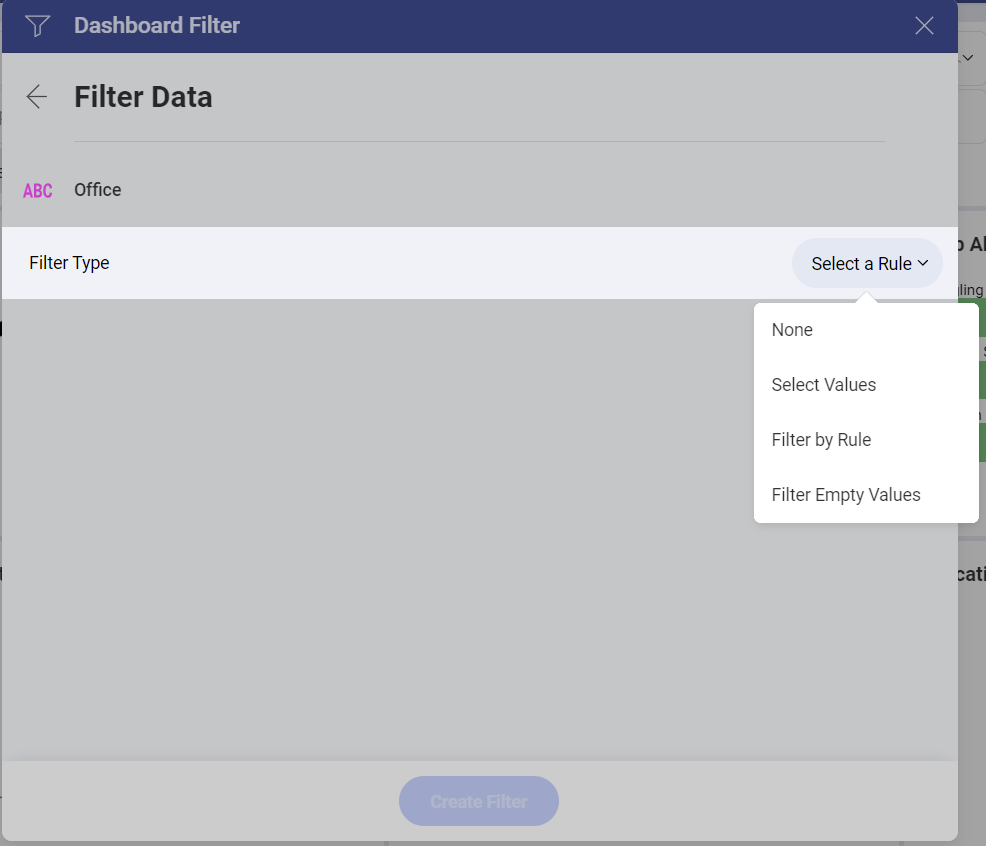

## ダッシュボード フィルターとそのプロパティ

### ダッシュボード フィルター プロパティにアクセスする

新しいダッシュボード フィルターを追加するには:

1.  ダッシュボード エディターに移動し、[フィルターの追加] ⇒ [ダッシュボード フィルターの追加] を選択します。

2.  ダッシュボード フィルター メニューが開きます。デフォルトで、選択されたデータ ソースは、はじめての表示形式で使用されるデータ ソースになります。変更するには、データソース名の横にあるオーバーフロー ボタンを選択します。

    

3.  ダッシュボード フィルターとして使用するデータセットを選択し、[データの選択] をクリック/タップします。

### フィルター設定の概要

フィルターの以下の設定を変更できます:

<table class="tg">
  <tr>
    <th class="tg-cly1" rowspan="5"></th>
    <th class="tg-cly1">タイトル。ダッシュボードのタイトルのすぐ下に表示される、ダッシュボード ィルターのタイトル。デフォルトで、これはフィルターとして使用されるフィールド名です。</th>
  </tr>
  <tr>
    <td class="tg-cly1"><a href="#displayed-field">表示フィールド</a>。ダッシュボード フィルターとして使用されるデータセット内のフィールド。</td>
  </tr>
  <tr>
    <td class="tg-cly1">選択。この設定では、次を構成できます。 <a href="#multiple-selection">複数選択</a> (一度に複数の値を選択できます) および/または <a href="#required-selection">必須選択</a> (少なくとも 1 つの値を常に選択する必要があります)。</td>
  </tr>
  <tr>
    <td class="tg-cly1"><a href="#data-filters">データ フィルター</a>。この設定により、ダッシュボード フィルターに使用されるデータソースに<a href="~/jp/data-visualizations/fields/field-filters-rules.md">フィールド フィルターとルール</a>を適用できます。</td>
  </tr>
  <tr>
    <td class="tg-cly1"><a href="connecting-dashboard-filters-visualization.md">接続された表示形式</a>。ダッシュボードを表示形式に接続するかどうか。</td>
  </tr>
</table>

### 表示フィールド

この設定は、ダッシュボード フィルターに値を表示するために使用されるデータセット フィールドを指定します。リスト値は、元のデータセットで複数回表示された場合も繰り返されません。

ダッシュボード フィルター名の隣りのオーバーフロー メニューで [編集] ボタンをクリックして、編集モードで表示列を変更できます。

### 複数選択

Reveal は、複数のダッシュボード フィルター値の同時選択をサポートしています。これにより、コレクション内で要素を並べて比較できます。たとえば、[HR ダッシュボード] で複数の選択を有効にすることで、さまざまなオフィスの雇用や欠勤を比較することができます。

**「複数選択」を有効する**には、ダッシュボードを編集モードに替える必要があります。⇒ ダッシュボード フィルターのオーバーフロー ニューから [編集] を選択 ⇒ [選択] ⇒ [複数選択] チェックボックスをオンにします。

### 必須選択

ダッシュボード フィルターで選択オプションを必須または無効にできます。
デフォルトでは、選択は不要です。選択オプションで、ユーザーがすべてのダッシュボード フィルター値を解除することができ、実行したクエリからフィルターを削除します。クエリはデータ ソースのすべてのデータを取得し、ダッシュボード フィルター行に「選択なし」と表示されます。

**「必須選択」を有効する**には、ダッシュボードを編集モードに替える必要があります。⇒ ダッシュボード フィルターのオーバーフロー ニューから [編集] を選択 ⇒ [選択] ⇒ [必須選択] チェックボックスをオンにします。

### データ フィルター

ダッシュボード フィルターに表示されるデータセットのフィールドにフィルターを適用することもできます。これにより、特定のフィールドの null または空の値をフィルター アウトできます ([空の値のフィルター](~/jp/data-visualizations/fields/field-filters-rules.md#empty-values))。[特定の値を選択する](~/jp/data-visualizations/fields/field-filters-rules.md#select-values)か、フィールド タイプに応じてオプションを変更するためにフィールドに[ルール](~/jp/data-visualizations/fields/field-filters-rules.md#rules) を追加することもできます。詳細は、[フィールド フィルターとルール](~/jp/data-visualizations/fields/field-filters-rules.md)をご覧ください。

たとえば、*従業員名*フィールドを使用して *HR ダッシュボード*のデータをフィルタリングする場合、*ダッシュボード フィルター*は会社のすべてのオフィスの従業員リストを表示します。

ここでは、特定のオフィスで働いている従業員だけをフィルターとして使用する場合は、*データ フィルター* プロパティを適用でる、たとえば、*ロンドン、英国*。それにより、ダッシュボード フィルターには、ロンドンオフィスで働く従業員のリストが表示されます。

#### ダッシュボード フィルターにデータ フィルターを適用

フィルター リストに特定のオフィスで働いている従業員のみ (たとえば、*London, UK*) を含める場合は、以下に示すようにデータ フィルターを適用します。

1.  ダッシュボード フィルター設定の*データ フィルター*に移動します。

2.  *表示フィールド*プロパティで*従業員名*を選択します。

3.  *フィールドを選択*をクリック/タップして、リストから*オフィス*を選択します。

    

4.  次のダイアログで、適用するフィルター タイプを選択します (この例では、*値の選択*を選択します)。

    

5.  リストから *London, UK* を選択し、[フィルターの作成] ボタンをクリック/タップします。

### Dashboard Filters Using MS Analysis Data

SSAS ベースのダッシュボード フィルターを構成する場合、いくつかの詳細があります (以下のリストを参照)。

> A screenshot showing both fields below (no collapsing a dropdown, please)

 1. **表示される要素** - ダッシュボード フィルター値を表示するために **ディメンション**、**階層**または**レベル**データ フィールドを選択できますが、**メジャー** データ フィールドは選択できません。

2. (オプション) **メジャーにデータがある場合のみ表示** - メジャーを選択して、ダッシュボードのフィルター値リストを特定のメジャーのデータを含む値に制限します。

たとえば、**製品**ディメンションを**表示要素**として使用する場合、ダッシュボード フィルターは製品のリスト (バイク、衣服など) を表示します。
[メジャーにデータがある場合のみ表示] フィールドの**インターネット注文** メジャーを追加選択すると、**インターネット注文**メジャーに関する情報を含まないダッシュボード フィルター値を除外します。自転車のインターネット注文がない場合、その製品は [ダッシュボード フィルター] リストに表示されません。

### 次の手順 

ダッシュボード フィルターを作成したので、フィルターを適用する**表示形式に接続する**必要があります。詳細は、[ダッシュボード フィルターを表示形式に接続](connecting-dashboard-filters-visualization.md)をご覧ください。
