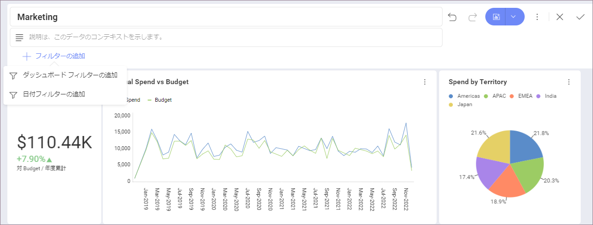
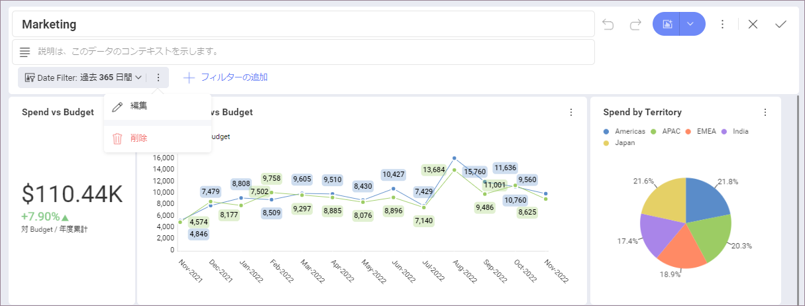
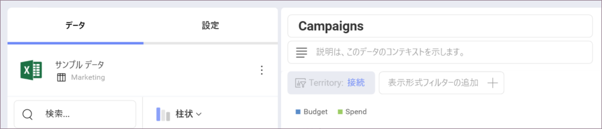
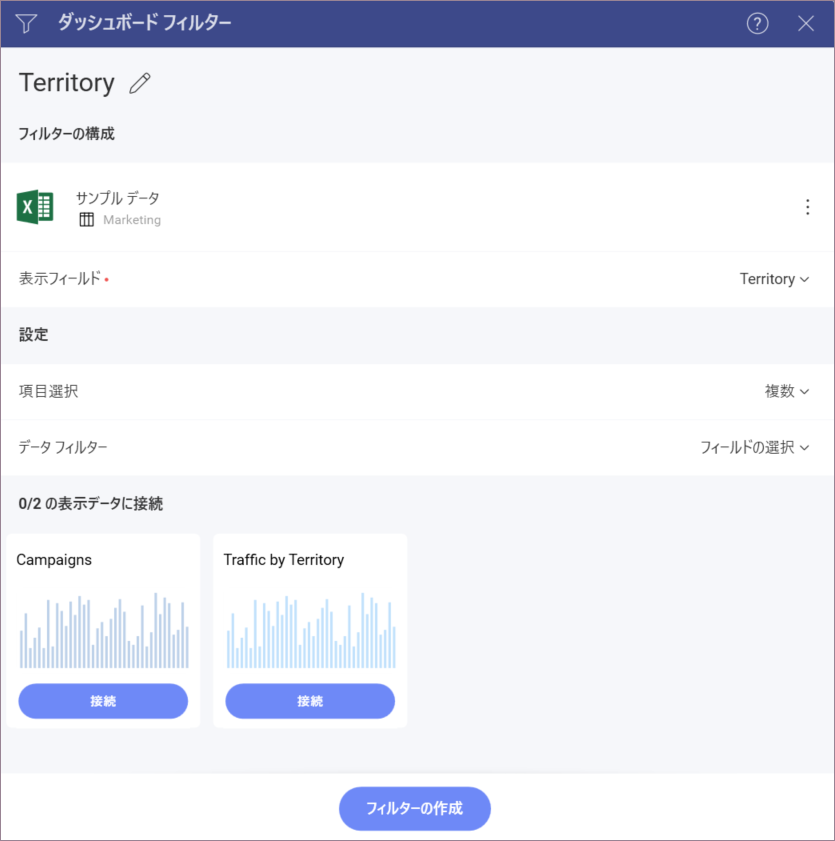

# ダッシュボード フィルター

ダッシュボード フィルター データセットは、ダッシュボード編集モードを開始することによって定義されます。新しいデータセットを追加するには、[フィルターの追加] のボタン を選択します。

これにより、適用される可能性のあるダッシュボード フィルターのリストが表示されます。
以下から選択できます:

  - **ダッシュボード フィルターの追加**。このオプションを使用すると、データ ソースから情報を選択できます。その後、ダッシュボードの各表示形式にフィルターをバインドできます。

  - **日付フィルターの追加**。このオプションは、固定範囲の選択や指定した日付範囲のみ表示するようカスタマイズできます。

ダッシュボード フィルター リストからデータセットを削除するには、ダッシュボード フィルターの横にあるオーバーフロー ボタンを選択し、**[削除]** を選択します。

## ダッシュボード フィルターと表示形式エディター

ダッシュボード エディターに 1 つ以上のダッシュボード フィルターまたは日付フィルターが定義されている場合、フィルター名の下部にある **[接続]** をクリックするとダッシュボード フィルターまたは日付フィルターのデータを表示形式にバインドします。

あるいは、[日付フィルター] ダイアログまたは [ダッシュボード フィルター] ダイアログでデータを接続することもできます。

バインド機能の詳細については、[ダッシュボード フィルターを表示形式に接続](connecting-dashboard-filters-visualization.html)トピックを参照してください。
