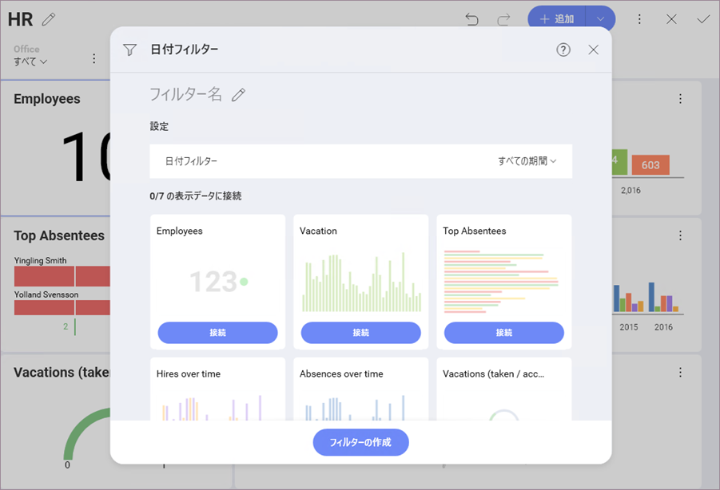
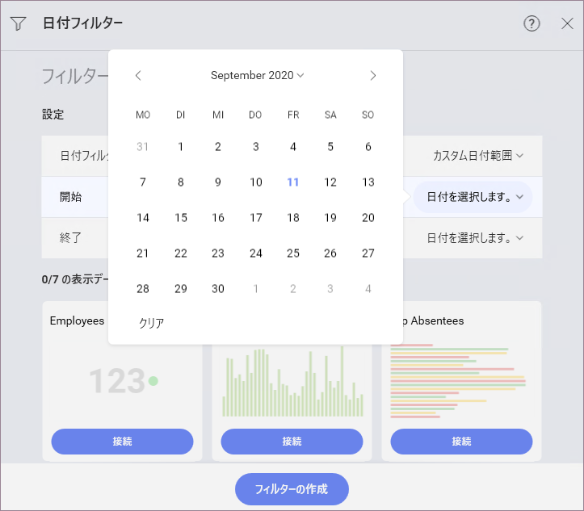

# 日付範囲ダッシュボード フィルター

Reveal は、データをダッシュボード フィルターにバインドする際のさまざまな日付範囲の設定をサポートしています。これにより、時間ベースの分析シナリオ、単一日付範囲の変更、ダッシュボード全体のフィルタリングが可能になります。ダッシュボード フィルター セクションで日付範囲を有効にするには、**[フィルターの追加]** メニューで **[日付フィルターを追加]** を選択します。

日付のダッシュボード フィルターを有効にすると、[表示形式バインディング式](connecting-dashboard-filters-visualization.html)で使用できるようになります。

## カスタム日付範囲の使用

Reveal では、さまざまな事前設定された日付範囲 (特に、過去 30 日、7 日、または 365 日を含む) を提供していますが、特定の日付範囲内のデータを表示するように範囲を定義することもできます。**[日付フィルター]** ドロップダウンで **[カスタム日付範囲]** を選択すると、パーソナライズされた日、月、および時代のオプションを含むカレンダーが表示されます。

