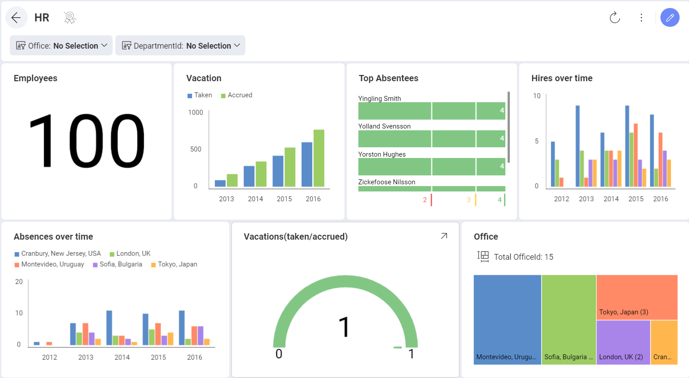

## フィルター

ダッシュボード フィルターを使用すると、ダッシュボードの全ての表示形式のコンテンツを一度にフィルター適用できます。データセットをダッシュボード フィルター コレクションに追加すると、すべてのダッシュボード表示形式にバインドされるフィルター設定が維持されます。動的なフィルターは、フィルターの選択が変更されると、接続されているすべての表示形式に適用されます。

たとえば、世界中の場所のリストを含むデータセットを追加して、ダッシュボードのすべての表示形式をバインドできます。このシナリオでは、各ダッシュボードの情報を参照するユーザーが場所ごとに各表示形式のコンテンツをフィルタリングできます。

Reveal は、日付範囲をダッシュボード フィルターとして有効にすることもサポートします。これにより、特定の期間ですべての表示形式をフィルタリングできます。

このセクションは以下のトピックを説明します:

  - *ダッシュボード*と*表示形式エディター*の両方の[ダッシュボード フィルター](dashboard-filters.md)

  - [ダッシュボード フィルターの構成可能なプロパティ](dashboard-filters-properties.md):

      - [表示フィールド](dashboard-filters-properties.md#displayed-field)

      - [複数選択](dashboard-filters-properties.md#multiple-selections)

      - [必須選択](dashboard-filters-properties.md#required-selection)

      - [データ フィルター](dashboard-filters-properties.md#data-filters)

  - [ダッシュボード フィルターと表示形式への接続](connecting-dashboard-filters-visualization.md) (表示形式バインディングとも呼ばれます)

  - [表示形式のクイック フィルター](visualization-filters.md)
