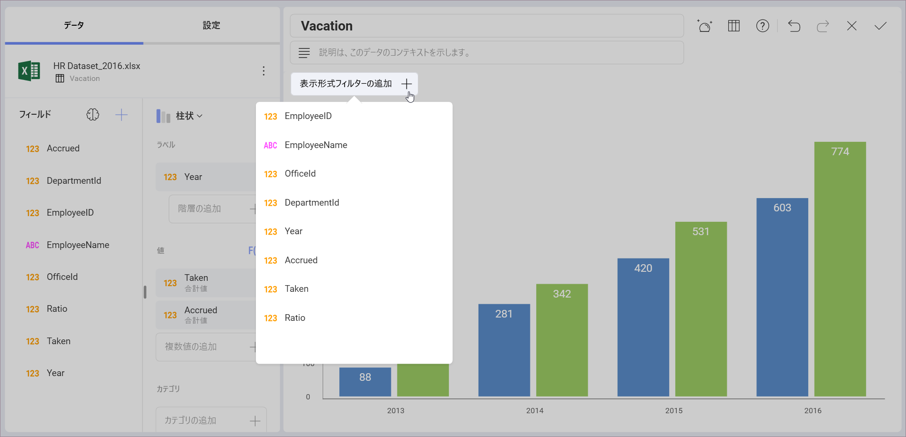
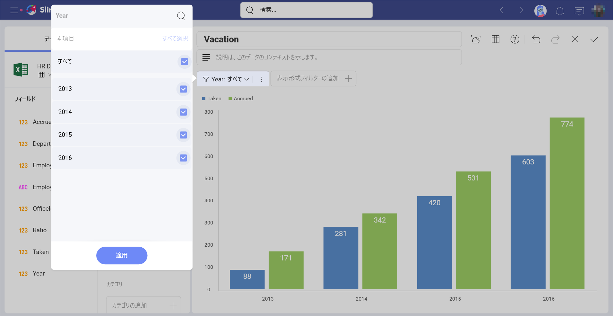
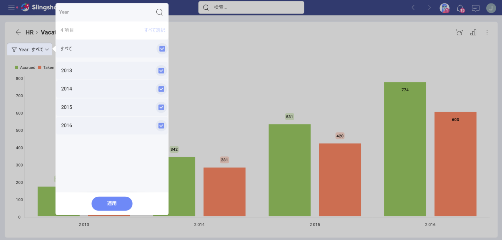
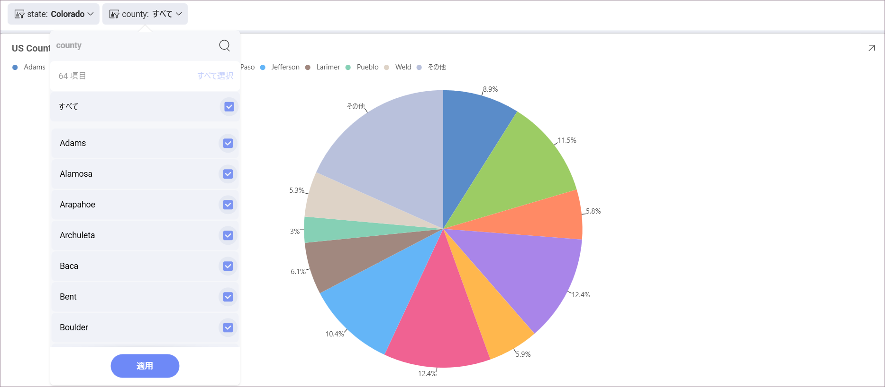
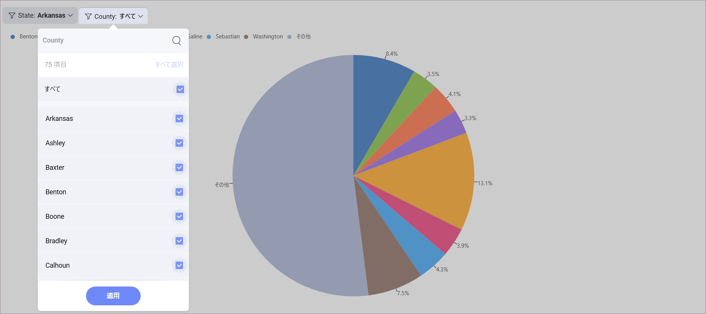

# 表示形式のクイック フィルター

表示形式レベルでは、クイック フィルターを適用することもできます。これにより、クイック フィルターの選択が変更されたときに表示形式コンテンツを動的にフィルターできます。これらは、ダッシュボード定義の一部となり、ダッシュボードのユーザーが変更することはできません。

クイック フィルターを定義するには、表示形式エディターで表示形式の上にある **[表示形式フィルターの追加]** ボタンを選択します。

フィルター オプションは、フィールドのデータ タイプに応じて表示形式フィルター エリアで表示されます。テキスト、数値、日付の 3 つのフィルター ダイアログがあります。作成されたクイック フィルターは、表示形式エディターの表示形式の上に表示されます。

ダッシュボード ビュー モードで表示形式を最大化すると、表示形式のタイトルの下に表示されます。

[ダッシュボード フィルター](dashboard-filters.html)同様に、簡易フィルター セクションが変更されると表示形式コンテンツの動的なフィルターが有効になります。

## フィルターのカスケード

クイック フィルターで表示される選択可能な値のリストは、以前のクイック フィルター選択に基づいてフィルターされます。左側のフィールドが優先され、右側のフィルターに表示される選択可能な値のリストを決定します。

たとえば、以下の例では、*State* フィルターが最初に作成され、*County* フィルターがその後に作成されました。**Colorado** を *State* として選択すると、*County* リストは次のようになります。

ただし、代わりに **Arkansas** を選択した場合、*County* のリストは異なります。

