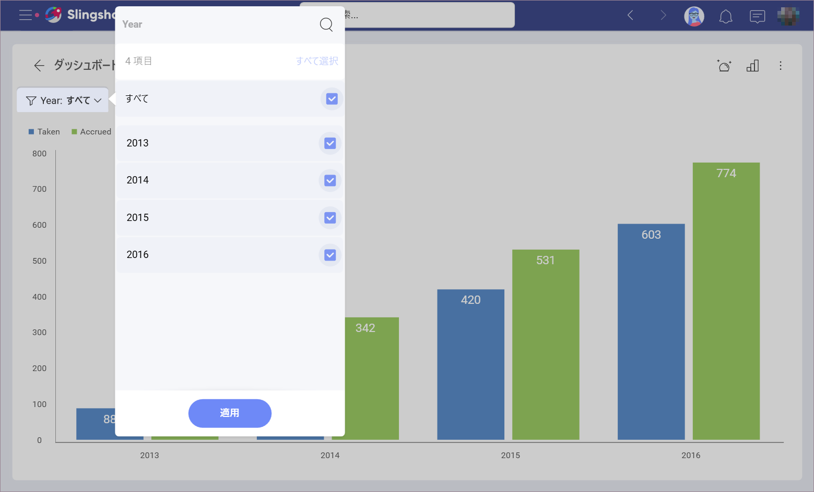
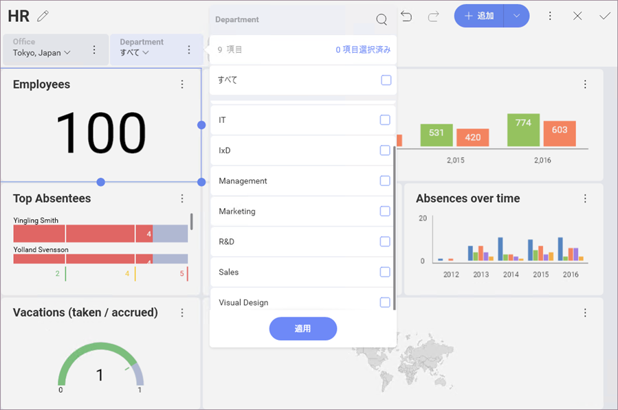

## 表示形式のクイック フィルター

表示形式レベルでは、「クイック」フィルターを適用することもできます。これにより、クイック フィルターの選択が変更されたときに表示形式コンテンツを動的にフィルターできます。これらは、ダッシュボード定義の一部となり、ダッシュボードのユーザーが変更することはできません。

クイック フィルターを定義するには、表示形式エディターで表示形式の上にある **[表示形式フィルターの追加]** ボタンを選択します。

フィルター オプションは、フィールドのデータ タイプに応じて表示形式フィルター エリアで表示されます。テキスト、数値、日付の 3 つのフィルター ダイアログがあります。作成されたクイック フィルターは、表示形式エディターの表示形式の上に表示されます。

ダッシュボード ビュー モードで表示形式を最大化すると、表示形式のタイトルの下に表示されます。

[ダッシュボード フィルター](dashboard-filters.html)同様に、簡易フィルター セクションが変更されると表示形式コンテンツの動的なフィルターが有効になります。

### フィルターのカスケード

クイック フィルターで表示される選択可能な値のリストは、以前のクイック フィルター選択に基づいてフィルターされます。左側のフィールドが優先され、右側のフィルターに表示される選択可能な値のリストを決定します。

たとえば、以下の例では、*オフィス* フィルターが最初に作成され、*部門* フィルターがその後に作成されました。**Cranbury, New Jersey, USA** を *オフィス* として選択すると、部門リストは次のようになります。

ただし、代わりに **Tokyo, Japan** を選択した場合、*部門*のリストは異なります。

### データ フィルター

表示形式フィルターに表示されたデータセットのフィールドにフィルターを適用することもできます。これにより、たとえば、特定の列で空値のフィルターを有効に設定することで、特定の列に null、または空の値を持つデータ セット内の行をフィルタリングする機能を提供します。特定の値を選択するか、フィールド タイプに応じてオプションを変更するためにフィールドにルールを追加することもできます。詳細は、[フィールド フィルターとルール](~/jp/data-visualizations/fields/field-filters-rules.html)をご覧ください。

**[表示形式フィルター]**セクションで、表示形式フィルターの横にあるオーバーフロー ボタンで **[編集]** を選択します。これにより、フィールドに適用するフィルターのタイプを選択できます。

