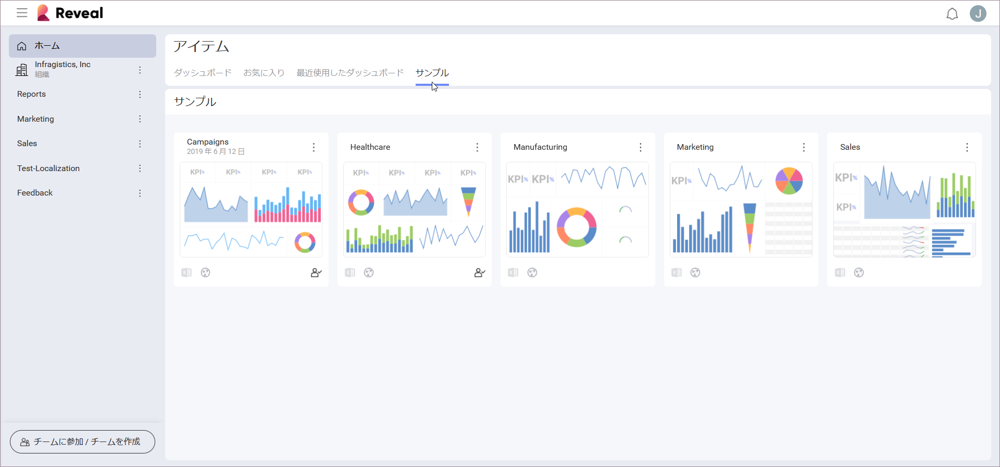

## アプリケーション テーマ

一般的なユーザー エクスペリエンス (UX) は、アプリケーション テーマを適用し、ローカライズと地域の設定を変更、さらに Reveal SDK でカスタマイズすることもできます。

カラー テーマを使用すると、Reveal インターフェースの色を好みに合わせて変更できます。現在のテーマを変更するには、初期画面の右上角にあるイニシャル (写真) アイコンをクリック/タップします。次に、[設定] ⇒ [一般設定] ⇒ [UI テーマ] に移動します。

ライト (デフォルト) とダークテーマから選択できます。これらの色は、ダッシュボード名の背景色、データソースダイアログなど、アプリケーションの UI の一部を変更します。以下は、各テーマの画面のほんの一例です。

| **スクリーン名**     | **ライト**                                                                                   | **ダーク**                                                                                  |
| ------------------- | ------------------------------------------------------------------------------------------- | ----------------------------------------------------------------------------------------- |
| ダッシュボード セレクター  |            |            |
| データソース クリエーター |  |  |
| チーム クリエーター       |                        |                        |

*Match OS* 機能をオンにすると、Reveal のテーマは、オペレーティング システムのテーマが変更されるたびに自動的に変更されます。 
