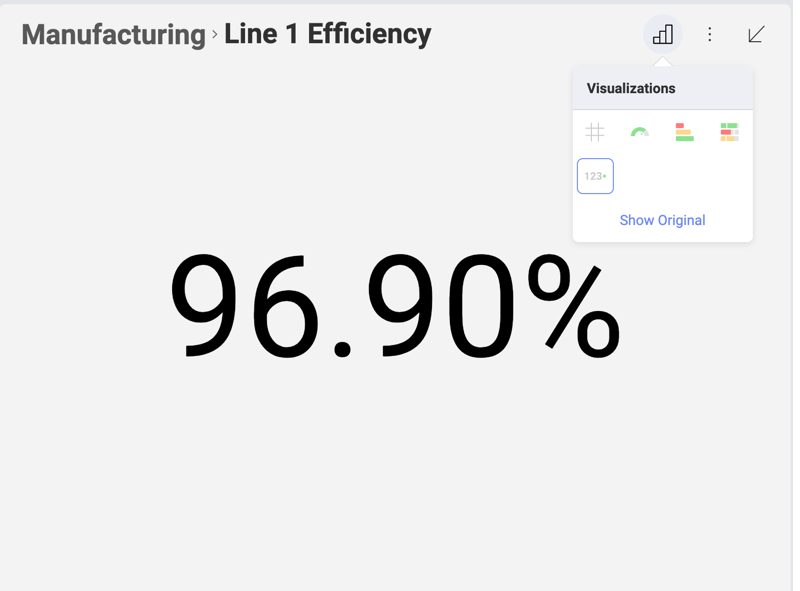
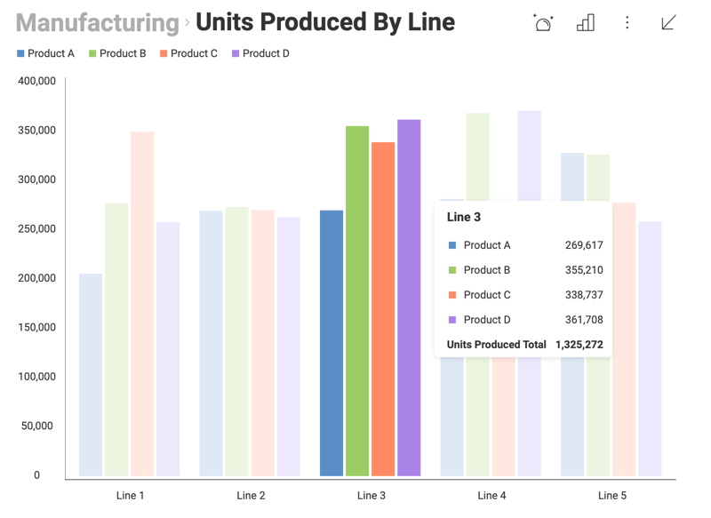

## ダッシュボードの概要

初期画面でダッシュボードのサムネイル画像をクリックし、既存のダッシュボードを開くことができます。

### ダッシュボード インタラクション

さまざまな方法で表示形式の **UI 操作が**できます。たとえば、表示形式がグリッド ビューの場合、水平方向および垂直方向にスクロールできます。チャート ビューではパン、ズームがサポートされています。また、基になるデータ モデルがサポートしている場合は、ドリルダウンとドリルアップの実行が可能になります。

#### 最大化されたビュー

ダッシュボードが開くと、表示形式のいずれかにカーソルをホバーし、右上隅の矢印をクリック/タップすることで**最大化**できます。

最大化されたビューは、より多くの情報の表示を可能にします。

さらに、このモードでは、最大化されたビューを他の表示形式に切り替え、または右上の**小さなチャート アイコン**をタップしチャートをさまざまな角度から分析できます。開始する可視化によってオプションが異なります。オーバーフ ローメニューから*[編集]*を選択して編集モードに入り、表示形式への変更を明示的に保存しない場合、表示形式への変更も保存されません。

さらに、表示形式メニューの右上隅にある**シャープ記号 (#)** アイコンをクリックすると、ビューを切り替え、チャートの背後のデータを表示できます。

可視化のデータ ビハインド表示で並べ替え (昇順または降順) を適用できます。グリッドの並べ替え詳細については、[グリッド ビュー](~/jp/data-visualizations/grid-view.md)トピックをご覧ください。

元の表示形式へ戻すために、**[元の表示形式を表示]** リンクを選択します。

#### 通常のツールチップ

特定の表示形式 (タッチ環境で長押すと) をクリックすると、ツールチップ ポップアップが表示されます。ツールチップは、次のようにチャートの特定のポイントで値を表示するのに役立ちます:

通常のツールチップを閉じるには、離れてクリックするかタップしてください。

#### ツールチップのホバーと十字線

**インタラクション**メニューでは、次の 2 つのオプションを有効にできます: *ツールチップのホバー*と*十字線*。どちらもダッシュボード ビュー モードの場合のみ使用できます。ダッシュボード編集モードでは使用できません。

  - *ホバー ツールチップ*を有効にすると、データにホバーした際に (タッチ環境で長押しした際に) **ツールチップ** ポップアップが表示されます。

    

    データをクリックすると (タッチ環境でドラッグ ツールチップをリリースすると)、ツールチップのインタラクションが適用可能な場合、ドリルダウン、ドリルアップ、および、リンク済みのダッシュボードなどのインタラクションで **[ツール]** セクションにアクセスできます。

  - *十字線*を有効にすると、Reveal はツールチップとともに十字線要素を表示します。ツールチップにより多くのコンテキストを与える。

    

十字線は、現在以下のデータ 表示形式でサポートされています。散布図、バブル、エリア、ローソク足、折れ線、OHLC、スプライン、スプラインエリア、ステップエリア、ステップ折れ線。

ローソク足と OHLC の表示形式は、水平の十字線のみを表します。垂直十字線を含めると、データ ポイントの線が見えにくくなります。

#### ツールチップの合計

ツールチップを表示するときに、カテゴリごとに合計値を表示するように構成できます。

この機能を有効にするには、次のように、[設定] \> [ツールチップに合計を表示] に移動します:

合計を有効にする場合、表示形式で複数の値を表示するためにカテゴリを追加したことを確認してください。

### ビュー & 編集モード

ダッシュボードを初めて開いた場合、**ビュー モード**でブラウズすることになります。このモードでは、表示された情報のナビゲーションやフィルタリングが可能ですが、ダッシュボード定義を変更することはできません。

ダッシュボードへの変更を適用するためには、**ダッシュボードの編集モード**に切り替える必要があります。ダッシュボードの右上隅のオーバーフロー メニューから*編集*を選択します。これにより、*自動レイアウト*、ダッシュボード *テーマ*の適用、ダッシュボードのエクスポートなどの編集オプションが有効になります。

以下は、*ダッシュボード編集*モードのダッシュボードです:

**編集モードを終了するには**、右上隅の*チェック アイコン*を選択するだけです。これにより、*表示モード*に戻ります。

### ダッシュボード フィルター

ダッシュボードまたは表示形式レベルで情報をフィルターできます。

  - [**ダッシュボード フィルター**](~/jp/filters/dashboard-filters.md) は、ダッシュボード編集モードを開くと使用できます (このモードにアクセスするには、ダッシュボードのオーバーフロー メニューから *[編集]* を選択します)。画面の左上隅に、現在のダッシュボード フィルターと、新しいフィルターを追加するオプションが表示されます。

  - [**表示形式フィルター**](~/jp/filters/Visualization-Filters.md) (つまり、クイック フィルター) は最大化モードで表示されます。これらは、表示形式の名前の下にある表示形式の上部セクションにあります。

ダッシュボードと表示形式フィルターの詳細については、[このセクション](~/jp/filters/overview.md)をご覧ください。

### 表示形式の自動レイアウト

Reveal の自動レイアウトは、デバイスのサイズ制約と表示形式の量に基づいて、ダッシュボードのすべての表示形式を動的にサイズ変更します。

自動レイアウトが有効なときに表示形式のサイズを変更するには、隅を下または横にドラッグするだけです。これにより、*自動レイアウト* が自動的にオフになります。
