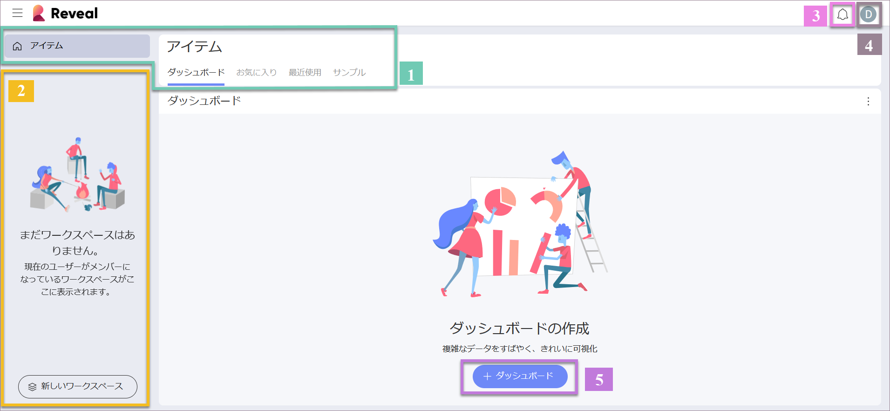
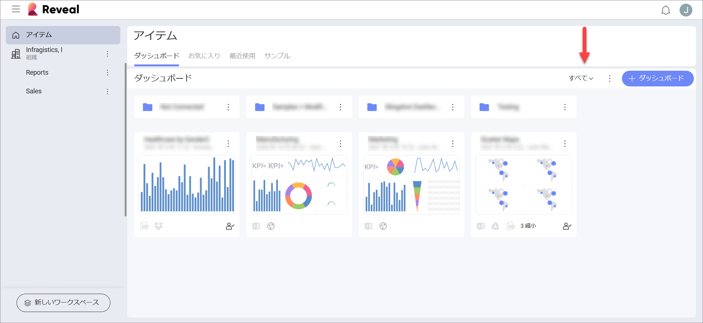

# Reveal へのログイン

Reveal へようこそ！
アプリを開くとき、さまざまなログイン オプションが表示されます。

開始前に、Reveal で**組織**に参加できることを考慮してください。組織のメンバーは、組織のメール アドレスでログインする必要があります。Google または Microsoft (O365) を選択し、組織ワークスペースに関連付けられます。または、iCloud (Apple) アカウントの資格情報を使用してログインできます。

> [!NOTE]
> 組織ワークスペースの名前は組織と同じ名前になります (会社名など)。

Reveal へのサインインに使用したアカウントに応じて、OneDrive または Google ドライブが[データ ソース](~/jp/datasources/overview.html)のリストに自動的に追加されます。

## 初期画面

開始するときに、初期画面が表示されます。

**アイテム**の個人用スペースで開始します。以下は、この初期画面のクイック リファレンスです。

1.  **[アイテム]** - ここでは、ダッシュボード、お気に入り、最近のもの、事前定義されたサンプルなど、個人用スペースにアクセスできます。

    *  **[ダッシュボード]** - すべてのダッシュボードの中央のスペースです。他のワークスペース メンバーによって作成された必要なダッシュボードを作成、修正、共有または検索する場合は、ここから始めてください。

    * **[お気に入り]** - 最も重要なダッシュボードを [お気に入り] に保存できます。

    * **最近** - [最近] では、表示または編集したダッシュボードが、最近使用した順に並べ替えられています。

    * **ダッシュボードのサンプル** - [サンプル] には、Reveal のチームによって構成されたダッシュボードがあります。豊富な種類の表示形式により、創造性が刺激され、独自の美しいダッシュボードを作成できます。

2.  **[組織とワークスペース]** - 画面の左側で、組織ワークスペースとメンバーである任意のワークスペースにアクセスできます。新しいワークスペースを作成、あるいは既存のワークスペースに参加することもできます。

3.  **[通知センター]** - ベル アイコンを選択してワークスペースおよびダッシュボードの更新にアクセスします。

4.  **プロファイル設定** - イニシャル (写真) のアイコンを選択して、Reveal の一般設定、学習のヒント、ヘルプ センターにアクセスし、アプリケーションに関するフィードバックや質問をします。

5.  **[+ ダッシュボード] のボタン** - **[+ ダッシュボード]** ボタンを選択すると、フォルダーを作成するか、ダッシュボードの作成に直接移動できます。また、ここで .rdash ファイル (Reveal ダッシュボード) をアップロードすることもできます。

アプリケーションの使用を開始すると、以下のようになります。

**フィルター** - ダッシュボードがあれば、ドロップダウン メニューから、ダッシュボード モジュールに表示するダッシュボードを選択します: **すべて**のダッシュボード、自分で作成したダッシュボード、あるいは共有しているダッシュボードです。

## ロールとアクセス許可

Reveal では、ユーザーは組織および 1 つ以上のワークスペースに参加できます。ロールとアクセス許可は組織とワークスペースの両方に適用されます。ロールは、ワークスペースまたは組織に関連して Reveal ユーザーに割り当てられた一連のアクセス許可を表します。つまり、組織またはワークスペースに参加するときにすべてのユーザーにロールが割り当てられます。明確なアクセス許可を持つ 3 つの異なるロロール (管理者、メンバー、閲覧者) があります。
