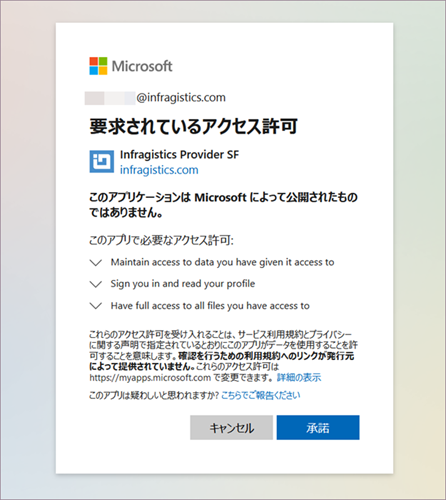

## Reveal へのログイン

Reveal へようこそ！
アプリを開くとき、さまざまなログイン オプションが表示されます。

開始前に、Reveal で **組織**に参加できることを考慮してください。組織のメンバーは、組織のメール アドレスでログインする必要があります。Google (G Suite) または Microsoft (O365) を選択し、組織チームに関連付けられます。または、iCloud (*Apple*) アカウントの資格情報を使用してログインできます。

> [!NOTE]
> 組織チームの名前は組織と同じ名前になります (会社名など)。  

Reveal へのサインインに使用したアカウントに応じて、OneDrive または Google ドライブが[データ ソース](~/jp/datasources/overview.md)のリストに自動的に追加されます。さらに、[OneDrive](~/jp/datasources/OneDrive.md) と [Google ドライブ](~/jp/datasources/Google-Drive.md)を初めて使用するときにのみ、制限された権限制限付きのアクセス許可を求められます。

### 初期画面

開始するときに、初期画面が表示されます。

**アイテム**の個人用スペースで開始します。

以下は、この初期画面のクイック リファレンスです。

 1.  **[アイテム/チーム]** - このポップオーバー メニューでは、個人用スペースとメンバーになっているチームにアクセスできます。新しいチームを作成、あるいは既存のチームに参加することもできます。

 1.  **[ダッシュボード]** - すべてのダッシュボードの中央のスペースです。他のチーム メンバーによって作成された必要なダッシュボードを作成、修正、共有または検索する場合は、ここから始めてください。

 3.  **[お気に入り]** - 最も重要なダッシュボードを [お気に入り] に保存できます。

 4.  **[最近]** - [最近] では、表示または編集したダッシュボードが、最近使用した順に並べ替えられています。

 5.  **[ダッシュボードのサンプル]** - [サンプル] には、Reveal のチームによって構成されたダッシュボードがあります。豊富な種類の表示形式により、創造性が刺激され、独自の美しいダッシュボードを作成できます。

 6.  **[+ ダッシュボード]の分割ボタン** - [+ ダッシュボード] 分割ボタンを選択すると、フォルダーを作成するか、ダッシュボードの作成に直接移動できます。また、ここで .rdash ファイル (Reveal ダッシュボード) をアップロードすることもできます。

 7.  **[フィルター]** - ドロップダウン メニューから、ダッシュボード モジュールに表示するダッシュボードを選択します: すべてのダッシュボード、自分で作成したダッシュボード、あるいは共有しているダッシュボードです。

 8.  **[通知センター]** - ベル アイコンを選択してチームおよびダッシュボードの更新にアクセスします。

 9.  **プロファイル設定** - イニシャル (写真) のアイコンを選択して、Reveal の一般設定、学習のヒント、ヘルプ センターにアクセスし、アプリケーションに関するフィードバックや質問をします。

### ロールとアクセス許可

Reveal では、ユーザーは組織および 1 つ以上のチームに参加できます。ロールとアクセス許可は組織とチームの両方に適用されます。ロールは、チームまたは組織に関連して Reveal ユーザーに割り当てられた一連のアクセス許可を表します。つまり、組織またはチームに参加するときにすべてのユーザーにロールが割り当てられます。明確なアクセス許可を持つ 3 つの異なるロール (管理者者、メンバー、閲覧者) があります。
