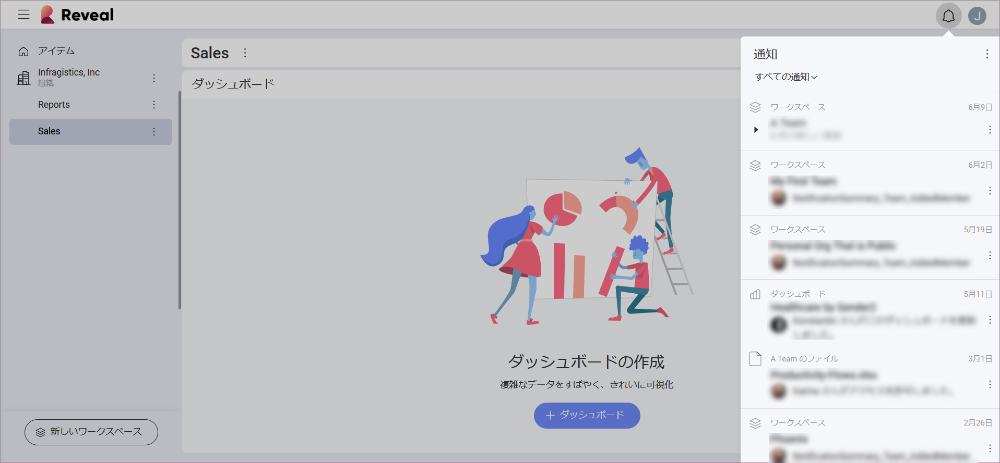
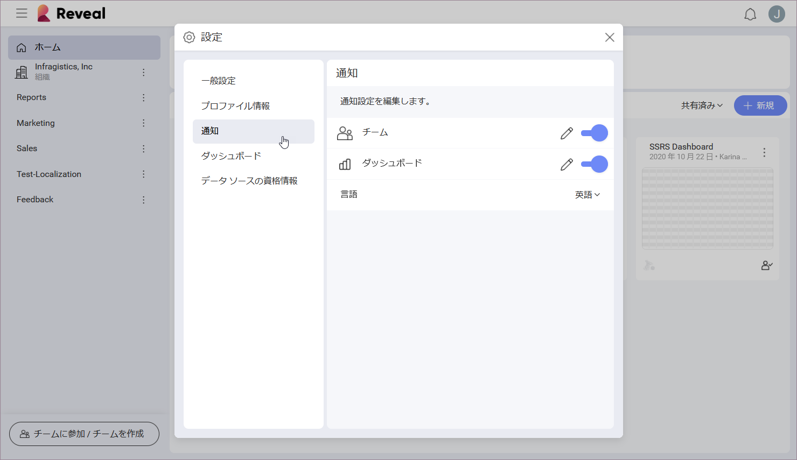

## 通知センター

通知センターは、チームおよびダッシュボードの変更を通知するように設計されています。アプリケーションの右上の**ベル アイコン**を選択して開きます。

通知を受け取ると、通知のアイコンが変更されます。通知設定によっては、特定の変更を含むアプリ内通知が表示される場合もあります。

通知センターでは次のことができます。

  - *メガネのアイコン*を選択して、すべての通知を**既読**または**未読**にします。

  - **日付**または**チーム**で通知を**グループ化します**。

  - さらに、オーバーフロー メニューで *[この種類の通知をミュート]* オプションを選択すると、**通知をオフにできます**。

### 通知設定

通知設定は簡単に編集できます。メイン画面の右上にある名前のイニシャル (または写真) のアイコンをクリック/タップします。次に、*[設定]* ⇒ *[通知]*へ移動します。

### 通知の種類

**チーム**および**ダッシュボード**の変更について、3 種類の通知を受け取ることができます。

  - アカウントに関連付けられたメール アドレスに配信される**メール通知**。

  - 通知アイコンの下にテキストとして表示される**プッシュ通知**。

  - 通知アイコン内に数字で表示される**アプリ内通知**。

通知設定を**編集する**には、*鉛筆アイコン*を選択します。通知を**オン/オフにする**には、右側の*切り替えボタン*をクリック/タップします。

#### チーム通知

チームから削除されたとき、またはすでに参加しているチームに新しいメンバーが参加したときに通知を受け取るように Reveal アカウントを構成できます。

チームでは、以下の設定がデフォルトで有効になっています。

|                         | メール                                                     | プッシュ | アプリ内                                                   |
| ----------------------- | --------------------------------------------------------- | ---- | -------------------------------------------------------- |
| チームから削除されました。 |             |      |            |
| 新しいメンバーが参加しました。        |                                                           |      |            |

#### ダッシュボード通知

ダッシュボードが自分やチームに共有されたとき、または更新されたときに通知を受け取るようにアカウントを構成できます。

ダッシュボードでは、以下の設定がデフォルトで有効になっています。

|                                     | メール                                                     | プッシュ | アプリ内                                                    |
| ----------------------------------- | --------------------------------------------------------- | --------------------------------------------------------- | --------------------------------------------------------- |
| ダッシュボードが共有されました。         |             |             |             |
| ダッシュボードが自分が参加しているチームと共有されました。 |                                                           |                                                           |             |
| ダッシュボードが更新されました。               |                                                           |             |             |
