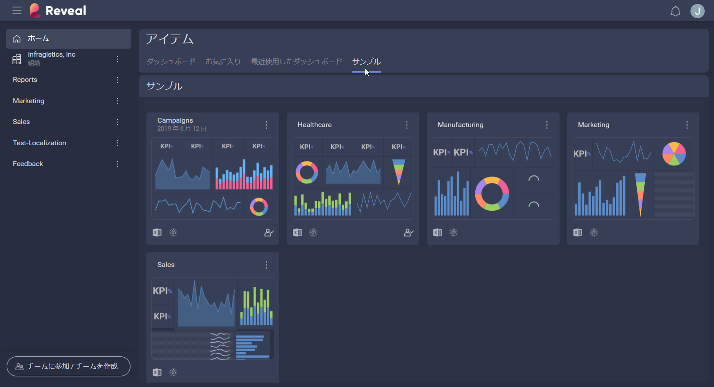
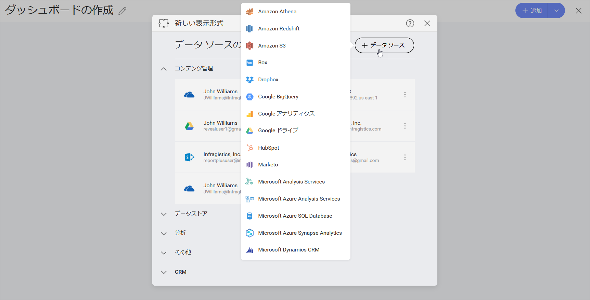

## テーマとローカライズ

ユーザー エクスペリエンス (UX) は、アプリケーション テーマの適用、ローカリゼーションと地域の設定の変更、また Reveal SDK でさらにカスタマイズすることができます。

### アプリケーション テーマ

カラー テーマを使用すると、Reveal インターフェースの色を好みに合わせて変更できます。現在のテーマを変更するには、初期画面の右上角にあるイニシャル (写真) アイコンをクリック/タップします。次に、*設定* ⇒ *一般設定* ⇒ *UI テーマ*に移動します。

ライト (デフォルト) とダークテーマから選択できます。これらの色は、ダッシュボード名の背景色、データソースダイアログなど、アプリケーションの UI の一部を変更します。以下は、各テーマの画面のほんの一例です。

| **スクリーン名**     | **Light**                                                                                   | **Dark**                                                                                  |
| ------------------- | ------------------------------------------------------------------------------------------- | ----------------------------------------------------------------------------------------- |
| ダッシュボード セクター  |            |            |
| データソース クリエーター |  |  |
| チーム クリエーター       |                        |                        |

*Match OS* 機能をオンにすると、Reveal のテーマは、オペレーティング システムのテーマが変更されるたびに自動的に変更されます。 

### ローカライズ

Reveal は、次のようなさまざまなプラットフォームで構成されている言語と地域の設定を検出して適用します。

  - **Web ブラウザ**

  - **Windows**

  - **モバイル デバイス (Android と iOS)**

> [!NOTE]
>**表示形式における日付形式について** 
>Reveal 表示形式で使用される日付形式は、**表示形式エディター**のフィールドでカスタマイズできます。そうすることで、「一般」形式を効果的に上書きします。

#### 言語

利用可能な言語は、英語、ドイツ語、スペイン語、フランス語、イタリア語、日本語、韓国語、マレー語、オランダ語、ポルトガル語、ロシア語、中国語 (繁体および簡体) です。

さらに、メール通知と通知センターに使用される言語を Reveal 内で明示的に構成できます。これを行うには、**設定 -> 一般設定 -> 通知の言語**に移動します。
