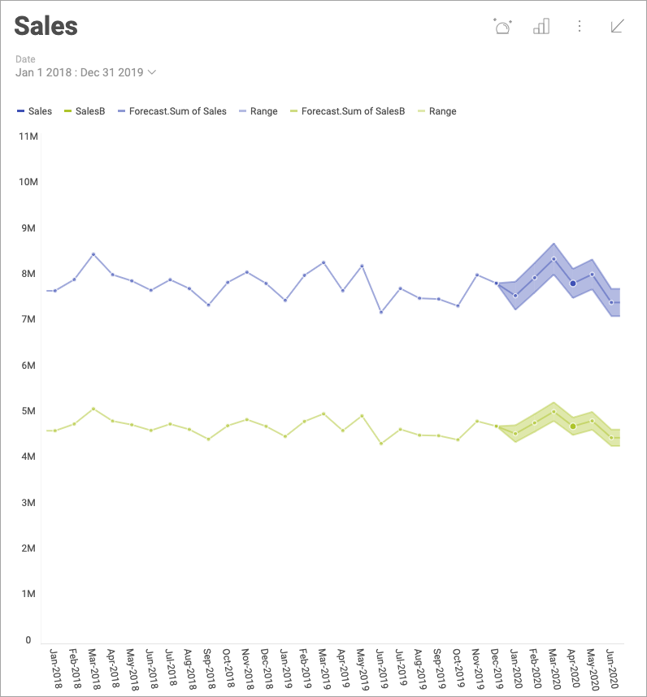
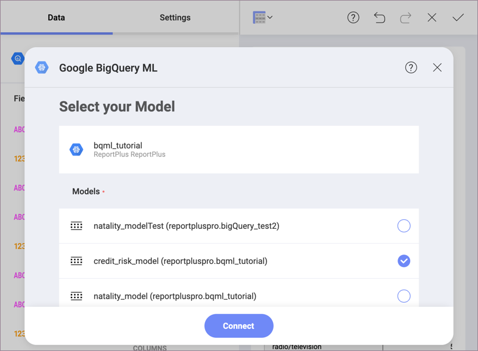

## Reveal ヘルプへようこそ!

Reveal は、埋め込み分析用に構築された最新の BI ソリューションです。データ分析をアプリケーションに簡単に統合でき、Reveal データ可視化を制御できる豊富な API を利用しながら、アプリでのユーザー エクスペリエンスを強化できます。

ユーザー エクスペリエンスのエキスパートによって構築され、ビジネス ユーザー向けに設計された Reveal は、データ可視化の作成、表示、チームとの共有を簡単にします。使用しているデバイスに関係なく、シームレスで同一のエクスペリエンスを提供します: ウェブ、デスクトップ、iOS および Android。

埋め込み分析に興味をお持ちですか? [Reveal SDK をダウンロードします](https://www.revealbi.io/download-sdk)。使用を開始する方法については、[Reveal SDK ヘルプ](developer/index.html)を参照してください。

### Reveal アプリケーションのハイライト

<h4 style="color:#2328B0;">データに安全に接続し、強力なデータ視覚化を構築する</h4>

人気のあるデータ ソースへ、特別なサーバー設定なしで接続できます。SharePoint オンライン、Googleドライブ、OneDrive、Microsoft Analysis Services、Microsoft SQL Server、CRM などに直接接続して、リアルタイムなインサイトを取得します。

直感的なドラッグアンドドロップ インターフェイスを備えた Reveal は、数分でダッシュボードを簡単に作成できます。20 以上の異なる表示形式から選択して、データを提示し、ストーリーを最良の方法で伝えます。

<h4 style="color:#2328B0;">データ視覚化をカスタマイズ</h4>

必要に応じて、データを並べ替えて、フィルターし、集計できます! チャートの種類ごとにさまざまな設定が用意されており、表示形式を希望どおりにデザインできます。

<h4 style="color:#2328B0;">ダッシュボードを操作する</h4>

ダッシュボードが作成されたら、ドリル ダウン サポートを使用して表示形式を操作するか、表示形式をオンザフライで変更することもできます。より深いインサイトを得るために、表示形式の注釈付き画像を作成して共有します。

<h4 style="color:#2328B0;">チームとインサイトを共有する </h4>

組織のリポジトリ内のダッシュボードを、所属しているチーム、または同僚と共有することで、すべての人がデータの恩恵を享受できます。ユーザーにさまざまなレベルの権限を割り当てて、ダッシュボードへのアクセス許可を付与します。

<h4 style="color:#2328B0;">高度な予測分析を活用する </h4>

統計関数を使用した高度な予測分析により、表示形式からさらにインサイトを得ることができます。
時系列予測、線形回帰、および外れ値の検出を使用して、データ シリーズで予測を行い、傾向を認識して評価し、外れ値を検出できます。

<h4 style="color:#2328B0;">機械学習でより良いインサイトを得る</h4>

Reveal で BigQuery または Azure Machine Learning Studio からのトレーニング済みモデルのデータを使用します。たった 3 つの手順で、データ ソースを選択し、表示形式を構築し、統合を使用して、トレーニングされた機械学習モデルに接続します。

### 新機能

* [Amazon Athena](~/jp/datasources/supported-data-sources/athena.md) データ ソース – Amazon Athena に接続して Amazon S3 からデータをクエリし、それを使用して Reveal で表示形式を構築できるようになりました。
* [Amazon S3](~/jp/datasources/supported-data-sources/amazon-s3.md) データ ソース – Reveal で Amazon S3 から直接データにアクセスできるようになりました。

### Reveal はどこで入手できますか?

Reveal は使用しているデバイスに関係なく、シームレスでほぼ同一のエクスペリエンスを提供します。Web ブラウザーの使用や iOS、Android、デスクトップでネイティブ アプリケーションを取得することが可能であるため、さまざまなデバイスやプラットフォームで簡単に作業できます。

私たちの[**無料デモ**](https://app.revealbi.io/Login?provider=Demo&_ga=2.197140908.2008019520.1580398635-1419162557.1572354605)版を試して、Reveal がお客様のビジネスに何ができるかを発見してください!

以下に、各プラットフォームでサポートされているバージョンを示します:

| PLATFORM | SUPPORT |
| --- | --- |
|**Android**|Android 5.0 (Lollipop) 以降 (Kindle Fire を除く)。|
|**Desktop**|.NET Framework 4.6.2 がインストールされているすべての Windows 7 SP1以降。.NET Framework のシステム要件の詳細については、[Microsoft 記事](https://docs.microsoft.com/en-us/dotnet/framework/get-started/system-requirements)をご参照ください。|
|**IOS**|iOS 12 以降。|
|**Web**|Mac および Windows のすべての主要なブラウザー ( 直近の2 リリース)。Web ブラウザーは、モバイル デバイスではサポートされていません。|
