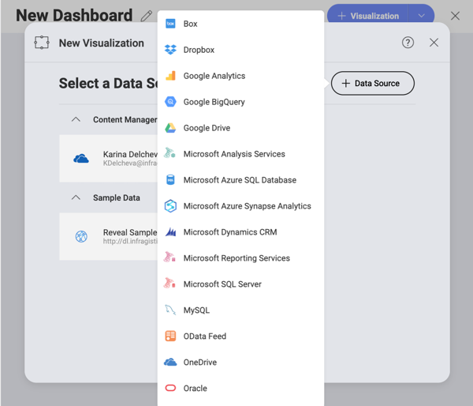
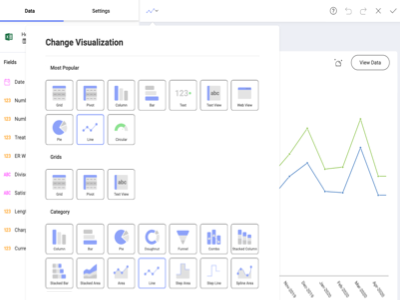

## Reveal ヘルプ センターへようこそ!

 
Reveal は、手頃な価格のビジネス ユーザー向けセルフサービス BI ツールであり、データに基づく意思決定を迅速に行うことができます。ユーザー エクスペリエンスに特化した開発者によって構築され、ビジネス ユーザー向けに設計された Reveal は、ダッシュボードの作成、表示、チームとの共有を簡単にします。使用しているデバイスに関係なく、シームレスで同一のエクスペリエンスを提供します: ウェブ、デスクトップ、 iOS および Android。 

Reveal は自由にアプリに埋め込まれるように設計されています。Reveal SDK を使用すると、Windows または Web でホストされるアプリに迅速かつシームレスに統合することで、ユーザーに分析機能を提供できます。興味をお持ちですか? [Reveal SDK をダウンロードします](https://www.revealbi.io/download-sdk)。使用を開始する方法については、[Reveal SDK ヘルプ](developer/index.md)を参照してください。 

### Reveal を使用して、次のことができます:

<table class="tg">
<colgroup>
<col style="width: 30%" />
<col style="width: 70%" />
</colgroup>
  <tr>
    <th class="tg-0pky"></th>
    <th class="tg-0pky"><a href="~/jp/datasources/overview.md">データに安全に接続する</a>: 人気のあるデータ ソースへ、特別なサーバー設定なしで接続できます。<a href="~/jp/datasources/sharepoint.md">SharePoint オンライン</a>, <a href="~/jp/datasources/google-drive.md">Googleドライブ</a>, <a href="~/jp/datasources/onedrive.md">OneDrive</a>, <a href="~/jp/datasources/microsoft-analysis-services.md">Microsoft Analysis Services</a>, <a href="~/jp/datasources/microsoft-sql-server.md">Microsoft SQL Server</a>, <a href="~/jp/datasources/microsoft-dynamics-crm.md">CRM</a> などに直接接続して、リアルタイムなインサイトを取得します。</th>
  </tr>
  <tr>
    <td class="tg-0pky"></td>
    <td class="tg-0pky"><a href="~/jp/dashboards/creating-dashboards.md">ダッシュボードを簡単に作成できる</a>: 直感的なドラッグ＆ドロップ インターフェイスを備えた Reveal は、数分でダッシュボードを簡単に作成できます。20 以上の異なる表示形式から選択して、データを提示し、ストーリーを最良の方法で伝えます。</td>
  </tr>
  <tr>
    <td class="tg-0pky"></td>
    <td class="tg-0pky"><a href="~/jp/data-visualizations/visualizations-editor.md">データ表示形式のカスタマイズ:</a> 必要に応じて、データを並べ替えて、フィルターし、集計できます! チャートの種類ごとにさまざまな設定が用意されており、表示形式を希望どおりにデザインできます。</td>
  </tr>
  <tr>
    <td class="tg-0pky"></td>
    <td class="tg-0pky"><a href="~/jp/dashboards/exporting-dashboards/overview.md">ダッシュボードをインタラクティブに操作する</a>: ダッシュボードが作成されたら、ドリルダウン サポートを使用して表示形式を操作するか、表示形式をオンザフライで変更することもできます。より深いインサイトを得るために、表示形式の注釈付き画像を作成して共有します。</td>
  </tr>
  <tr>
    <td class="tg-0pky"></td>
    <td class="tg-0pky"><a href="~/jp/dashboards/sharing-dashboards/sharing-dashboards.md">チームとインサイトを共有する</a>: <a href="~/jp/dashboards/teams/teams-collaboration-privacy.md#organization-team">組織のリポジトリ内</a>のダッシュボードを、所属しているチーム、または同僚と共有することで、全員にデータの力を与えます。ユーザーにさまざまなレベルの権限を割り当てて、ダッシュボードへのアクセス権を付与します。</td>
  </tr>
</table>

### 新機能:

  - [**新規 TreeMap 表示形式**](~/jp/data-visualizations/treemap-view.md) – この新しい表示形式を使用して、大きな階層をネストされた四角形の集合で表示できます。四角形のサイズは、さまざまなメトリック間の部分と全体の関係を示し、同様のデータ間のパターンと関係を識別します。

  - [**Excel エクスポート**](~/jp/dashboards/exporting-dashboards/excel-data-format.md) の機能拡張 – エクスポートする際に複数の表示形式をスプレッドシートに追加できます。散布図、バブル チャート、スパークライン チャートが利用できるようになりました。

  - **UI/UX の改善** – 表示形式、ダッシュボード、新しいデータソース ダイアログなどのユーザーエクスペリエンスを向上するために、小さな変更が追加されました。
  
  - **Google ドライブで共有ドライブのサポート**を追加 – G Suite Business アカウントをお持ちの場合、共有ドライブ データにアクセスし、 Reveal で可視化できます。Reveal で [Google ドライブ](~/jp/datasources/google-drive.md)をデータ ソースとして追加すると、共有ドライブが表示されます。

私たちの [**無料デモ**](https://app.revealbi.io/Login?provider=Demo&_ga=2.197140908.2008019520.1580398635-1419162557.1572354605) 版を試して、Reveal がお客様のビジネスに何ができるかを発見してください!
