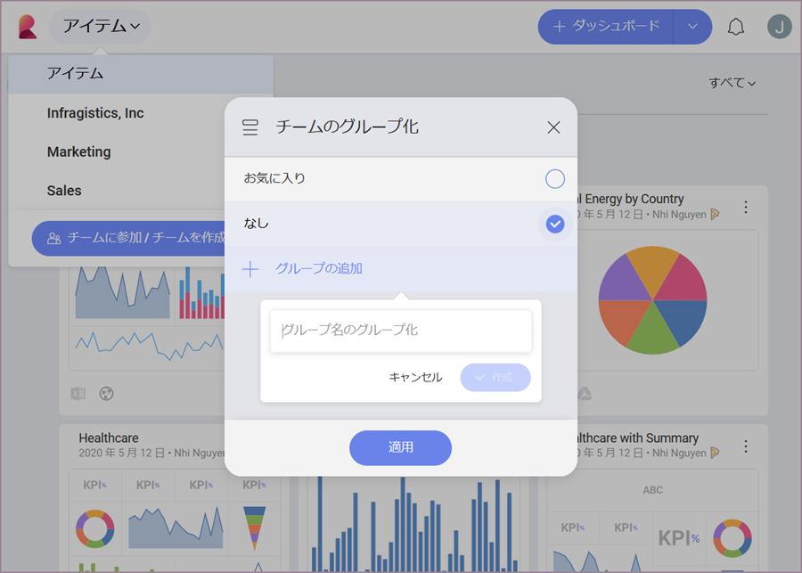

## チームの作成と参加

Reveal の*チーム*は、組織内外とのコラボレーションを容易にします。組織内すべてのチームへのアクセスや参加が可能で、あなたのチームを作成して、組織内のユーザーが他のチームと共同作業を行うことができます。

[チームを新規に作成](#create-team-scratch)または[既存のチームに参加](#join-team)し、チームの使用を開始します。

### チームを新規に作成

1.  左上の **[アイテム]** をクリックし、ポップオーバー メニューの **[チームに参加/チームを作成]** ボタンを選択します。

  

  >[!NOTE]
  > 初めてサインインする際に、すでにチームに参加されている場合があります。つまり、Office365 アカウントで Reveal にログインしたことのある、組織の他のメンバーを含む[組織チーム](overview.html#組織リポジトリ)です。

2.  青い **[+ チームの作成]** ボタンをクリック/タップします。以下の画面が表示されます。

    

    以下の手順を実行します。

      - チームに*名前*を割り当てます。

      - チームがメイン*組織*に属するかどうかを選択します。

          - [組織チーム](overview.html#組織リポジトリ) (このオプションは、*Infragistics、Inc* などの組織名で表示されます)。チームをメイン組織チームに関連付けると、チームがメイン組織のすべてのメンバーが[参加できる](#join-team)チームのリストに表示されます (チームを非公開にしない場合)。

          - *個人組織* - 新しいチームはメイン組織に属しておらず、招待なしに他のユーザーが参加できません。

            >[!NOTE]
            >後で変更することはできないため、慎重にチームの*組織*プロパティを選択してください。
      - チームの[*プライバシー*](overview.html#team-privacy-levels)を決定する - このオプションは、チームに [組織] を選択した場合は使用できません。
  
      - ブランディング設定 - チームのダッシュボードを [PDF 文書](~/jp/dashboards/exporting-dashboards/export-as-pdf-document.html)および [PPT プレゼンテーション](~/jp/dashboards/exporting-dashboards/export-as-powerpoint-presentation.html)としてエクスポートするときに使用するメイン色とロゴを選択します。
       
        >[!NOTE] **ロゴ画像の要件**。ロゴとしてアップロードする画像は、**5 MB** 以下で、jpg、jpeg、png、gif のいずれかの形式である必要があります。

3.  **[作成]** をクリック/タップします。 これでチームが作成され、以下に示すポップオーバー メニューの [アイテム] の下にあるチームのリストで見つけることができます。 
  
    
    
4. チームを作成すると、メンバーを招待するように求められます。**[+ メンバー]** の青いボタンをクリック/タップします。ドロップダウン リスト (以下を参照) からメンバーを選択するか、検索バーを使用して、組織外のユーザーのメール アドレスを追加できます。準備ができたら、**[完了]** を選択します。

    

1. **メンバー**は、別の役割を割り当てない限り、招待するすべてのユーザーのデフォルトの役割です。各ユーザー名の横にあるドロップダウンで、[管理者]、[メンバー]、[閲覧者] から選択できます。[チームコラボレーションとプライバシー](overview.html＃members-roles-permissions)でチームの役割の詳細をご覧ください。

2. 役割を決定すると、[更新] をクリックして招待を送信します。

### 既存のチームに参加

アカウントが[組織チーム](overview.html#組織リポジトリ)に自動的に追加された場合、**組織に属する他のチームを検出して参加できます**。以下の手順で既存のチームに参加できます。

1.  左上隅にある (*Reveal* アイコンの横) ポップオーバー メニューをクリック/タップします。
    

2.  青い *[チームに参加 / チームを作成]* ボタンをクリック/タップします。

3.  以下の画面が表示されます。

    

    ここには、組織に属するすべての[公開](overview.html#team-privacy-levels)チームがあります。

4.  *[参加]* ボタンをクリック/タップすると、メンバーの[権限](overview.html#members-roles-permissions)を持つ新しいメンバーとして選択したチームに自動的に追加されます。チームがチーム リストに表示されます。

### チーム リストの編成

作成または参加できるチームに制限はありません。多くのチームのリストを簡単に移動してチームを検索するには、以下の方法でチームをフィルターできます。

* 属する*組織*。
* *お気に入り*。
* *作成した*カスタム グループ。

#### 組織にでフィルター

組織によるフィルタリングは、組織に少なくとも 1 つの*組織チーム*と 1 つの*個人チーム*がある場合にのみ、オプションとして表示されます。

1.  左上隅にある (_Reveal_ アイコンの横) ポップオーバー メニューをクリック/タップします。

2. チーム リストの上にある [すべての組織] ドロップダウンをクリック/タップします。

3. 表示の選択: すべてのチーム、メイン組織に属するチームのみ、または組織に属さないチームのみ (個人組織のオプション)。

>[!NOTE]
>**すべての組織メニューは利用できません。**メイン組織に所属するチームと個人組織のチームの両方がない場合、[すべての組織] ドロップダウン メニューは表示されません。

#### お気に入りに追加

1. チーム リストにあるチームのオーバーフロー メニューをクリック/タップします。
2. [お気に入り] を選択します。

3. このチームは、チームの上部にある「お気に入り」リストに表示されます。

#### グループによる整理

選択したカスタム グループでチームを編成できます。新しいグループを作成する方法:

1. リスト内のチームのオーバーフロー メニューに移動します。
2. [グループの選択] をクリック/タップします。
3. [チームのグループ化] ダイアログが開きます。新しいグループを作成するには、[+グループの追加] をクリック/タップします。

4. チームを追加するグループの丸をオンにします。[適用] を選択します。

チーム リストには、チームが グループ化されていないチームとカスタム グループのチームで分類されて表示されます。

