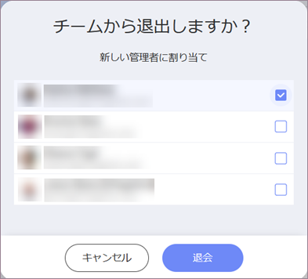

## チームの管理

チームの[オーナー](index.html#members-roles-permissions)として、次のことができます:

  - チーム メンバーを管理する

  - チーム プロパティを管理する

  - チームを[削除する](#delete-team)

特殊なタイプのチームとして、[組織リポジトリ](index.html#organization-team) 管理は、Reveal のチーム管理の一般的なルールに対応しています。組織のリポジトリ管理に違いがある場合、それらはこのトピックで明示的に言及されます。

### チーム メンバーを管理する

チームのオーナーのみがメンバーを招待できます。

チームの完全なメンバーのリストを表示するには、以下に示すように、チームのリストに移動 → チームを選択 → 右側にあるメンバーのアイコンをクリック/タップします。

ここでは、メンバーの役割を変更し、メンバーを削除または追加できます。

チームのメンバーに加えて、まだ招待を受け入れていないメンバーの名前が灰色で表示されます。彼らが招待を受け入れるまで、彼らの役割を変えることはできません。

#### 役割の変更または複数のメンバーの同時削除

1.  メンバー リストの上にある右側のチェックボックスをオフにします。

2.  メンバーの名前の右側にチェックボックスが表示されます。変更/削除するものを選択します。

3.  画面下部中央のメニューからゴミ箱アイコンまたは役割を選択します。

### チーム プロパティを管理する

チームのプロパティを変更するには、チームのリストに移動 → チームを選択 → 右側のギア アイコンをクリック/タップします。

ここでは、チームの*プライバシー*の設定、*色*と名前を変更できます。

ロゴをアップロードして色を設定することで、チームの**ブランディング**を設定することもできます。*ロゴ*として使用する画像は次の条件を満たす必要があります:

  - jpg, jpeg, png, gif;

  - 最大 5 MB。

ブランド情報は、ダッシュボードを PDF 文書および PowerPoint プレゼンテーションにエクスポートするときに使用されます。

**組織リポジトリ**: 組織リポジトリの名前は変更できません。

### チームの削除

オーナーのみがチームを削除できます。これを行うには、チームの[プロパティ](#manage-team-properties)に移動し、*[チームの削除]*をクリックします。

チームを削除すると、チームのすべてのコンテンツが消えます。

最後のメンバーがチームを離れた場合、チームも削除されます。

**組織リポジトリ**: は削除できません。

### チームを退会する

チームを退会するには、チームの[メンバー リスト](#manage-team-members)に移動し、名前の右側にあるドロップダウン メニューをクリック/タップして、*[退会]*を選択します。

チームの唯一のオーナーである場合、別のメンバーをオーナーとして割り当てずにチームを退会することはできません。

Reveal は、オーナーの役割に適したチームのすべてのメンバーを示します。

**組織リポジトリ**: 組織リポジトリの唯一または最後のオーナーであり、退会する場合は、インフラジスティックスに連絡して、新しいオーナーを割り当てるプロセスを開始してください。
