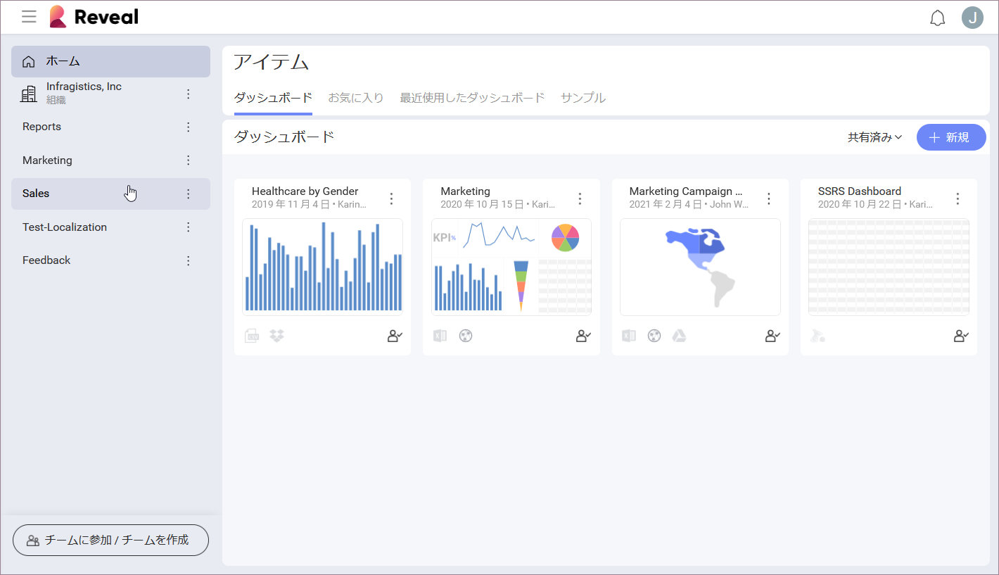

## チームのコラボレーションとプライバシー

チームは、Reveal ユーザーのグループ間でダッシュボードでの効果的なコラボレーションを促進し、機密情報を含むダッシュボードの高レベルのセキュリティを確保します。

Reveal チームの機能:

  - Organize your group's work in a **team's dashboards** section -
    create and share dashboards directly with other members, view and
    edit their dashboards.

  - グループの作業を**チームのダッシュボード**セクションで整理 - ダッシュボードを作成して他のメンバーと直接共有し、メンバーのダッシュボードを表示および編集します。

  - チームのダッシュボードを他のチームや Reveal のユーザーと[**共有します**](~/jp/sharing-dashboards/sharing-dashboards.md)。

  - すべてのチーム メンバーを個別のアクセス レベルを持つ [**3 つのメンバー役割**](#members-roles-permissions)の 1 つに割り当て、機密情報を含むダッシュボードを保護します。

  - 組織全体のさまざまな部署や従業員が自動的に作成された[**組織リポジトリ**](#organization-team)で共同で作業できます。

  - 組織チームに所属するメンバーを含む**他のチームを検索します**。

### チームへのアクセス

チームにアクセスするには、*Reveal* アイコンの隣のポップオーバー メニューをクリック/タップします。

ポップオーバー メニューの [アイテム] の下にチームのリストがあります。

### 組織リポジトリ

組織のメンバーが Office365 で最初にログインすると、Reveal は組織リポジトリを自動的に作成します。メンバーは、組織のメール アドレスでログインして組織に関連付け、組織リポジトリに追加する必要があります。 

組織チームは [アイテム] の下のチーム リストにあります。このチームは、組織と同じ名前になります。

他のチームとは異なり、[管理者](#members-roles-permissions)のみがダッシュボードを作成して組織リポジトリに追加できます。組織のキー メンバーのみに管理者のロールが付与されます。この制限により、組織チームのダッシュボードに正確で信頼できるデータが含まれるようになります。

### チームのプライバシー レベル

チームを作成するときに、プライバシー レベルを選択できます。

  - **公開**: メイン組織チームのメンバーはチームを検索して参加できます。

  - **非公開**: チームが検索結果に表示されません。ユーザーは招待を受け取った場合のみ参加できます。

### メンバーのロールとアクセス許可

Reveal には 3 種類のチーム メンバーがあります。

  - **管理者**

  - **メンバー**

  - **閲覧者**

組織チームでこれらのロールを割り当てるプロセスは、他のチームとは異なります。以下に、このプロセスの説明と、組織および他のチームのメンバーのアクセス許可を示す 2 つの参照表を示します。

#### 組織リポジトリ - メンバーのロールおよびアクセス許可の割り当て

Reveal にサインインする組織の最初のユーザーには、組織リポジトリの**管理者**のロールが与えられます。同じ組織の他のユーザーがログインすると、そのユーザーも管理者として追加されます。管理者が初めて誰かを**閲覧者**または**メンバー**として割り当てた後、サインインするすべての新しいユーザーがメンバーとして追加されます。

以下の表は、組織チームのメンバーのさまざまなアクセス許可を示しています。

| 許可                                                      | 管理者                                   | メンバー                                  | 閲覧者                                  |
| --------------------------------------------------------------- | --------------------------------------- | --------------------------------------- | --------------------------------------- |
| **ダッシュボード**を表示できます。                                         | 〇 | 〇 | 〇 |
| 組織リポジトリに**ダッシュボード**を作成できます。                 | 〇 | x  | x  |
| 組織外で**ダッシュボード**を編集権限で共有できます。  | 〇 | x  | x  |
| 組織外で**ダッシュボード**を表示権限で共有できます。  | 〇 | 〇 | 〇 |
| 組織リポジトリで**メンバー**を管理できます。           | 〇 | x  | x  |
| 組織に**メンバー**を招待できます。                              | 〇 | x  | x  |
| **公開チーム**にメンバーとして参加できます。                           | 〇 | 〇 | 〇 |
| **非公開チーム**を表示できます。                                      | x  | x  | x  |
| 組織内に独自の公開または非公開チームを作成できます。 | 〇 | 〇 | x  |

#### チーム - メンバーのロールおよびアクセス許可の割り当て

ユーザーがチームを作成すると、ユーザーはそのチームの管理者であり、そこにアクセス許可のレベルを分散できます。管理者は新しいメンバーをチームに招待し、ロールを割り当てます。

以下の表は、組織チームとは異なるチームのメンバーが持つアクセス許可を示しています。

| 許可                                                      | 管理者                                   | メンバー                                  | 閲覧者                                  |
| --------------------------------------------------------------- | --------------------------------------- | --------------------------------------- | --------------------------------------- |
| **ダッシュボード**を表示できます。                                         | 〇 | 〇 | 〇 |
| チームで**ダッシュボード**を作成できます。                           | 〇 | 〇 | x  |
| チームの外部で編集権限の**ダッシュボード**を共有できます。 | 〇 | 〇 | x  |
| チームの外部で表示権限の**ダッシュボード**を共有できます。 | 〇 | 〇 | 〇 |
| チームの**メンバー**を管理できます。                                    | 〇 | x  | x  |
| チームに**メンバー**を招待できます。                              | 〇 | x  | x  |
| **公開チーム**にメンバーとして参加できます。                           | 〇 | 〇 | 〇 |
| **非公開チーム**を表示できます。                                      | x  | x  | x  |

チームおよび組織リポジトリのプロパティとメンバーの管理の詳細については、[「チームの管理」](managing-your-team.md)トピックを参照してください。
