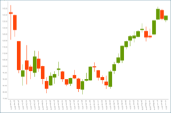
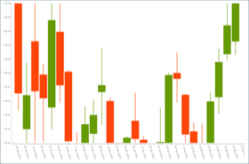
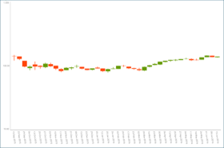
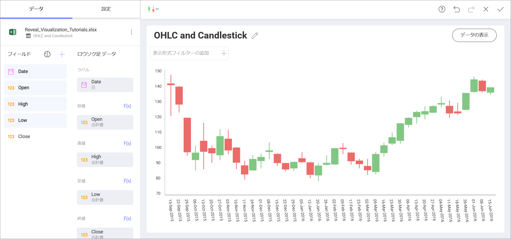
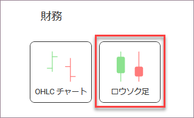

### ローソク足で可視化する方法

このチュートリアルは、サンプル スプレッドシートを使用してローソク足を作成する方法を説明します。

<table>
<colgroup>
<col style="width: 33%" />
<col style="width: 33%" />
<col style="width: 33%" />
</colgroup>
<tbody>
<tr class="odd">
<td>
 

<a href="#create-candlestick-chart">ローソク足チャート</a> 

</td>
<td>
 

<a href="#changing-axis-configuration">範囲のローソク足チャート</a> 

</td>
<td>
 

<a href="#setting-logarithmic-axis">対数軸のローソク足チャート</a> 

</td>
</tr>
</tbody>
</table>

ローソク足チャート ビューのガイドは、以下のリンクから参照してください。

  - [ローソク足チャートを作成する方法](#creating-candlestick-chart)

  - [軸の構成を変更する](#changing-axis-configuration)

  - [軸の構成を対数に変更する](#setting-logarithmic-axis)

### 重要なコンセプト

[OHLC](ohlc-chart.html) チャートとローソク足チャートは各財務データの始値、高値、安値、終値を表します。財務シナリオと株の変動の分析のために役立ちます。このチャートは各垂直軸に始値および終値を表す 2 つの水平線で数値を垂直軸に表します。

そのため、ローソク足チャートには以下の項目が必要になります。

  - 通常日付に関連するデータ エディターの **[ラベル] プレースホルダーへドロップする 1 つのフィールド**。

  - Open、High、Low および Close の **4 つの異なるフィールド** データ エディターのカテゴリ。

チャートに追加情報を表示するためのオプションが複数あります。

  - **軸の構成**: 軸の構成でチャートの最大値と最小値を構成できます。デフォルトで最小値は 0 に設定され、最大値は使用されるデータによって設定されます。

  - **対数軸構成**: [対数] ボックスをチェックする場合、値のスケールは通常のリニア スケールを使用する代わりに大きさを使用するリニア スケール以外で計算されます。

### サンプル データ ソース

このチュートリアルでは、[Reveal チュートリアル スプレッドシート](http://download.infragistics.com/reportplus/help/samples/Reveal_Visualization_Tutorials.xlsx)の「OHLC and Candlestick」シートを使用します。

>[!NOTE]
>このリリースでは、ローカル ファイルとしての Excel ファイルはサポートされていません。チュートリアルを実行するには、サポートされているクラウド サービスのいずれかにファイルをアップロードするか、[Web リソース](~/jp/datasources/supported-data-sources/web-resource.html)として追加してください。

### ローソク足チャートを作成する方法

|                                          |                                                                                                                                           |                                                                                                                                                       |
| ---------------------------------------- | ----------------------------------------------------------------------------------------------------------------------------------------- | ----------------------------------------------------------------------------------------------------------------------------------------------------- |
| 1\. **表示形式を作成する**           |                                        | ホーム画面で、[+ ダッシュボード] 分割ボタンを選択します。                                                                                            |
| 2\. **データ ソースを構成する**       |                                             | **[新しい表示形式]** 画面で、[+ データソース] ボタンを選択し、リストからデータソースを選択します。                                       |
| 3\. **チュートリアル スプレッドシートを選択する** |  | データソースを設定したら、**Reveal チュートリアル スプレッドシート**を選択します。 次に、「OHLC and Candlestick」シートを選択します。                       |
| 4\. **表示形式ペインを開く**     |                               | 表示形式エディターのトップ バーで**グリッド アイコン**を選択します。                                                                                 |
| 5\. **表示形式を選択する**        |                              | デフォルトで、表示形式のタイプはグリッドに設定されています。**ローソク足**を選択します。                                                                 |
| 6\. **データを体系化する**               |                                | Date フィールドをラベルにドラッグアンドドロップし、*Open*、*High*、*Low* および *Close* フィールドを対応するプレースホルダーにドラッグアンドドロップします。                      |
| 7\. **日付集計を変更する**      |                        | データ エディターのラベル プレースホルダーで Date フィールドを選択し、**[日付集計]** を **[日]** に変更します。次に, [フィールドの更新] を選択します。 |

### 軸の構成を変更する方法

[ゲージの範囲](gauge-views.html#adding-bounds-gauge)と同様に、チャート軸構成でチャート (範囲) の最小値と最大値を設定できます。この機能を使用して、特定のデータ含有や除外ができます。

以下は軸構成のメニューにアクセスするための手順です。

|                                             |                                                                                               |                                                             |
| ------------------------------------------- | --------------------------------------------------------------------------------------------- | ----------------------------------------------------------- |
| 1\. **設定メニューにアクセスする**            |   | 表示形式エディターの **[設定]** セクションに移動します。 |
| 2\. **軸範囲セクションに移動する** |  | 変更する設定は **[軸範囲]** です。   |

最大値または最小値 (または両方) のどれを設定するかに基づいて、以下のオプションの 1 つにアクセスする必要があります。

#### 最小境界値を変更する

デフォルト値は「自動」に設定されています。境界値を変更する場合は、チャートの開始値を入力してください。

#### 最大境界値を変更する

最大境界値の場合、Reveal が元のデータを使用するためにデフォルトの値は「自動」に設定されます。別の値を設定するには、チャートの上限値を入力します。

### 軸を対数軸として設定

|                                        |                                                                                                              |                                                             |
| -------------------------------------- | ------------------------------------------------------------------------------------------------------------ | ----------------------------------------------------------- |
| 1\. **設定メニューにアクセスする**       |                  | 表示形式エディターの **[設定]** セクションへ移動します。 |
| 2\. **軸を対数に変更する** |  | **[軸]** ドロップダウンを開き、**[対数]** を選択します。      |
