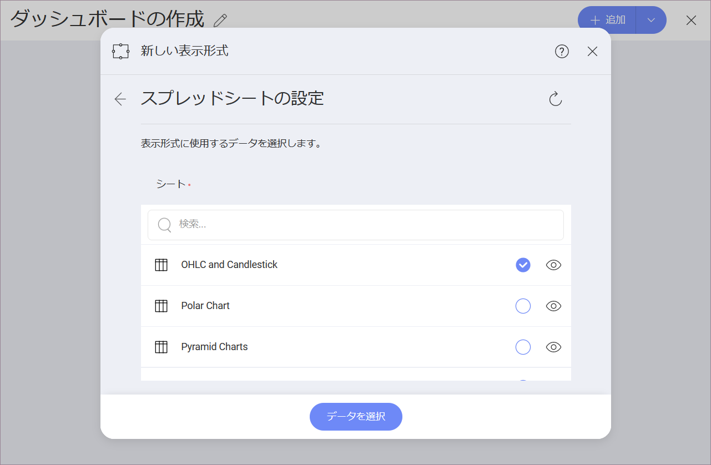
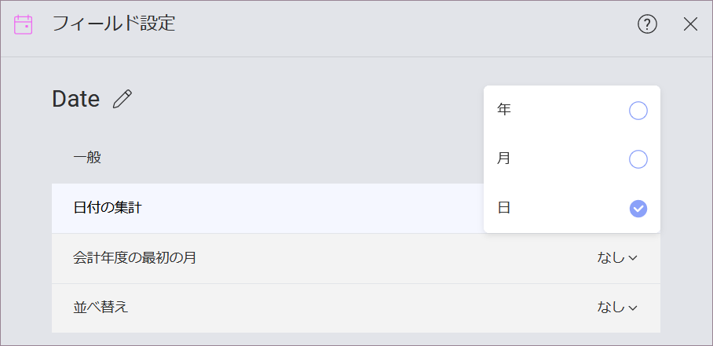

### ローソク足で可視化する方法

このチュートリアルは、サンプル スプレッドシートを使用してローソク足を作成する方法を説明します。

<table>
<colgroup>
<col style="width: 33%" />
<col style="width: 33%" />
<col style="width: 33%" />
</colgroup>
<tbody>
<tr class="odd">
<td>
 

<a href="#create-candlestick-chart">ローソク足チャート</a> 

</td>
<td>
 

<a href="#changing-axis-configuration">範囲のローソク足チャート</a> 

</td>
<td>
 

<a href="#setting-logarithmic-axis">対数軸のローソク足チャート</a> 

</td>
</tr>
</tbody>
</table>

ローソク足チャート ビューのガイドは、以下のリンクから参照してください。

  - [ローソク足チャートを作成する方法](#creating-candlestick-chart)

  - [軸の構成を変更する](#changing-axis-configuration)

  - [軸の構成を対数に変更する](#setting-logarithmic-axis)

### 重要なコンセプト

[OHLC](tutorial-ohlc-chart.md) チャートとローソク足チャートは各財務データの始値、高値、安値、終値を表します。財務シナリオと株の変動の分析のために役立ちます。このチャートは各垂直軸に始値および終値を表す 2 つの水平線で数値を垂直軸に表します。

そのため、ローソク足チャートには以下の項目が必要になります。

  - 通常日付に関連するデータ エディターの **[ラベル] プレースホルダーへ 1 フィールドドロップします**。

  - [Open]、[High]、 [Low] および [Close]の **4 つの異なるフィールド** データ エディタのカテゴリ。

チャートに追加情報を表示するためのオプションが複数あります。

  - **軸の構成**: 軸の構成でチャートの最大値と最小値を構成できます。デフォルトで最小値は 0 に設定され、最大値は使用されるデータによって設定されます。

  - **対数軸構成**: [対数]ボックスをチェックする場合、値のスケールは通常のリニア スケールを使用する代わりに大きさを使用するリニア スケール以外で計算されます。

### サンプル データ ソース

このチュートリアルでは、[Reveal チュートリアル スプレッドシート](http://download.infragistics.com/reportplus/help/samples/Reveal_Visualization_Tutorials.xlsx)の「チャート表示」のシートを使用します。

>[!NOTE]
>このリリースでは、ローカル ファイルとしての Excel ファイルはサポートされていません。チュートリアルを実行するには、サポートされている [クラウド サービス](data-sources.md) のいずれかにファイルをアップロードするか、[Web リソース](web-resource.md)として追加してください。

### ローソク足チャートを作成する方法

|                                          |                                                                                                                                           |                                                                                                                                                       |
| ---------------------------------------- | ----------------------------------------------------------------------------------------------------------------------------------------- | ----------------------------------------------------------------------------------------------------------------------------------------------------- |
| 1\. **Create a Visualization**           |                                        | In the home screen, select the *+ Dashboard* split button.                                                                                            |
| 2\. **Configure your Data Source**       |                                             | In the *New Visualization* screen, select the *+ Data Source* button and choose your data source from the list.                                       |
| 3\. **Select the Tutorials Spreadsheet** |  | Once the data source is configured, select the **Reveal Tutorials Spreadsheet**. Then, choose the "OHLC and Candlestick" sheet.                       |
| 4\. **Open the Visualizations Menu**     |                               | Select the **grid icon** in the top bar of the Visualizations Editor.                                                                                 |
| 5\. **Select your Visualization**        |                              | By default, the visualization type will be set to *Grid*. Select the **Candlestick**.                                                                 |
| 6\. **Organize your Data**               |                                | Drag and drop the *Date* field into *Label* and the *Open*, *High*, *Low* and *Close* fields in their corresponding placeholder.                      |
| 7\. **Change the Date Aggregation**      |                        | Select the **Date** field in the *Label* placeholder of the data editor, and change the **Date Aggregation** to **Day**. Then, select *Update Field*. |

### 軸の構成の変更

[ゲージの範囲](tutorial-gauge-views.html#adding-bounds-gauge)と同様に、チャート軸構成でチャート (範囲) の最小値と最大値を設定できます。この機能を使用して、特定のデータ含有や除外ができます。

以下は軸構成のメニューへアクセスするための手順です。

|                                             |                                                                                               |                                                             |
| ------------------------------------------- | --------------------------------------------------------------------------------------------- | ----------------------------------------------------------- |
| 1\. **Access the Settings Menu**            |   | Go to the **Settings** section in the Visualization Editor. |
| 2\. **Navigate to the Axis Bounds section** |  | The settings you will change will be the **Axis Bounds**.   |

最大値または最小値 (または両方) のどれを設定するかに基づいて、以下のオプションの 1 つへアクセスする必要があります。

#### 最小境界値を変更する

デフォルト値は「自動」に設定されています。境界値を変更する場合は、チャートの開始値を入力してください。

#### 最大境界値を変更する

最大境界値の場合、Reveal が元のデータを使用するためにデフォルトの値は「自動」に設定されます。別の値を設定するには、チャートの上限値を入力します。

### 軸を対数軸として設定

|                                        |                                                                                                              |                                                             |
| -------------------------------------- | ------------------------------------------------------------------------------------------------------------ | ----------------------------------------------------------- |
| 1\. **Access the Settings Menu**       |                  | Go to the **Settings** section of the Visualization Editor. |
| 2\. **Change the Axis to Logarithmic** |  | Open the **Axis** dropdown and select **Logarithmic**.      |
