## ゲージで表示形式を作成する方法

このチュートリアルは、サンプル スプレッドシートを使用したゲージでデータの可視化を行います。

<table>
<colgroup>
<col style="width: 33%" />
<col style="width: 33%" />
<col style="width: 33%" />
</colgroup>
<tbody>
<tr class="odd">
<td>
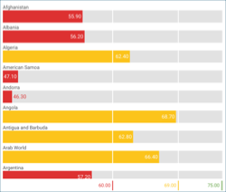 

<a href="#create-linear-gauge">リニア ゲージ</a> 

</td>
<td>
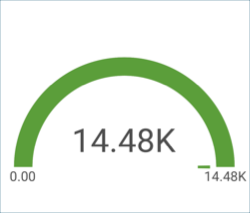 

<a href="#create-circular-gauge">円形ゲージ</a> 

</td>
<td>
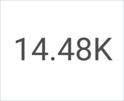 

<a href="#create-text-gauge">テキスト ゲージ</a> 

</td>
</tr>
<tr class="even">
<td>
 

<a href="#create-bullet-graph-gauge">ブレット グラフ</a> 

</td>
<td>
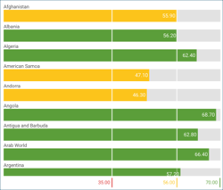 

<a href="#adding-bounds-gauge">範囲構成のリニア ゲージ</a> 

</td>
<td>
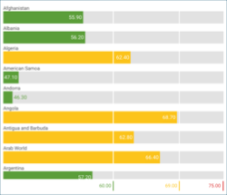 

<a href="#modify-bands">バンドの色が異なるリニア ゲージ</a> 

</td>
</tr>
</tbody>
</table>

ゲージ ビューのためのガイドは、以下のリンクから参照してください。

  - [リニア ゲージの作成方法](#create-linear-gauge)

  - [ラジアル ゲージの作成方法](#create-circular-gauge)

  - [ラベル ゲージの作成方法](#create-text-gauge)

  - [ブレット グラフ の作成方法](#create-bullet-graph-gauge)

  - [ゲージ可視化に範囲を追加する方法](#adding-bounds-gauge)

  - [バンドの色を変更する方法](#modify-bands)

### 重要なコンセプト

積層型チャートは、3 つのレイアウトから選択できます:

  - **しきい値の構成**。ゲージのしきい値の構成ではゲージの最大値と最小値を設定できます。デフォルトで最小値に設定されますが、特定のデータを除外するために変更できます。

  - **バンド構成**。バンドの構成は 3 つの範囲を設定できます (より大きい、中間、より小さい) です。データ ソースに基づく範囲でデフォルトの値を上書きします。

### サンプル データ ソース

このチュートリアルでは、[Reveal チュートリアル スプレッドシート](http://download.infragistics.com/reportplus/help/samples/Reveal_Visualization_Tutorials.xlsx).

>[!NOTE]
>このリリースでは、ローカル ファイルとしての Excel ファイルはサポートされていません。チュートリアルを実行するには、サポートされている[クラウド サービス](data-sources.md)のいずれかにファイルをアップロードするか、[Web リソース](web-resource.md)として追加してください。

### リニア ゲージを作成する方法

|                                          |                                                                                            |                                                                                                                                                                       |
| ---------------------------------------- | ------------------------------------------------------------------------------------------ | --------------------------------------------------------------------------------------------------------------------------------------------------------------------- |
| 1\. **ダッシュボードの作成**               |                | ダッシュボード ビューアーで、[ダッシュボード] 画面の右上隅にある [+] ボタンを選択します。次に、ドロップダウンから [ダッシュボード] を選択します。                  |
| 2\. **データ ソースの構成**       |                    | *新しい表示形式*ウィンドウで、右下隅の [+] ボタンを選択し、データソースを選択します。                                                        |
| 3\. **チュートリアル スプレッドシートの選択** | 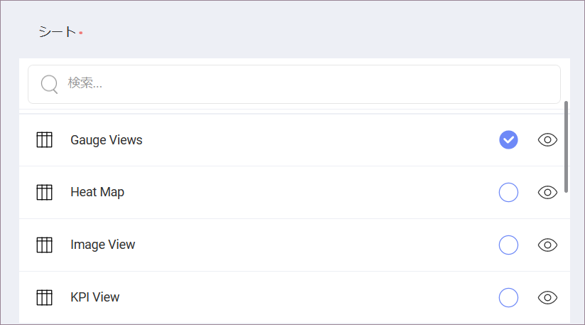                   | データソースを設定したら、**Reveal チュートリアル スプレッドシート**を選択します。次に、[ゲージ ビュー] シートを選択し、*[データのロード]* を選択します。                         |
| 4\. **表示形式メニューを開く**     |  | 表示形式エディターのトップ バーで**グリッド アイコン**を選択します。                                                                                                 |
| 5\. **表示形式の選択**        | 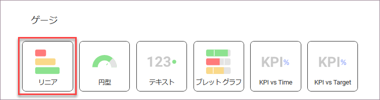                 | デフォルトで、表示形式タイプはグリッドに設定されています。[リニア] ゲージを選択してください。                                                                                  |
| 6\. **データの体系化**               | 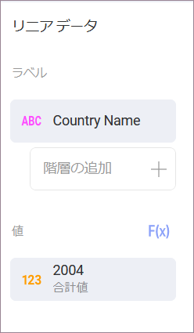                       | たとえば、このリニア ゲージは国別で平均寿命を表します。[ラベル] に [Country Name] フィールド、年フィールドの 1 つを [値] へドラッグアンドドロップします。|

### 円型ゲージを作成する方法

|                                          |                                                                                            |                                                                                                                                                                       |
| ---------------------------------------- | ------------------------------------------------------------------------------------------ | --------------------------------------------------------------------------------------------------------------------------------------------------------------------- |
| 1\. **ダッシュボードの作成**               |                | ダッシュボード ビューアーで、[ダッシュボード] 画面の右上隅にある [+] ボタンを選択します。次に、ドロップダウンから [ダッシュボード] を選択します。                  |
| 2\. **データ ソースの構成**       |                    | *新しい表示形式*ウィンドウで、右下隅の [+] ボタンを選択し、データソースを選択します。                                                       |
| 3\. **チュートリアル スプレッドシートの選択** |                    | データソースを設定したら、**Reveal チュートリアル スプレッドシート**を選択します。次に、[ゲージ ビュー] シートを選択し、*[データのロード]* を選択します。                         |
| 4\. **表示形式メニューを開く**     |  | 表示形式エディターのトップ バーで**グリッド アイコン**を選択します。                                                                                                 |
| 5\. **表示形式の選択**        | 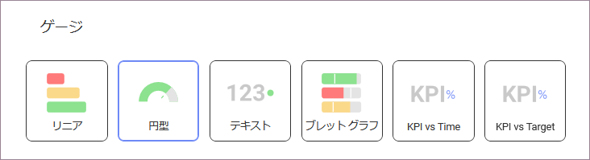                 | デフォルトで、表示形式のタイプは*グリッド*に設定されています。[円型] ゲージを選択してください。                                                                                |
| 6\. **データの体系化**               | 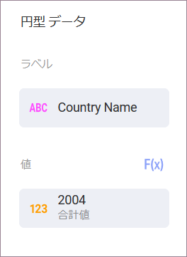                   | 例えば、このラジアル ゲージは国別平均寿命を表します。[ラベル] に [Country Name] フィールド、年フィールドの 1 つを [値] へドラッグアンドドロップします。|

円形ゲージは、特に平均値と値の合計の表示に適しています。[値] に表示されるフィールドの集計を変更する手順:

|                                              |                                                                            |                                                                                           |
| -------------------------------------------- | -------------------------------------------------------------------------- | ----------------------------------------------------------------------------------------- |
| 1\. **値のフィールド設定にアクセスする** | 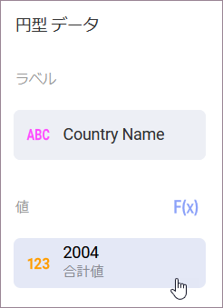 | **値** のフィールドを選択してアクセスします                                                  |
| 2\. **別の集計を選択します**       | 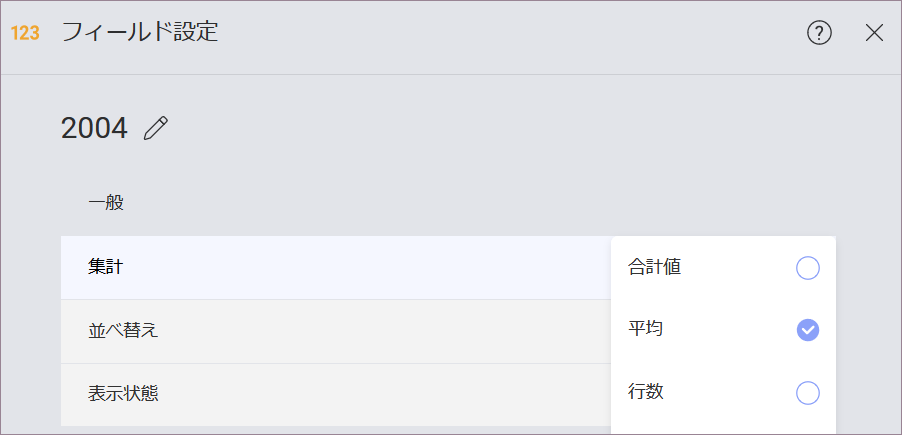         | **集計**のドロップダウンを展開し、別のオプションを選択します (平均値など)。|

### テキスト ゲージを作成する方法

|                                          |                                                                                                                   |                                                                                                                                                                                                                                                       |
| ---------------------------------------- | ----------------------------------------------------------------------------------------------------------------- | ----------------------------------------------------------------------------------------------------------------------------------------------------------------------------------------------------------------------------------------------------- |
| 1\. **ダッシュボードの作成**               |                                       | ダッシュボード ビューアーで、[ダッシュボード] 画面の右上隅にある [+] ボタンを選択します。 次に、ドロップダウンから [ダッシュボード] を選択します。                                                                                                  |
| 2\. **データ ソースの構成**       |                                           | *新しい表示形式*ウィンドウで、右下隅の [+] ボタンを選択し、データソースを選択します。                                                                                                                                        |
| 3\. **チュートリアル スプレッドシートの選択** |  | データソースを設定したら、**Reveal チュートリアル スプレッドシート**を選択します。次に、[ゲージ ビュー] シートを選択します。                                                                                                                               |
| 4\. **表示形式メニューを開く**     |                         | 表示形式エディターのトップ バーで**グリッド アイコン**を選択します。                                                                                                                                                                                 |
| 5\. **表示形式の選択**        | 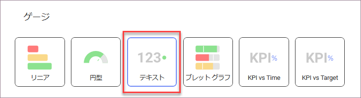                                        | デフォルトで、表示形式のタイプは*グリッド*に設定されています。[テキスト] ゲージを選択してください。                                                                                                                                                                    |
| 6\. **データの体系化**               | 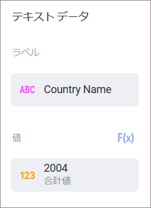                            | 例えば、このテキスト ゲージは国別平均寿命を表します。年フィールドの 1 つを [値] にドラッグアンドドロップし、[Country Name] フィールドを [データ フィルター] にドラッグアンドドロップします。次に、フィールドを選択して、必要な特定の国を選択します。|

上記の [テキスト ゲージのサンプル] は平均値の集計を使用します。フィールドの集計を変更するために、[この手順](#aggregation-instructions)をご参照ください。

### ブレット グラフを作成する方法

|                                          |                                                                                                                   |                                                                                                                                                                                              |
| ---------------------------------------- | ----------------------------------------------------------------------------------------------------------------- | -------------------------------------------------------------------------------------------------------------------------------------------------------------------------------------------- |
| 1\. **ダッシュボードの作成**               |                                       | ダッシュボード ビューアーで、[ダッシュボード] 画面の右上隅にある [+] ボタンを選択します。次に、ドロップダウンから [ダッシュボード] を選択します。                                         |
| 2\. **データ ソースの構成**       |                                           | *新しい表示形式*ウィンドウで、右下隅の [+] ボタンを選択し、データソースを選択します。                                                                               |
| 3\. **チュートリアル スプレッドシートの選択** |  | データソースを設定したら、**Reveal チュートリアル スプレッドシート**を選択します。次に、[ゲージ ビュー] シートを選択します。                                                                       |
| 4\. **表示形式メニューを開く**     |                         | 表示形式エディターのトップ バーで**グリッド アイコン**を選択します。                                                                                                                        |
| 5\. **表示形式の選択**        | 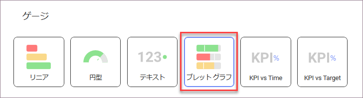                        | デフォルトで、表示形式のタイプは*グリッド*に設定されています。ブレット グラフ の表示形式を選択してください。                                                                                           |
| 6\. **データの体系化**               | 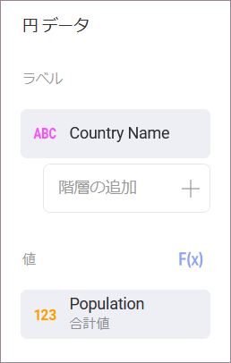                                  | 例えば、このブレット グラフ は国別平均寿命を表します。[ラベル] に [Country Name] フィールド、年フィールドの 1 つを [値] に、別の年フィールドを [ターゲット] にドラッグアンドドロップします。|

### ゲージの化でしきい値を追加する方法

しきい値を使用すると、ゲージの最小値と最大値を設定できます。 [重要なコンセプト](#key-concepts)で述べたように、特定のデータを除外するように変更できます。以下は作業手順です。

|                                                |                                                                        |                                                                                                                                       |
| ---------------------------------------------- | ---------------------------------------------------------------------- | ------------------------------------------------------------------------------------------------------------------------------------- |
| 1\. **設定を変更します。**                        | 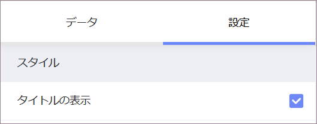 | 表示形式エディターの**設定**セクションへ移動します。                                                                           |
| 2\. **制限のデフォルトの選択を変更する** | 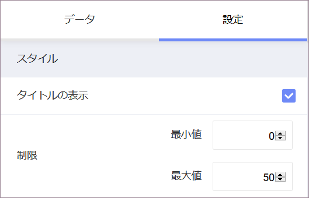         | 最大値または最小値 (または両方) 値を設定するかどうかに基づいて、チャートの開始値または終了値を入力します。|

### バンドの色の変更

以下は、バンド ([より大きい]、[中間] および [より小さい]) の色を変更するための手順です。以下は変更手順です。

|                                    |                                                                        |                                                                          |
| ---------------------------------- | ---------------------------------------------------------------------- | ------------------------------------------------------------------------ |
| 1\. **設定を変更します。**            |  | 表示形式エディターの**設定**セクションへ移動します。              |
| 2\. **色のドロップダウンを表示します。** | 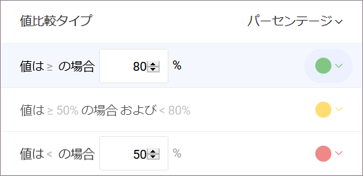     | 色を変更する範囲のドロップダウンを展開します。|
| 3\. **色を選択します。**          | 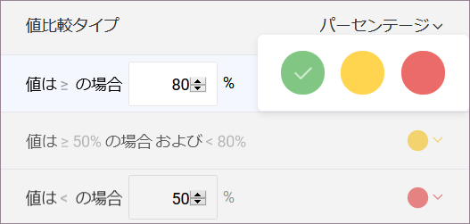       | バンドの色として、Reveal の 3 つの定義済み色のいずれかを選択します。      |
