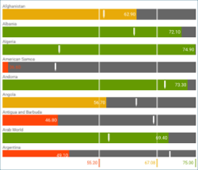
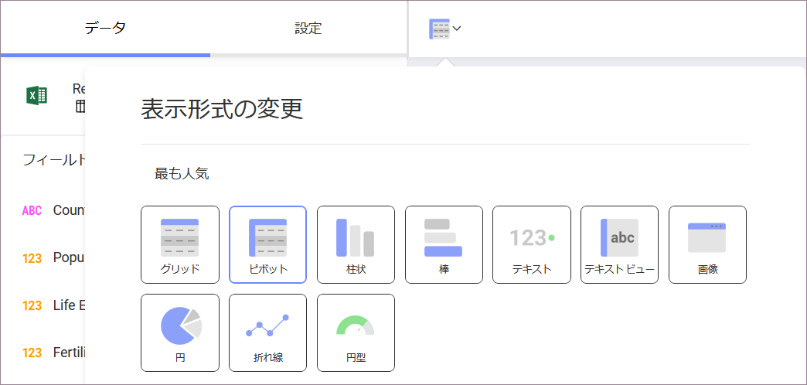

## ゲージで表示形式を作成する方法

このチュートリアルは、サンプル スプレッドシートを使用したゲージでデータの可視化を行います。

<table>
<colgroup>
<col style="width: 33%" />
<col style="width: 33%" />
<col style="width: 33%" />
</colgroup>
<tbody>
<tr class="odd">
<td>
 

<a href="#create-linear-gauge">リニア ゲージ</a> 

</td>
<td>
 

<a href="#create-circular-gauge">円形ゲージ</a> 

</td>
<td>
 

<a href="#create-text-gauge">テキスト ゲージ</a> 

</td>
</tr>
<tr class="even">
<td>
 

<a href="#create-bullet-graph-gauge">ブレット グラフ</a> 

</td>
<td>
 

<a href="#adding-bounds-gauge">範囲構成のリニア ゲージ</a> 

</td>
<td>
 

<a href="#modify-bands">バンドの色が異なるリニア ゲージ</a> 

</td>
</tr>
</tbody>
</table>

ゲージ ビューのためのガイドは、以下のリンクから参照してください。

  - [リニア ゲージの作成方法](#create-linear-gauge)

  - [ラジアル ゲージの作成方法](#create-circular-gauge)

  - [ラベル ゲージの作成方法](#create-text-gauge)

  - [ブレット グラフ の作成方法](#create-bullet-graph-gauge)

  - [ゲージ可視化に範囲を追加する方法](#adding-bounds-gauge)

  - [バンドの色を変更する方法](#modify-bands)

### 重要なコンセプト

積層型チャートは、 3 つのレイアウトから選択できます:

  - **しきい値の構成**。ゲージのしきい値の構成ではゲージの最大値と最小値を設定できます。デフォルトで最小値に設定されますが、特定のデータを除外するために変更できます。

  - **バンド構成**。バンドの構成は 3 つの範囲を設定できます ([より大きい]、[中間]、[より小さい]) です。データ ソースに基づく範囲でデフォルトの値を上書きします。

### サンプル データ ソース

このチュートリアルでは、[Reveal チュートリアル スプレッドシート](http://download.infragistics.com/reportplus/help/samples/Reveal_Visualization_Tutorials.xlsx).

>[!NOTE]
>このリリースでは、ローカル ファイルとしての Excel ファイルはサポートされていません。チュートリアルを実行するには、サポートされている[クラウド サービス](data-sources.md)のいずれかにファイルをアップロードするか、[Web リソース](web-resource.md)として追加してください。

### リニア ゲージを作成する方法

|                                          |                                                                                            |                                                                                                                                                                       |
| ---------------------------------------- | ------------------------------------------------------------------------------------------ | --------------------------------------------------------------------------------------------------------------------------------------------------------------------- |
| 1\. **Create a Dashboard**               |                | In the dashboard viewer, select the + button in the top right-hand corner of the "My Dashboards" screen. Then, select "Dashboard" from the dropdown.                  |
| 2\. **Configure your Data Source**       |                    | In the *New Visualization* window, select the + button in the bottom right corner and select your data source.                                                        |
| 3\. **Select the Tutorials Spreadsheet** |                    | Once the data source is configured, select the **Reveal Tutorials Spreadsheet**. Then, choose the "Gauge Views" sheet and select *Load Data*.                         |
| 4\. **Open the Visualizations Menu**     |  | Select the **grid icon** in the top bar of the Visualizations Editor.                                                                                                 |
| 5\. **Select your Visualization**        |                  | By default, the visualization type will be set to "Grid". Select the "Linear" gauge.                                                                                  |
| 6\. **Organize your Data**               |                        | This linear gauge, for example, will display life expectancy per Country. Drag and drop the "Country Name" field to "Label" and one of the year fields into "Values". |

### 円形ゲージを作成する方法

|                                          |                                                                                            |                                                                                                                                                                       |
| ---------------------------------------- | ------------------------------------------------------------------------------------------ | --------------------------------------------------------------------------------------------------------------------------------------------------------------------- |
| 1\. **ダッシュボードの作成**               |                | In the dashboard viewer, select the + button in the top right-hand corner of the "My Dashboards" screen. Then, select "Dashboard" from the dropdown.                  |
| 2\. **データ ソースの構成**       |                    | In the *New Visualization* window, select the + button in the bottom right corner and select your data source.                                                        |
| 3\. **Select the Tutorials Spreadsheet** |                    | Once the data source is configured, select the **Reveal Tutorials Spreadsheet**. Then, choose the "Gauge Views" sheet and select *Load Data*.                         |
| 4\. **Open the Visualizations Menu**     |  | Select the **grid icon** in the top bar of the Visualizations Editor.                                                                                                 |
| 5\. **Select your Visualization**        |                  | By default, the visualization type will be set to "Grid". Select the "Circular" gauge.                                                                                |
| 6\. **Organize your Data**               |                    | This radial gauge, for example, will display life expectancy per Country. Drag and drop the "Country Name" field to "Label" and one of the year fields into "Values". |

円形ゲージは、特に平均値と値の合計の表示に適しています。[値] に表示されるフィールドの集計を変更する手順:

|                                              |                                                                            |                                                                                           |
| -------------------------------------------- | -------------------------------------------------------------------------- | ----------------------------------------------------------------------------------------- |
| 1\. **Access Field Settings for your Value** |  | Select the field in **Values** to access                                                  |
| 2\. **Choose a different Aggregation**       |          | Expand the **Aggregation** dropdown and select a different option (for example, Average). |

### テキスト ゲージを作成する方法

|                                          |                                                                                                                   |                                                                                                                                                                                                                                                       |
| ---------------------------------------- | ----------------------------------------------------------------------------------------------------------------- | ----------------------------------------------------------------------------------------------------------------------------------------------------------------------------------------------------------------------------------------------------- |
| 1\. **Create a Dashboard**               |                                       | In the dashboard viewer, select the + button in the top right-hand corner of the "My Dashboards" screen. Then, select "Dashboard" from the dropdown.                                                                                                  |
| 2\. **Configure your Data Source**       |                                           | In the *New Visualization* window, select the + button in the bottom right corner and select your data source.                                                                                                                                        |
| 3\. **Select the Tutorials Spreadsheet** |  | Once the data source is configured, select the **Reveal Tutorials Spreadsheet**. Then, choose the "Gauge Views" sheet.                                                                                                                                |
| 4\. **Open the Visualizations Menu**     |                         | Select the **grid icon** in the top bar of the Visualizations Editor.                                                                                                                                                                                 |
| 5\. **Select your Visualization**        |                                         | By default, the visualization type will be set to "Grid". Select the "Text" gauge.                                                                                                                                                                    |
| 6\. **Organize your Data**               |                             | This text gauge, for example, will display life expectancy per Country. Drag and drop one of the year fields into "Values", and then the "Country Name" field into "Data Filters". Then, select the specific country you want by selecting the field. |

The text gauge sample above utilizes the average aggregation. In order to learn how to change your field's aggregation, [review these instructions](#aggregation-instructions).

### ブレット グラフを作成する方法

|                                          |                                                                                                                   |                                                                                                                                                                                              |
| ---------------------------------------- | ----------------------------------------------------------------------------------------------------------------- | -------------------------------------------------------------------------------------------------------------------------------------------------------------------------------------------- |
| 1\. **Create a Dashboard**               |                                       | In the dashboard viewer, select the + button in the top right-hand corner of the "My Dashboards" screen. Then, select "Dashboard" from the dropdown.                                         |
| 2\. **Configure your Data Source**       |                                           | In the *New Visualization* window, select the + button in the bottom right corner and select your data source.                                                                               |
| 3\. **Select the Tutorials Spreadsheet** |  | Once the data source is configured, select the **Reveal Tutorials Spreadsheet**. Then, choose the "Gauge Views" sheet.                                                                       |
| 4\. **Open the Visualizations Menu**     |                         | Select the **grid icon** in the top bar of the Visualizations Editor.                                                                                                                        |
| 5\. **Select your Visualization**        |                         | By default, the visualization type will be set to "Grid". Select the "Bullet Graph" visualization.                                                                                           |
| 6\. **Organize your Data**               |                                   | This bullet graph, for example, will display life expectancy per Country. Drag and drop the "Country Name" field to "Label", one of the years into "Values", and another year into "Target". |

### ゲージの化でしきい値を追加する方法

しきい値を使用すると、ゲージの最小値と最大値を設定できます。 [重要なコンセプト](#key-concepts)で述べたように、特定のデータを除外するように変更できます。以下は作業手順です。

|                                                |                                                                        |                                                                                                                                       |
| ---------------------------------------------- | ---------------------------------------------------------------------- | ------------------------------------------------------------------------------------------------------------------------------------- |
| 1\. **Change Settings**                        |  | Go to the **Settings** section of the Visualization Editor.                                                                           |
| 2\. **Change the Default selection in Limits** |          | Depending on whether you want to set the minimum or maximum value (or both), enter the value you want the chart to start or end with. |

### バンドの色の変更

以下は、バンド ([より大きい]、[中間] および [より小さい]) の色を変更するための手順です。以下は変更手順です。

|                                    |                                                                        |                                                                          |
| ---------------------------------- | ---------------------------------------------------------------------- | ------------------------------------------------------------------------ |
| 1\. **Change Settings**            |  | Go to the **Settings** section of the Visualization Editor.              |
| 2\. **Access the Colors dropdown** |      | Expand the dropdown of the range for which you want to change the color. |
| 3\. **Select your Color**          |        | Select one of Reveal's three predefined colors for your band color.      |
