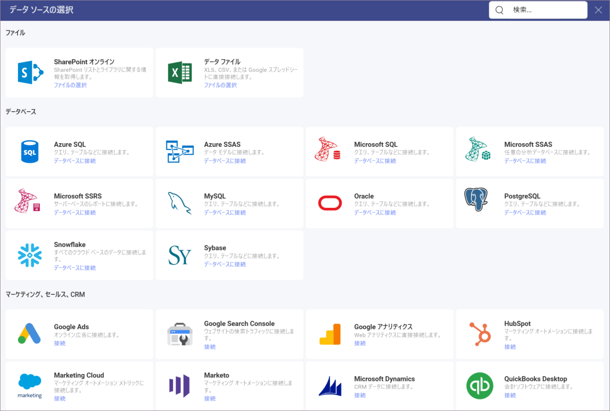

# 画像チャートを作成する方法

このチュートリアルでは、サンプル スプレッドシートを使用して画像の表示形式を作成する方法を説明します。

## 重要なコンセプト

[データ表示] セクションに述べたように、[画像チャート](image-chart.md)は URL へ要求を送信して、埋め込みのブラウザーで結果を表示します。したがって、データ ソースに以下の項目が必要です:

  - ウィジェットに表示されるウェブ リソースへのリンク。

  - リンクを**データセットの最初の行**に含みます。

## サンプル データ ソース

このチュートリアルでは、[Slingshot Visulization Tutorials](https://download.infragistics.com/reportplus/help/samples/Reveal_Visualization_Tutorials.xlsx) の「Image Chart」シートを使用します。

 1. **[分析]** で、右上隅にある **[+ ダッシュボード]** を選択します。

     

 2. ダイアログが開き、すでに追加されているデータ ソースのリストが表示されます。Visualization Tutorial (表示形式チュートリアル) ファイルは、すでに使用している場合はデータ ソースとしてそこにあります。ファイルを追加していない場合は、**[+ データ ソース]** > **[データ ファイル]** > **[+ 新規]** > **[アップロード]** をクリックまたはタップして、ファイルを選択し、**[選択して続行]** ををクリックまたはタップしてリストに含めます。

    

 3. データ ソースを設定した、*Image View* シートを選択します。                                

    

 4. デフォルトで、表示形式のタイプは**柱状**に設定されています。**画像**オプションを選択します。

       
                                                      
5. 使用可能なフィールドのいずれかを **[URL]** にドラッグします。        

   
