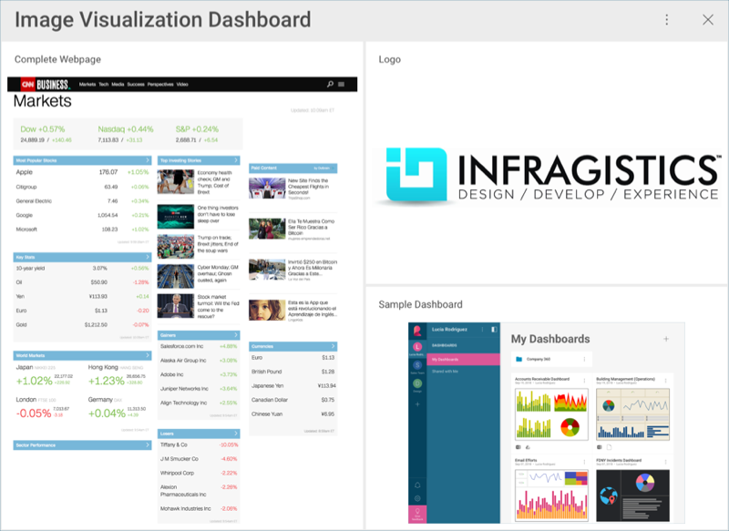
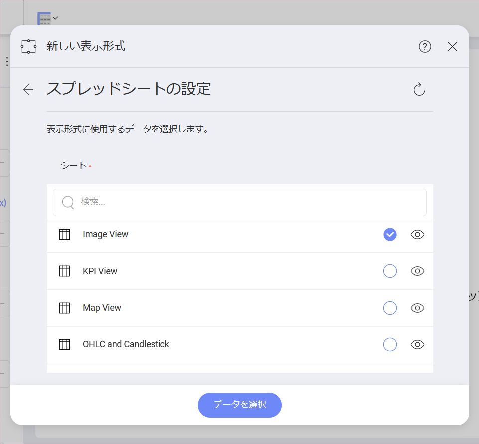
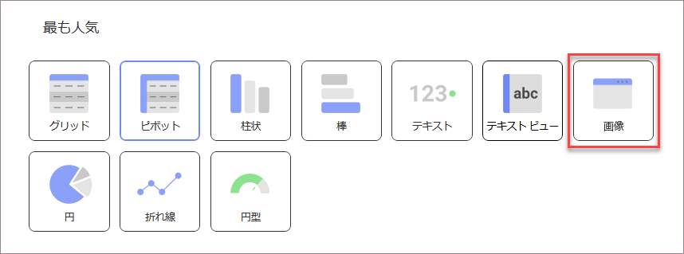
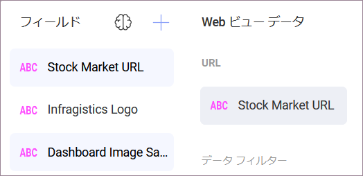

## 画像ビューを作成する方法

このチュートリアルでは、サンプル スプレッドシートを使用して画像の表示形式を作成する方法を説明します。

### 重要なコンセプト

[データ表示] セクションに述べたように、画像ビュー は URL へ要求を送信して、埋め込みのブラウザーで結果を表示します。したがって、データソースに以下の項目が必要です:

  - ウィジェットに表示される Web リソースへのリンク。

  - リンクを**データセットの最初の行**に含みます。

### サンプル データソース

このチュートリアルでは、[Reveal チュートリアル スプレッドシート](http://download.infragistics.com/reportplus/help/samples/Reveal_Visualization_Tutorials.xlsx)の「Image View」シートを使用します。

>[!NOTE]
>このリリースでは、ローカル ファイルとしての Excel ファイルはサポートされていません。チュートリアルを実行するには、サポートされているクラウド サービスのいずれかにファイルをアップロードするか、[Web リソース](~/jp/datasources/supported-data-sources/web-resource.html)として追加してください。

### イメージ ビューを作成する方法

|                                          |                                                                                                |                                                                                                                                                      |
| ---------------------------------------- | ---------------------------------------------------------------------------------------------- | ---------------------------------------------------------------------------------------------------------------------------------------------------- |
| 1\. **ダッシュボードを作成する**               |                    | ダッシュボード ビューアーで、[ダッシュボード] 画面の右上隅にある [+ ダッシュボード] ボタンを選択します。|
| 2\. **データソースを構成する**       |                        | [新しい表示形式] ウィンドウで、右下隅の [+ データソース] ボタンを選択し、データソースを選択します。                                       |
| 3\. **チュートリアル スプレッドシートを選択する** |  | データソースを設定したら、**Reveal チュートリアル スプレッドシート**を選択します。次に、Image View シートを選択し、[データを選択] を選択します。                               |
| 4\. **表示形式メニューを開く**     |      | 表示形式エディターのトップ バーで**グリッド アイコン**を選択します。                                                                                |
| 5\. **表示形式を選択する**        |                            | デフォルトで、表示形式のタイプは**グリッド**に設定されています。**[画像]** オプションを選択してください。                                                               |
| 6\. **データを構成する**               |          | 使用可能なフィールドのいずれかを **URL** にドラッグします。                                                                                                       |
