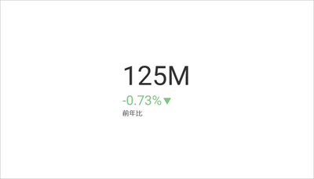

## KPI ゲージを作成

このチュートリアルでは、サンプル スプレッドシートを使用して KPI ゲージの表示形式を作成する方法を説明します。

<table>
<colgroup>
<col style="width: 50%" />
<col style="width: 50%" />
</colgroup>
<tbody>
<tr class="odd">
<td>
 

<a href="#create-kpi-gauge">KPI ゲージ</a> 

</td>
<td>
 

<a href="#adding-category-kpi">複数の KPI ゲージ</a> 

</td>
</tr>
<tr class="even">
<td>
 

<a href="#changing-date-comparison-type">月ごとの KPI ゲージ</a> 

</td>
<td>
 

<a href="#changing-difference-label-kpi">値とパーセンテージの違いがある KPI ゲージ</a> 

</td>
</tr>
<tr class="odd">
<td>
 

<a href="#changing-color-difference-marker">値が減少したときに緑色のマーカーが付いた KPI ゲージ</a> 

</td>
<td></td>
</tr>
</tbody>
</table>

KPI ゲージ ビューのためのガイドは、以下のリンクから参照してください:

  - [KPI ゲージの作成方法](#create-kpi-gauge)

  - [1 つの表示形式で複数の KPI ゲージを作成する方法](#adding-category-kpi)

  - [KPI の日付タイプを変更する方法](#changing-date-comparison-type)

  - [KPI の差分ラベルを変更する方法](#changing-difference-label-kpi)

  - [KPI の差分マーカーの色を変更する方法](#changing-color-difference-marker)

### 重要なコンセプト

KPI ゲージは、特定の期間内のパフォーマンスとその変動を表示するためのものです。作成するには、次のものが必要です:

  - データ エディターの **[日付]**プレースホルダーへ **1 フィールド**ドロップします。

  - **1 フィールド**を **[値]** へドロップします。

### サンプル データ ソース

このチュートリアルでは、[Reveal チュートリアル スプレッドシート](http://download.infragistics.com/reportplus/help/samples/Reveal_Visualization_Tutorials.xlsx)の [KPI ビュー] のシートを使用します。

>[!NOTE]
>このリリースでは、ローカル ファイルとしての Excel ファイルはサポートされていません。チュートリアルを実行するには、サポートされている[クラウド サービス](data-sources.md)のいずれかにファイルをアップロードするか、[Web リソース](web-resource.md)として追加してください。

### KPI ゲージを作成

|                                          |                                                                                              |                                                                                                                                                      |
| ---------------------------------------- | -------------------------------------------------------------------------------------------- | ---------------------------------------------------------------------------------------------------------------------------------------------------- |
| 1\. **Create a Dashboard**               |                  | In the dashboard viewer, select the + button in the top right-hand corner of the "My Dashboards" screen. Then, select "Dashboard" from the dropdown. |
| 2\. **Configure your Data Source**       |                      | In the *New Visualization* window, select the + button in the bottom right corner and select your data source.                                       |
| 3\. **Select the Tutorials Spreadsheet** |  | Once the data source is configured, select the **Reveal Tutorials Spreadsheet**. Then, choose the "KPI Gauge" sheet.                                 |
| 4\. **Open the Visualizations Menu**     |    | Select the **grid icon** in the top bar of the Visualizations Editor.                                                                                |
| 5\. **Select your Visualization**        |                          | By default, the visualization type will be set to "Grid". Select the **Sparkline** chart.                                                            |
| 6\. **Organize your Data**               |          | Drag and drop the "Date" field into "Date" and the "Sales" field into "Value".                                                                       |

### 1 つの表示形式で複数の KPI ゲージを作成する方法

1 つの表示形式で複数の KPI を作成するには、データ エディターの**カテゴリ** プレースホルダーにフィールドを追加する必要があります。

|                                          |                                                                                                      |                                                                                                                                                      |
| ---------------------------------------- | ---------------------------------------------------------------------------------------------------- | ---------------------------------------------------------------------------------------------------------------------------------------------------- |
| 1\. **Create a Dashboard**               |                          | In the dashboard viewer, select the + button in the top right-hand corner of the "My Dashboards" screen. Then, select "Dashboard" from the dropdown. |
| 2\. **Configure your Data Source**       |                              | In the *New Visualization* window, select the + button in the bottom right corner and select your data source.                                       |
| 3\. **Select the Tutorials Spreadsheet** |          | Once the data source is configured, select the **Reveal Tutorials Spreadsheet**. Then, choose the "KPI Gauge" sheet.                                 |
| 4\. **Open the Visualizations Menu**     |            | Select the **grid icon** in the top bar of the Visualizations Editor.                                                                                |
| 5\. **Select your Visualization**        |                                  | By default, the visualization type will be set to "Grid". Select the **Sparkline** chart.                                                            |
| 6\. **Organize your Data**               |  | Drag and drop the "Date" field into "Date", the "Sales" field into "Value" and the "State" field into "Category".                                    |

### 日付比較タイプの変更

デフォルトでは、KPI ゲージの日付タイプは前年比になります。[タイプ] フィールドを変更することでこれを変更できます。以下は変更手順です。

|                                  |                                                                        |                                                                                                                                                |
| -------------------------------- | ---------------------------------------------------------------------- | ---------------------------------------------------------------------------------------------------------------------------------------------- |
| 1\. **Access the Settings Menu** |  | Go to the **Settings** section of the Visualization Editor.                                                                                    |
| 2\. **Change the Type**          |      | By default, the date type will be set to Year-to-Year. Select the dropdown next to **Type**, and change the selection to **Month-over-Month**. |

### KPI ゲージの差分ラベルの変更

|                                  |                                                                                            |                                                                                                                                                                         |
| -------------------------------- | ------------------------------------------------------------------------------------------ | ----------------------------------------------------------------------------------------------------------------------------------------------------------------------- |
| 1\. **Access the Settings Menu** |                      | Go to the **Settings** section of the Visualization Editor.                                                                                                             |
| 2\. **Change the Type**          |  | By default, the difference label will be set to "Percentage". Select the dropdown next to **Show difference as**, and change the selection to **Value and Percentage**. |

### 差分マーカーの色の変更

デフォルトでは、 KPI ゲージのマーカーの色は、正の値の場合は緑、負の値の場合は赤に設定されます。ただし、減少をプラスとして表現したい場合もあります。以下は設定方法です。

|                                  |                                                                                                          |                                                                                                                                                             |
| -------------------------------- | -------------------------------------------------------------------------------------------------------- | ----------------------------------------------------------------------------------------------------------------------------------------------------------- |
| 1\. **Access the Settings Menu** |                                    | Go to the **Settings** section of the Visualization Editor.                                                                                                 |
| 2\. **Change the Type**          |  | By default, the color of the marker will be set to green. Select the dropdown next to **When difference is positive**, and change the selection to **red**. |
