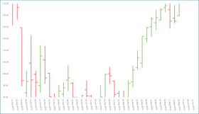
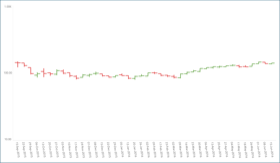
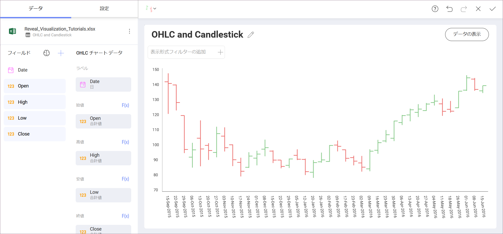
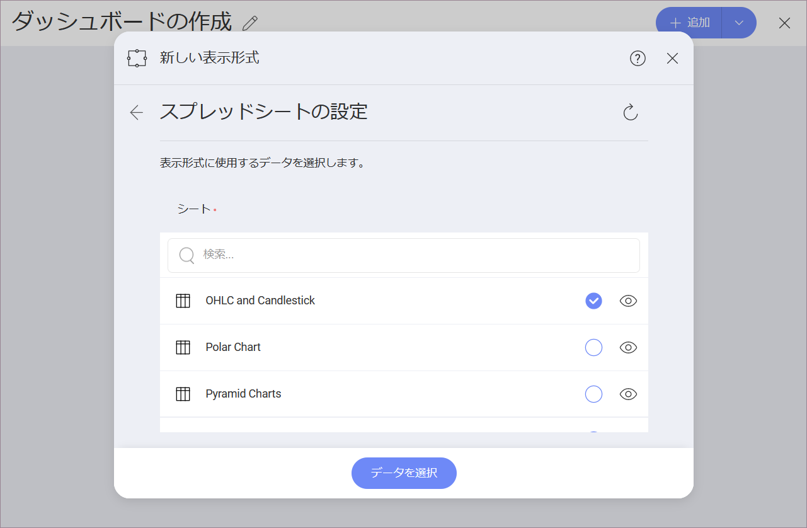
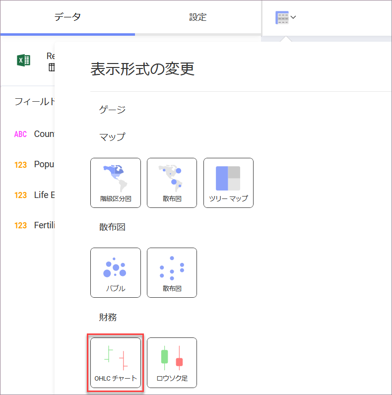
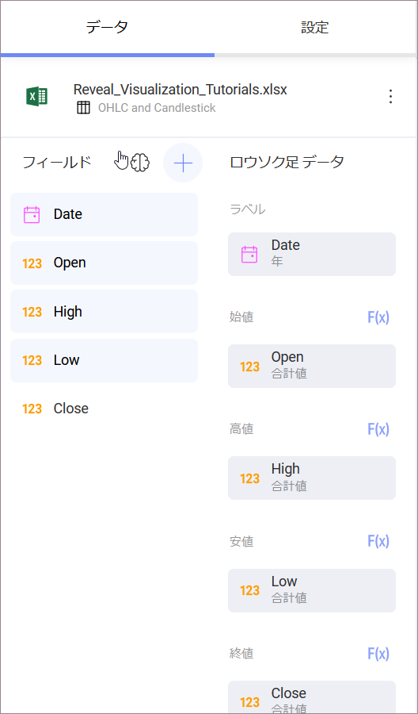
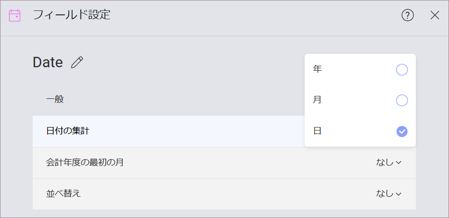
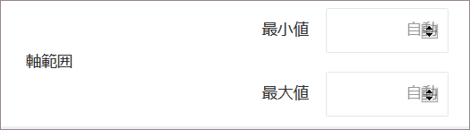
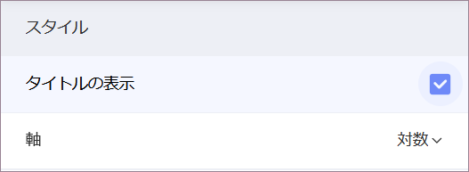

# OHLC チャートを作成する方法

このチュートリアルは、サンプル スプレッドシートを使用して OHLC チャートを作成する方法を説明します。

<table>
<colgroup>
<col style="width: 33%" />
<col style="width: 33%" />
<col style="width: 33%" />
</colgroup>
<tbody>
<tr class="odd">
<td>
 

<a href="#creating-ohlc-chart">OHLC チャート</a> 

</td>
<td>
 

<a href="#changing-axis-configuration">範囲の OHLC チャート</a> 

</td>
<td>
 

<a href="#setting-logarithmic-axis">対数軸の OHLC チャート</a> 

</td>
</tr>
</tbody>
</table>

OHLC チャート ビューのガイドは、以下のリンクから参照してください。

  - [OHLC 足チャートを作成する方法](#OHLC-足チャートを作成する方法)

  - [軸の構成を変更する方法](#軸の構成を変更する)

  - [軸の構成を対数に変更する方法](#軸の構成を対数に変更する)

## 重要なコンセプト

OHLC チャートとローソク足チャートは各財務データの始値、高値、安値、終値を表します。ファイナンシャル シナリオと株の変動の分析のために役立ちます。このチャートは各垂直軸に始まり値および終値を表す 2 つの水平線で数値を垂直軸に表します。

そのため、OHLC チャートには以下の項目が必要になります。

  - **データ エディターの [ラベル] プレースホルダーにドロップされる 1 つのフィールド。** 通常は日付に関連しています。

  - データ エディターの [始値]、[高値]、[安値]、および [終値] カテゴリの **4 つの異なるフィールド**。

チャートに追加情報を表示するためのオプションが複数あります。

  - **軸の構成**: 軸の構成でチャートの最大値と最小値を構成できます。デフォルトで最小値は 0 に設定され、最大値は使用されるデータによって設定されます。

  - **対数軸構成**: [対数] ボックスをチェックすると、値のスケールは通常のリニア スケールを使用する代わりに大きさを使用するリニア スケール以外で計算されます。

## サンプル データ ソース

このチュートリアルでは、[Reveal チュートリアル スプレッドシート](https://download.infragistics.com/reportplus/help/samples/Reveal_Visualization_Tutorials.xlsx)の「OHLC and Candlestick」シートを使用します。

>[!NOTE]
>このリリースでは、ローカル ファイルとしての Excel ファイルはサポートされていません。チュートリアルを実行するには、サポートされているクラウド サービスのいずれかにファイルをアップロードするか、[ウェブ リソース](~/jp/datasources/supported-data-sources/web-resource.html)として追加してください。

## OHLC チャートを作成する方法

|                                          |                                                                                                                          |                                                                                                                                                       |
| ---------------------------------------- | ------------------------------------------------------------------------------------------------------------------------ | ----------------------------------------------------------------------------------------------------------------------------------------------------- |
| 1\. **ダッシュボードを作成する**               |                                              | ダッシュボード ビューアーで、[ダッシュボード] 画面の右上隅にある [+ ダッシュボード] ボタンを選択します。|
| 2\. **データ ソースを構成する**       |                                                  | [新しい表示形式] ウィンドウで、右下隅の [+ データ ソース] ボタンを選択し、データ ソースを選択します。                                        |
| 3\. **チュートリアル スプレッドシートを選択する** |  | データ ソースを設定したら、**Reveal チュートリアル スプレッドシート**を選択します。次に、OHLC and Candlestick シートを選択します。                      |
| 4\. **表示形式ペインを開く**     |                                | 表示形式エディターのトップ バーで**グリッド アイコン**を選択します。                                                                                 |
| 5\. **表示形式を選択する**        |                                      | デフォルトで、表示形式のタイプは**グリッド**に設定されています。**[OHLC]** を選択します。                                                                        |
| 6\. **データを構成する**               |                              | Date フィールドを **[ラベル]** にドラッグアンドドロップし、Open、High、Low および Close フィールドを対応するプレースホルダーにドラッグアンドドロップします。                      |
| 7\. **日付集計を変更する**      |            | データ エディターのラベル プレースホルダーで Date フィールドを選択し、**[日付集計]** を **[日]** に変更します。次に、**[フィールドの更新]** を選択します。 |

## 軸の構成の変更

[ゲージの範囲](gauge-views.html#adding-bounds-gauge)と同様に、チャート軸構成でチャートの最小と最大値を設定できます。この機能を使用して、特定のデータ含有や除外ができます。

以下は軸構成のメニューへアクセスするための手順です。

|                                             |                                                                                      |                                                             |
| ------------------------------------------- | ------------------------------------------------------------------------------------ | ----------------------------------------------------------- |
| 1\. **設定メニューへアクセスする**            |                | 表示形式エディターの **[設定]** セクションに移動します。 |
| 2\. **軸範囲セクションに移動する** |  | 変更する設定は**軸範囲**です。   |

最大値または最小値 (または両方) のどれを設定するかに基づいて、以下のオプションの 1 つへアクセスする必要があります。

### 最小の限界を変更します。

デフォルトの値は 0 です。別の境界を設定するには、チャートの開始値を入力します。

### 最大値を変更します。

最大値のデフォルトは [自動] に設定されているため、Reveal は元のデータを使用します。別の値を設定するには、チャートの上限に設定する値を入力します。

## 軸構成を対数的としての設定

|                                        |                                                                                                       |                                                             |
| -------------------------------------- | ----------------------------------------------------------------------------------------------------- | ----------------------------------------------------------- |
| 1\. **設定メニューへアクセスする**       |                                 | 表示形式エディターの **[設定]** セクションに移動します。 |
| 2\. **軸を対数に変更する** |  | **[軸]** ドロップダウンを開き、**[対数]** を選択します。      |
