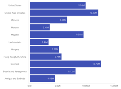
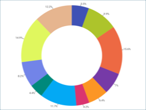
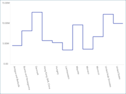
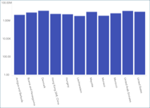
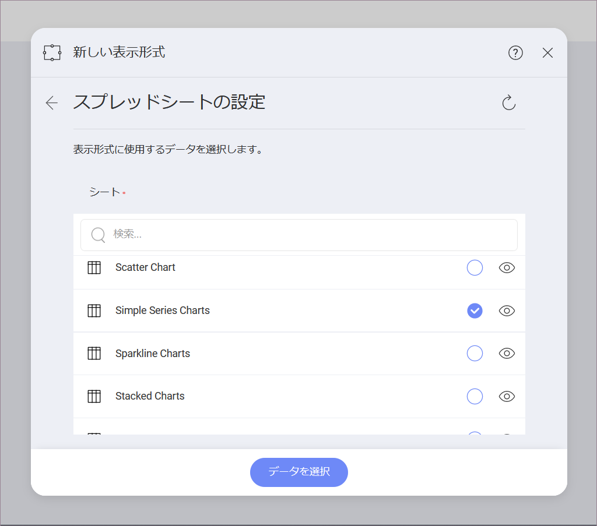

## シンプルシリーズのチャートの作成

このチュートリアルは、サンプル スプレッドシートを使用しシンプルシリーズのチャートを作成する方法を説明します。

<table>
<colgroup>
<col style="width: 33%" />
<col style="width: 33%" />
<col style="width: 33%" />
</colgroup>
<tbody>
<tr class="odd">
<td>
 

<a href="#create-basic-chart">エリア チャート</a> 

</td>
<td>
 

<a href="#create-basic-chart">棒チャート</a> 

</td>
<td>
 

<a href="#create-basic-chart">円/ラジアル チャート</a> 

</td>
</tr>
<tr class="even">
<td>
 

<a href="#create-basic-chart">柱状チャート</a> 

</td>
<td>
 

<a href="#create-basic-chart">ドーナツ型チャート</a> 

</td>
<td>
 

<a href="#create-basic-chart">ファンネル チャート</a> 

</td>
</tr>
<tr class="odd">
<td>
 

<a href="#create-basic-chart">折れ線チャート</a> 

</td>
<td>
 

<a href="#create-basic-chart">円チャート</a> 

</td>
<td>
 

<a href="#create-basic-chart">スプライン エリア チャート</a> 

</td>
</tr>
<tr class="even">
<td>
 

<a href="#create-basic-chart">スプライン チャート</a> 

</td>
<td>
 

<a href="#create-basic-chart">ステップ エリア チャート</a> 

</td>
<td>
 

<a href="#create-basic-chart">ステップ折れ線チャート</a> 

</td>
</tr>
<tr class="odd">
<td>
 

<a href="#add-trendline-chart">四次フィットトレンドラインのチャート</a> 

</td>
<td>
 

<a href="#change-axis-configuration">しきい値のチャート</a> 

</td>
<td>
 

<a href="#set-logarithmic-axis">対数軸構成のチャート</a> 

</td>
</tr>
<tr class="even">
<td>
 

<a href="#change-start-position">開始位置が270°のドーナツ型チャート</a> 

</td>
<td>
 

<a href="#change-slice-labels">値と割合のスライス ラベルが付いたドーナツ型チャート</em> slice labels</a> 

</td>
<td></td>
</tr>
</tbody>
</table>

シンプル チャート ビューのガイドは、以下のリンクから参照してください。

  - [エリア チャートを作成する方法](#create-basic-chart)

  - [チャートのタイプを変更する方法](#changing-chart-type)

  - [チャートにトレンドラインを追加する](#add-trendline-chart)

  - [軸の構成を変更する](#change-axis-configuration)

  - [軸の構成を対数に変更する](#set-logarithmic-axis)

  - [ドーナツ型と円チャートの開始位置の変更方法](#change-start-position)

  - [ファンネル、円とドーナツ型 チャートのスライスのラベルを変更する方法](#change-slice-labels)

### 重要なコンセプト

チャートを使用する時、可視化される情報とともに追加の情報も追加できます。これは以下の機能で追加できます。

  - チャートに折れ線で表示する**チャート トレンドライン**。変数間の関係や情報全体の方向性を表す場合に役立ちます。チャートに回帰と呼ばれるいくつかのアルゴリズムを適用できます。回帰は *[チャート トレンドライン]* から選択できます。

  - **軸の構成**: 軸の構成でチャートの最大値と最小値を構成できます。デフォルトで最小値は 0 に設定され、最大値は使用されるデータによって設定されます。

      - *対数軸構成*: [対数] ボックスをチェックする場合、値のスケールは通常のリニア スケールを使用する代わりに大きさを使用するリニア スケール以外で計算されます。

  - **開始位置**: 円チャートおよびドーナツ型チャートでチャートのスライスを回転する開始位置を構成し、データの表示順序を変更できます。

  - **スライス ラベル**: ドーナツ型、ファンネル、および円チャートでは、値やパーセンテージ、またはその両方を同時に表示するスライス ラベルを構成できます。

### サンプル データ ソース

このチュートリアルでは [Reveal チュートリアル スプレッドシート](http://download.infragistics.com/Reveal/help/samples/Reveal-Tutorials-Spreadsheet.xlsx) の [シンプル シリーズのチャート] のシートを使用します。

>[!NOTE]
>このリリースでは、ローカル ファイルとしての Excel ファイルはサポートされていません。チュートリアルを実行するには、サポートされている[クラウド サービス](data-sources.md)のいずれかにファイルをアップロードするか、[Web リソース](web-resource.md)として追加してください。

### チャートの作成

|                                          |                                                                                                                   |                                                                                                                                                                                                |
| ---------------------------------------- | ----------------------------------------------------------------------------------------------------------------- | ---------------------------------------------------------------------------------------------------------------------------------------------------------------------------------------------- |
| 1\. **ダッシュボードの作成**               |                                       | ダッシュボード ビューアーで、[ダッシュボード] 画面の右上隅にある [+] ボタンを選択します。次に、ドロップダウンから [ダッシュボード] を選択します。                                           |
| 2\. **データ ソースの構成**       |                                           | *新しい表示形式*ウィンドウで、右下隅の [+] ボタンを選択し、データソースを選択します。                                                                                |
| 3\. **チュートリアル スプレッドシートの選択** |  | データソースを設定したら、**Reveal チュートリアル スプレッドシート**を選択します。次に、「シンプル シリーズ チャート」 シートを選択します。                                                                |
| 4\. **表示形式メニューを開く**     |                         | 表示形式エディターのトップ バーで**グリッド アイコン**を選択します。                                                                                                                         |
| 5\. **表示形式の選択**        |                         | デフォルトで、表示形式のタイプは*グリッド*に設定されています。**チャート**の表示形式のいずれかを選択します。                                                                                          |
| 6\. **データの体系化**               |                                   | たとえば、上の表のチャートには、選択した国のリストの人口が表示されます。[ラベル] に [Country Name] フィールド、[Population] フィールドを [値] へドラッグアンドドロップします。|

### チャートのタイプの変更

上記のチュートリアルでは、チャートの作成方法を概説しています。必要に応じて別のタイプを選択する場合は、次の手順を実行してください。

|                                      |                                                                                            |                                                                                                                                 |
| ------------------------------------ | ------------------------------------------------------------------------------------------ | ------------------------------------------------------------------------------------------------------------------------------- |
| 1\. **表示形式メニューを開く** |  | 表示形式エディターのトップ バーで**グリッド アイコン**を選択します。                                                          |
| 2\. **表示形式の選択**    |  | このセクションの上部に各チャートのタイプのプレビューがあります。|

### チャートに近似曲線を追加する

情報全体の方向性またチャートの変数の関係を表すためにチャートの近似曲線を追加できます。以下は作業手順です。

|                                     |                                                                        |                                                                  |
| ----------------------------------- | ---------------------------------------------------------------------- | ---------------------------------------------------------------- |
| 1\. **設定を変更します**             |  | 表示形式エディターの**設定**セクションへ移動します。      |
| 2\. **チャートの近似曲線アクセスします** |  | 下矢印を選択して、[チャートの近似曲線] ドロップダウンを展開します。|
| 3\. **チャートの近似曲線を選択します**    |  | Reveal の定義済みの近似曲線の 1 つを選択します。                    |

### 軸の構成の変更

[ゲージのバンド](~/jp/data-visualizations/gauge-views.html#bands-configuration)と同様に、チャート軸構成でチャートの最小と最大値を設定できます。この機能を使用して、特定のデータ含有や除外ができます。

|                                        |                                                                                      |                                                                                                                                       |
| -------------------------------------- | ------------------------------------------------------------------------------------ | ------------------------------------------------------------------------------------------------------------------------------------- |
| 1\. **設定を変更します**                |                | 表示形式エディターの**設定**セクションへ移動します。                                                                           |
| 2\. **範囲の設定へアクセスします** |                            | 軸範囲に移動します。                                                                                                              |
| 3\. **デフォルト選択を変更します**   |  | 最大値または最小値 (または両方) 値を設定するかどうかに基づいて、チャートの開始値または終了値を入力します。|

### 軸を対数軸として設定

|                                           |                                                                          |                                                             |
| ----------------------------------------- | ------------------------------------------------------------------------ | ----------------------------------------------------------- |
| 1\. **設定を変更します**                   |    | 表示形式エディターの**設定**セクションへ移動します。|
| 2\. **軸オプションにアクセスする**            |                | 下矢印を選択して、軸ドロップダウンを展開します。       |
| 3\. **軸構成タイプを選択します** |  |「対数」を選択します。                                       |

### ドーナツ型と円チャートの開始位置の変更

|                                                   |                                                                                |                                                                                           |
| ------------------------------------------------- | ------------------------------------------------------------------------------ | ----------------------------------------------------------------------------------------- |
| 1\. **設定を変更します**                           |          | 表示形式エディターの**設定**セクションへ移動します。                               |
| 2\. **開始位置セクションにアクセスする**         |                | 下矢印を選択して、開始位置ドロップダウンを展開します。                           |
| 3\. **開始位置オプションの 1 つを選択します**。 |  | チャートに対して、Reveal の事前定義された開始位置 (0°、90°、180°、または 270°) のいずれかを選択します。 |

### ドーナツ型、ファンネルと円チャートのスライスのラベルの変更

|                                                |                                                                          |                                                                                                        |
| ---------------------------------------------- | ------------------------------------------------------------------------ | ------------------------------------------------------------------------------------------------------ |
| 1\. **設定を変更します**                        |    | 表示形式エディターの**設定**セクションへ移動します。                                            |
| 2\. **スライス ラベルのセクションにアクセスする**         |                | 下矢印を選択して、スライス ラベル ドロップダウンを展開します。                                          |
| 3\. **スライス ラベル オプションの 1 つを選択します**。 |  | Reveal の事前定義されたラベル付けオプション (パーセント、値、または値とパーセント) のいずれかを選択します。 |
