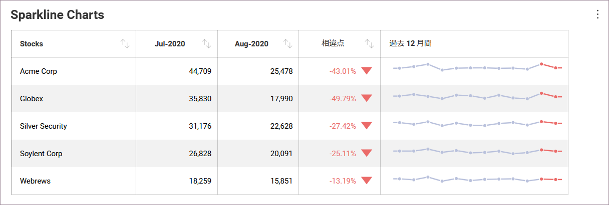
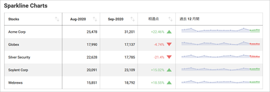
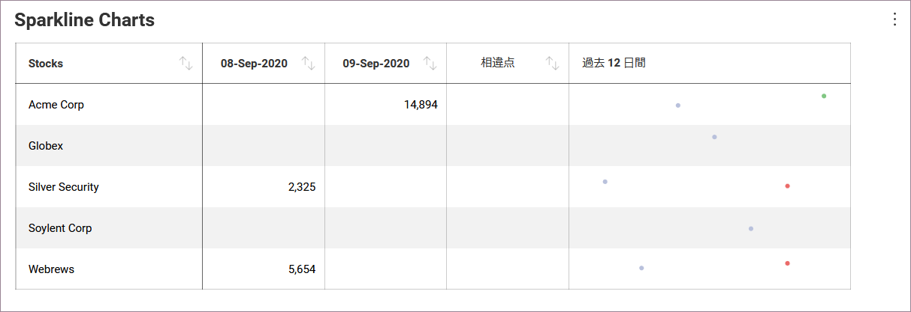
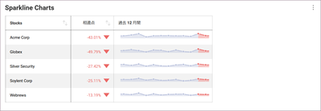
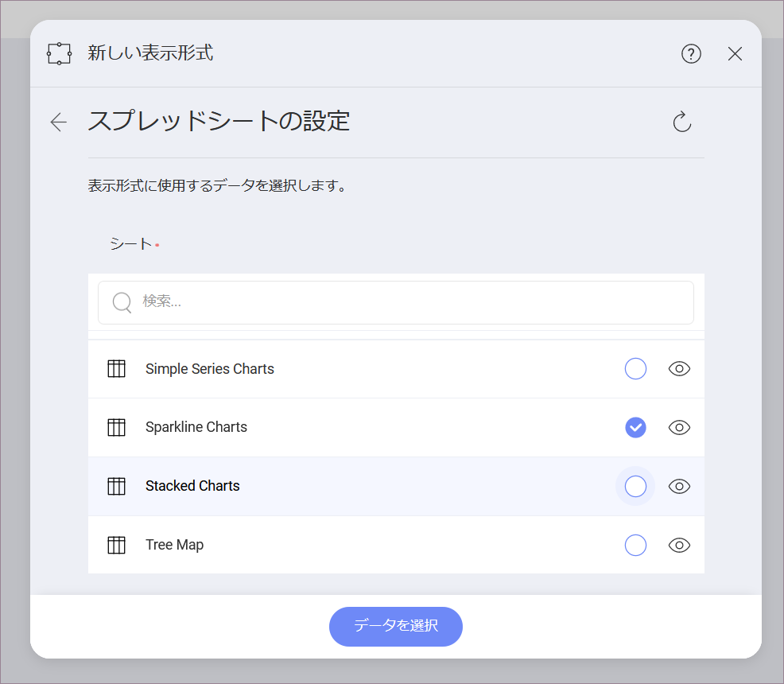
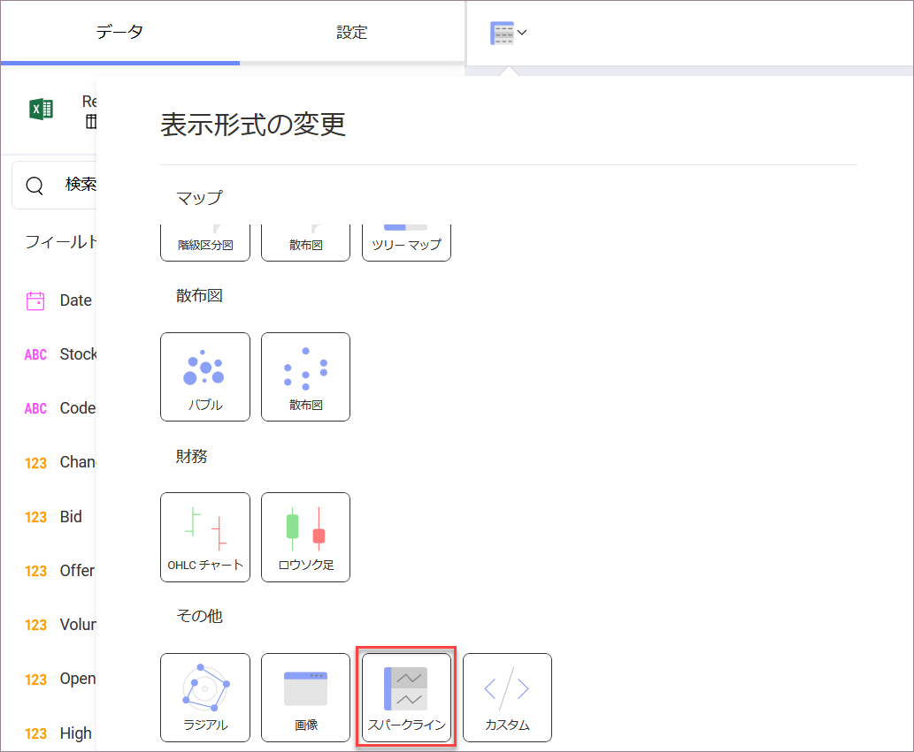
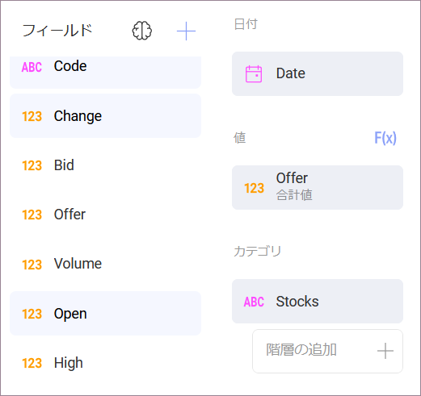
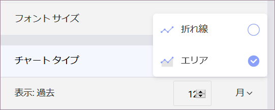
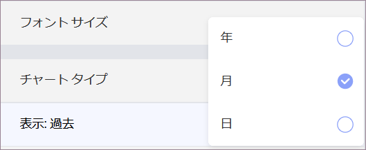
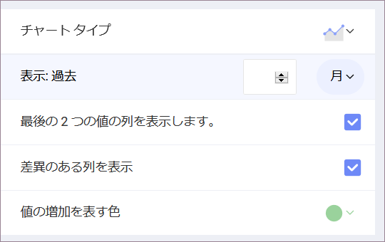

## スパークライン チャートを作成する方法

このチュートリアルは、サンプル スプレッドシートを使用してスパークライン チャートを作成する方法を説明します。

<table>
<colgroup>
<col style="width: 50%" />
<col style="width: 50%" />
</colgroup>
<tbody>
<tr class="odd">
<td>
 

<a href="#create-sparkline">シンプルなスパークライン</a> 

</td>
<td>
 

<a href="#change-chart-type-sparkline">エリア チャートのスパークライン</a> 

</td>
</tr>
<tr class="even">
<td>
 

<a href="#change-date-aggregation">日の集計のスパークライン</a> 

</td>
<td>
 

<a href="#modify-columns">データ量の少ない柱状およびエリア チャートのスパークライン</a> 

</td>
</tr>
</tbody>
</table>

スパークライン チャート ビューのガイドは、以下のリンクから参照してください。

  - [スパークライン チャートの作成](#スパークライン-チャートの作成)

  - [スパークラインのチャート タイプを変更する方法](#change-chart-type-sparkline)

  - [日付集計を変更する方法](#change-date-aggregation)

  - [スパークラインの列数を変更する方法](#modify-columns)

### 重要なコンセプト

スパークライン チャートは、指定した日付範囲のトレンドとその進行を表示します。OHLC チャートやローソク足チャートなど、ファイナンシャル シナリオと株の変動の分析のために役立ちます。
スパークラインは、グリッドセル内に折れ線チャートを表示します。

  - データ エディターの **[日付]** プレースホルダーにドロップする**フィールド**。

  - **[値]** にドロップする**フィールド**。

  - **[カテゴリ]** にドロップする**フィールド**。

スパークライン チャートを使用する時、表示するデータに対して情報を追加、変更または削除できます。これは以下の機能で追加できます。

  - スパークラインの**チャート タイプ**は、**折れ線**または**エリア** チャートのいずれかを選択できます。

  - チャートの日付**集計**。

  - 同じチャート内に表示される**値の数**。

  - データに**過去 2 か月を含めるかどうか、またそれらの差異など**、スパークラインのグリッドに含める明示的な情報。

### サンプル データ ソース

このチュートリアルでは [Reveal チュートリアル スプレッドシート](https://download.infragistics.com/reportplus/help/samples/Reveal_Visualization_Tutorials.xlsx) の「Sparkline Charts」シートを使用します。

>[!NOTE]
>このリリースでは、ローカル ファイルとしての Excel ファイルはサポートされていません。チュートリアルを実行するには、サポートされているクラウド サービスのいずれかにファイルをアップロードするか、[ウェブ リソースとして](~/jp/datasources/supported-data-sources/web-resource.md)追加してください。

### スパークライン チャートの作成

|                                          |                                                                                                                |                                                                                                                                                      |
| ---------------------------------------- | -------------------------------------------------------------------------------------------------------------- | ---------------------------------------------------------------------------------------------------------------------------------------------------- |
| 1\. **ダッシュボードを作成する**               |                                    | ダッシュボード ビューアーで、[ダッシュボード] 画面の右上隅にある [+ ダッシュボード] ボタンを選択します。 |
| 2\. **データ ソースを構成する**       |                                        | [新しい表示形式] ウィンドウで、右下隅の [+ データ ソース] ボタンを選択し、データ ソースを選択します。                                      |
| 3\. **チュートリアル スプレッドシートを選択する** |  | データ ソースを設定したら、**Reveal チュートリアル スプレッドシート**を選択します。次に、Sparkline Charts シートを選択します。                        |
| 4\. **表示形式メニューを開く**     |                      | 表示形式エディターのトップ バーの**グリッド アイコン**を選択します。                                                                                |
| 5\. **表示形式を選択する**        |                  | デフォルトで、表示形式のタイプは**グリッド**に設定されています。スパークライン チャートを選択します。                                                           |
| 6\. **データを構成する**               |                | Date フィールドを [日付] に、Offer を [値] に、Stocks を [カテゴリ] にドラッグアンドドロップします。                                                       |

### スパークラインのチャート タイプを変更する方法

スパークライン チャートに使用するチャートのタイプを変更できます。以下は作業手順です。

|                                  |                                                                                        |                                                                     |
| -------------------------------- | -------------------------------------------------------------------------------------- | ------------------------------------------------------------------- |
| 1\. **設定メニューへアクセスする** |                  | 表示形式エディターの **[設定]** セクションに移動します。         |
| 2\. **チャート タイプを変更する**    |  | デフォルトで、チャート タイプは [折れ線] に設定されています。[エリア] に設定します。 |

### 日付集計の変更

デフォルトでは、情報の集計は **12 ヶ月**です。[表示: 過去] 設定で変更できます。以下は変更手順です。

|                                  |                                                                                                      |                                                                                                                                                      |
| -------------------------------- | ---------------------------------------------------------------------------------------------------- | ---------------------------------------------------------------------------------------------------------------------------------------------------- |
| 1\. **設定メニューへアクセスする** |                                | 表示形式エディターの **[設定]** セクションに移動します。                                                                                          |
| 2\. **集計を変更する**   |  | デフォルトで、[表示: 過去] 設定は **[月]** に設定されます。[月] の横のドロップダウンを選択し、[年] または [日] に変更します。|

日付の集計の隣にある数値を変更して、表示するデータを増減できます。

### スパークラインの列数を変更する方法

Reveal で、表示形式の列数は、過去 2 か月とそれらの差を表示するかどうかによって定義されます。デフォルトで有効になります。以下は削除方法です。

|                                      |                                                                                    |                                                                                                                                                          |
| ------------------------------------ | ---------------------------------------------------------------------------------- | -------------------------------------------------------------------------------------------------------------------------------------------------------- |
| 1\. **設定メニューへアクセスする**     |              | 表示形式エディターの **[設定]** セクションに移動します。                                                                                              |
| 2\. **表示列を変更する** |  | どちらもスパークラインに表示しない場合は、**[最後の 2 つの値の列を表示] または [差異のある列を表示] ボックスをオフにします**。|
