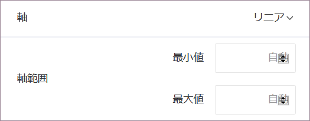
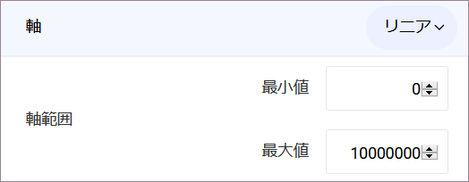

## 積層型チャートを作成する方法

このチュートリアルはサンプル スプレッドシートを使用し積層型チャートを作成する方法を説明します。

<table>
<colgroup>
<col style="width: 33%" />
<col style="width: 33%" />
<col style="width: 33%" />
</colgroup>
<tbody>
<tr class="odd">
<td>
 

<a href="#create-stacked-chart">積層型エリア チャート</a> 

</td>
<td>
 

<a href="#create-stacked-chart">積層型棒チャート</a> 

</td>
<td>
 

<a href="#create-stacked-chart">積層型柱状チャート</a> 

</td>
</tr>
<tr class="even">
<td>
 

<a href="#change-axis-configuration">しきい値の積層型柱状</a> 

</td>
<td>
 

<a href="#set-logarithmic-axis">対数を含む積層型柱状チャートの構成</a> 

</td>
<td>
 

<a href="#enable-percentage-distribution">百分率分布を含む積層型柱状チャート</a> 

</td>
</tr>
</tbody>
</table>

積層型チャート ビューのガイドは、以下のリンクから参照してください。

  - [積層型柱状チャートを作成する方法](#積層型チャートの作成)

  - [積層型チャートのタイプを変更する方法](#change-chart-type)

  - [軸の構成を変更する方法](#change-axis-configuration)

  - [軸の構成を対数に変更する方法](#set-logarithmic-axis)

  - [百分率分布を有効にする方法](#enable-percentage-distribution)

### 重要なコンセプト

積層型チャートは、3 つのレイアウトから選択できます - [エリア](#積層型チャートの作成)、[柱状](#積層型チャートの作成)および[棒](#積層型チャートの作成)。

以下の項目も設定できます。

  - **軸の構成**: 軸の構成でチャートの最大値と最小値を構成できます。デフォルトで最小値は 0 に設定され、最大値は使用されるデータによって設定されます。

      - **対数軸構成**: [対数] ボックスをチェックする場合、値のスケールは通常のリニア スケールを使用する代わりに大きさを使用するリニア スケール以外で計算されます。

### サンプル データソース

このチュートリアルでは [Reveal チュートリアル スプレッドシート](http://download.infragistics.com/reportplus/help/samples/Reveal_Visualization_Tutorials.xlsx) の Stacked Charts シートを使用します。

>[!NOTE]
>このリリースでは、ローカル ファイルとしての Excel ファイルはサポートされていません。チュートリアルを実行するには、サポートされているクラウド サービスのいずれかにファイルをアップロードするか、[ウェブ リソース](datasources/supported-data-sources/web-resource.html)として追加してください。

### 積層型チャートの作成

|                                          |                                                                                                        |                                                                                                                                                                                                                                                 |
| ---------------------------------------- | ------------------------------------------------------------------------------------------------------ | ----------------------------------------------------------------------------------------------------------------------------------------------------------------------------------------------------------------------------------------------- |
| 1\. **ダッシュボードを作成する**               |                            | ダッシュボード ビューアーで、[ダッシュボード] 画面の右上隅にある [+ ダッシュボード] ボタンを選択します。                                                                                            |
| 2\. **データソースを構成する**       |                                | [新しい表示形式] ウィンドウで、右下隅の [+ データソース] ボタンを選択し、データソースを選択します。                                                                                                                                  |
| 3\. **チュートリアル スプレッドシートを選択する** |  | データソースを設定したら、**Reveal チュートリアル スプレッドシート**を選択します。 次に、Stacked Charts シートを選択します。                                                                                                                       |
| 4\. **表示形式メニューを開く**     |              | 表示形式エディターのトップ バーで**グリッド アイコン**を選択します。                                                                                                                                                                          |
| 5\. **表示形式を選択する**        |            | デフォルトで、表示形式のタイプは**グリッド**に設定されています。 **積層型**の表示形式のいずれかを選択します。                                                                                                                                           |
| 6\. **データを構成する**               |        | 積層型チャートには 2 つ以上のフィールドをデータ エディターの [値] プレースホルダーにドラッグアンドドロップする必要があります。今の例で、1960、2003、2008 と 2010 を [値] へ、Country Name を [ラベル] にドラッグアンドドロップします。 |

### 積層型チャートのタイプを変更する方法

必要に応じて、他の積層型チャートを選択できます。以下は作業手順です。

|                                      |                                                                                              |                                                                                                                                      |
| ------------------------------------ | -------------------------------------------------------------------------------------------- | ------------------------------------------------------------------------------------------------------------------------------------ |
| 1\. **表示形式メニューを開く** |    | 表示形式エディターのトップ バーで**グリッド アイコン**を選択します。                                                                |
| 2\. **表示形式を選択する**    |  | 必要な積層型チャートのタイプを選択します。このセクションの上部に[各積層型チャートのタイプのプレビュー](#create-stacked-chart)があります。 |

### 軸の構成を変更する方法

[ゲージのバンド](~/jp/data-visualizations/visualization-types/gauge-charts.html#bands-configuration)と同様に、チャート軸構成でチャートの最小と最大値を設定できます。
この機能を使用して、特定のデータ含有や除外ができます。

|                                        |                                                                                      |                                                                                                                                       |
| -------------------------------------- | ------------------------------------------------------------------------------------ | ------------------------------------------------------------------------------------------------------------------------------------- |
| 1\. **設定を変更する**                |                | 表示形式エディターの **[設定]** セクションに移動します。                                                                           |
| 2\. **範囲の設定へアクセスする** |                            | [軸範囲] に移動します。                                                                                                              |
| 3\. **デフォルト選択を変更する**   |  | 最大値または最小値 (または両方) 値を設定するかどうかに基づいて、チャートの開始値または終了値を入力します。 |

### 軸構成を対数的としての設定

|                                           |                                                                          |                                                             |
| ----------------------------------------- | ------------------------------------------------------------------------ | ----------------------------------------------------------- |
| 1\. **設定を変更する**                   |    | 表示形式エディターの **[設定]** セクションに移動します。 |
| 2\. **軸のオプションへアクセスする**            |                | 下矢印を選択して、[軸] ドロップダウンを展開します。       |
| 3\. **軸構成タイプを選択する** |  | [対数] を選択します。                                       |

### 百分率分布を有効する方法

積層型チャートに百分率分布も構成できます。このタイプのチャートに値と百分率分布スケールを切り替えます。以下は作業手順です。

|                                        |                                                                                    |                                                                                           |
| -------------------------------------- | ---------------------------------------------------------------------------------- | ----------------------------------------------------------------------------------------- |
| 1\. **設定を変更する**                |              | 表示形式エディターの **[設定]** セクションに移動します。                               |
| 2\. **百分率分布を有効にする** |  | [パーセンテージの配分] ボックスをチェックして、パーセンテージの配分設定を有効にします。|
