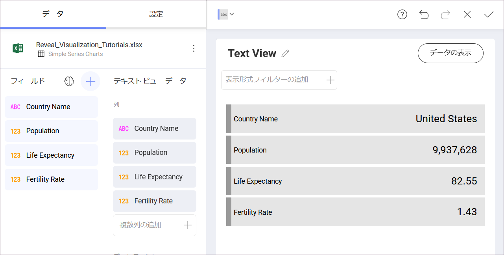
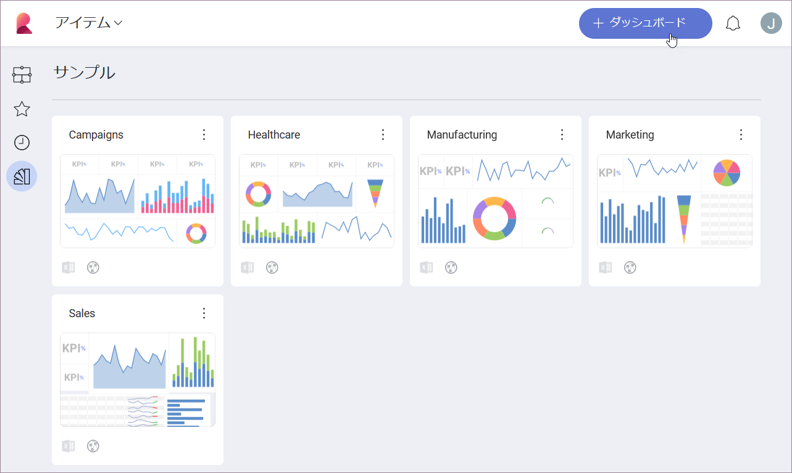
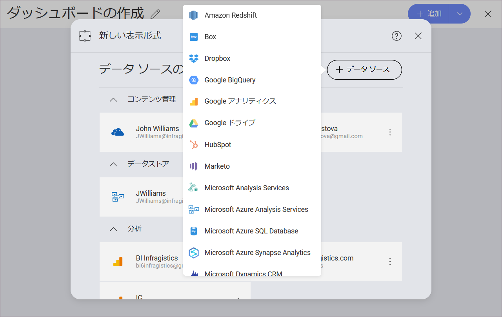
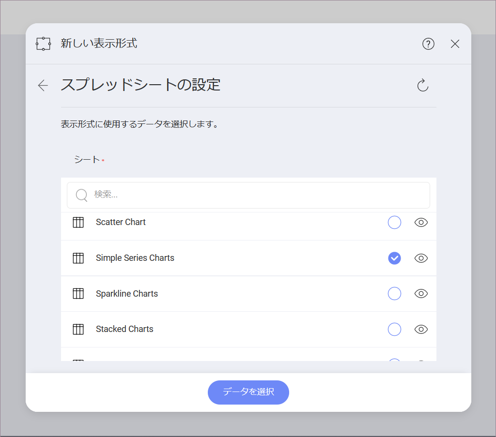
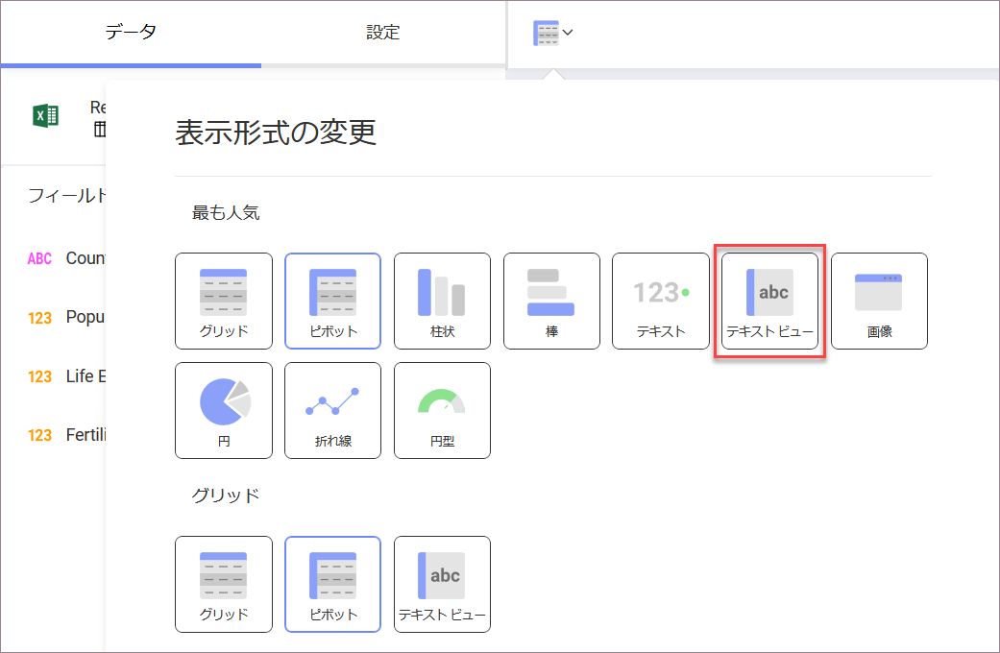
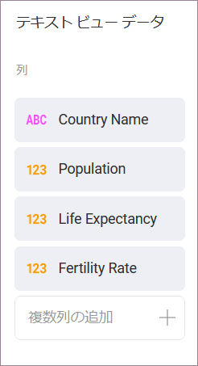
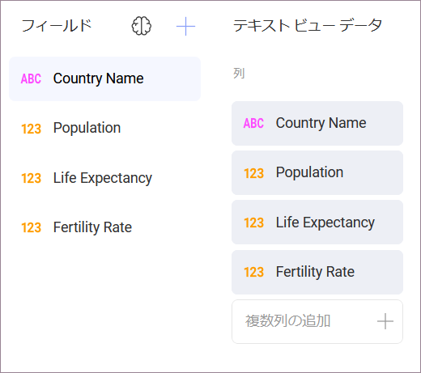
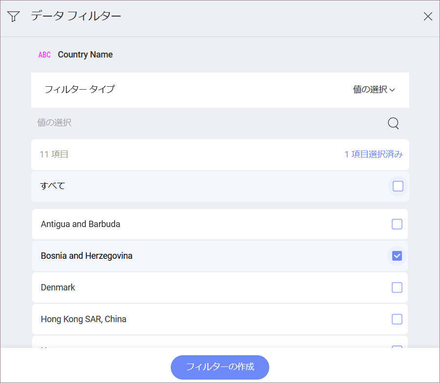

## テキスト ビューを作成する方法

このチュートリアルはサンプル スプレッドシートを使用しテキスト ビューを作成する方法を説明します。

テキスト ビューのガイドは、以下のリンクから参照してください。

  - [基本的なテキスト ビューを作成する方法](#creating-text-view)

  - [選択された行を変更する方法](#changing-selected-row)

### 重要なコンセプト

テキストビューではキーと値のパターンで情報が表示されますが、**列のラベルとペアになっているデータの最初の行のみが表示されます**。ただし、フィルターを追加して、必要な行が Reveal 表示されるようにすることができます。

### サンプル データソース

このチュートリアルでは [Reveal チュートリアル スプレッドシート](http://download.infragistics.com/reportplus/help/samples/Reveal_Visualization_Tutorials.xlsx) の [Simple Series Charts] シートを使用します。

>[!NOTE]
>このリリースでは、ローカル ファイルとしての Excel ファイルはサポートされていません。チュートリアルを実行するには、サポートされているクラウド サービスのいずれかにファイルをアップロードするか、[Web リソース](datasources/supported-data-sources/web-resource.html)として追加してください。

### テキスト ビューを作成する方法

|                                          |                                                                                                                   |                                                                                                                                                                                                                         |
| ---------------------------------------- | ----------------------------------------------------------------------------------------------------------------- | ----------------------------------------------------------------------------------------------------------------------------------------------------------------------------------------------------------------------- |
| 1\. **ダッシュボードの作成**               |                                       | ダッシュボード ビューアーで、[ダッシュボード] 画面の右上隅にある [+ ダッシュボード] ボタンを選択します。                                                                   |
| 2\. **データソースの構成**       |                                           | [新しい表示形式] ウィンドウで、右下隅の [+ データソース] ボタンを選択し、データソースを選択します。                                                                                                         |
| 3\. **チュートリアル スプレッドシートの選択** |  | データソースを設定したら、**Reveal チュートリアル スプレッドシート**を選択します。 次に、Simple Series Charts シートを選択します。                                                                                        |
| 4\. **表示形式メニューを開く**     |                         | 表示形式エディターのトップ バーで**グリッド アイコン**を選択します。                                                                                                                                                   |
| 5\. **表示形式を選択する**        |                                 | デフォルトで、表示形式のタイプは**グリッド**に設定されています。**[テキスト ビュー]** を選択します。                                                                                                                                     |
| 6\. **データを構成する**               |                               | たとえば、上記のテキスト ビューには、特定の国の人口、平均余命、および出生率が表示されます。Country Name、Population、Life Expectancy、Fertility Rate を [列] にドラッグアンドドロップします。 |

### 選択された行を変更する方法

デフォルトで、テキスト ビューはシートの最初の行を表示されます。これを変更するためにフィルターを適用できます。たとえば、テキスト ビューに行 9 (ボスニアおよびヘルツェゴビナ) を表示させます。

|                           |                                                                       |                                                                                                                                            |
| ------------------------- | --------------------------------------------------------------------- | ------------------------------------------------------------------------------------------------------------------------------------------ |
| 1\. **データフィルターを追加する** |        | Country Name フィールドを [データ フィルター] にドラッグアンドドロップします。                                                                                  |
| 2\. **フィルターを設定する**   |  | [フィルター タイプ] を選択してドロップダウン メニューを有効にしてから [値の選択] を選択します。                                                       |
| 3\. **値を選択する** |      | デフォルトでは、すべての値が選択済です。[すべて] のボックスをオフにして、**Bosnia and Herzegovina** のみを選択します。 |
