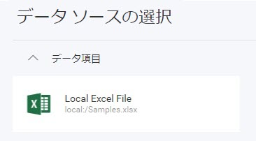

# Excel ファイル データ ソースの追加

**手順 1** - ASP.NET Web API サーバー アプリケーションで、Excel ファイルを含むフォルダーを作成します。


**手順 2** - `RevealEmbedSettings.LocalFileStoragePath` プロパティを**手順 1** で作成したフォルダーの場所に設定します。

```cs
builder.Services.AddControllers().AddReveal( builder =>
{
    builder.AddSettings(builder =>
   {
       builder.LocalFileStoragePath = "Data";
   });
});
```

**手順 3** - `RevealView.onDataSourcesRequested` イベントのイベント ハンドラーを追加します。

まず、`id` を `revealView` に設定して `<div>` タグを定義します。

```html
<div id="revealView" style="height: 920px; width: 100%;"></div>
```

`revealView` を初期化し、イベント ハンドラーを追加します。

```javascript
var revealView = new $.ig.RevealView("#revealView");
revealView.onDataSourcesRequested = (callback) => {
    //add code here
    callback(new $.ig.RevealDataSources([], [], true));
};
```

**手順 4** - `RevealView.onDataSourcesRequested` イベント ハンドラーで、`RVLocalFileDataSourceItem` オブジェクトの新しいインスタンスを作成します。`Uri` プロパティを、データ ソースとして使用する Excel ファイルのパス (ファイル名を含む) に設定します。

```javascript
revealView.onDataSourcesRequested = (callback) => {
    var localFileItem = new $.ig.RVLocalFileDataSourceItem();
    localFileItem.uri = "local:/Samples.xlsx";

    callback(new $.ig.RevealDataSources([], [], true));
};
```

> [!IMPORTANT]
> Excel ファイルパスの前に `local:/` を付ける必要があります。これは、`RevealEmbedSettings.LocalFileStoragePath` をファイル パスのルートとして使用してファイルを読み込むように Reveal SDK に指示するためです。ルート パス内にサブフォルダーがある場合は、これらのサブフォルダーを `Uri` プロパティに含めるようにしてください。
>
> 例:
>
> * サブフォルダーなし - `RVLocalFileDataSourceItem.Uri = "local:/FileName.xlsx"`
>
> * サブフォルダーあり - `RVLocalFileDataSourceItem.Uri = "local:/SubFolder/FileName.xlsx"`

**手順 5** - `RVExcelDataSourceItem` オブジェクトの新しいインスタンスを作成し、前の手順で作成した `RVLocalFileDataSourceItem` インスタンスをオブジェクト コンストラクターの引数として渡します。`Title` プロパティを、Excel ファイル内のデータを説明する文字列に設定します。

最後に、`RVExcelDataSourceItem` オブジェクトを`コールバック`のデータ ソース項目配列に追加します。

```javascript
revealView.onDataSourcesRequested = (callback) => {
    var localFileItem = new $.ig.RVLocalFileDataSourceItem();
    localFileItem.uri = "local:/Samples.xlsx";

    var excelDataSourceItem  = new $.ig.RVExcelDataSourceItem(localFileItem);
    excelDataSourceItem .title = "Local Excel File";

    callback(new $.ig.RevealDataSources([], [excelDataSourceItem], true));
};
```

アプリケーションが実行されたら、新しい表示形式を作成すると、[データ ソースの選択] ダイアログに新しく作成された Excel ファイル データ ソースが表示されます。



> [!NOTE]
> このサンプルのソース コードは [GitHub](https://github.com/RevealBi/sdk-samples-javascript/tree/main/AddingDataSources/ExcelFile) にあります。

> [!IMPORTANT]
> サーバーがクライアント アプリケーションとは異なる URL で実行されている場合は、`$。ig.RevealSdkSettings.setBaseUrl` を呼び出す必要があります。サーバー アプリケーションとクライアント アプリケーションの両方が同じ URL で実行されている場合、このメソッドは必要ありません。このメソッドを呼び出す必要があるのは 1 回だけです。
