# ダッシュボードの編集

ダッシュボードの編集は主にエンドユーザー機能ですが、開発者がさまざまな編集イベントに応答したり、UI 要素を表示/非表示にして編集エクスペリエンスを制御したり、編集を完全に無効にしたりするのに役立つ API が多数あります。

## プロパティ

### availableChartTypes

このプロパティは、可視化を作成および編集するためにエンドユーザーが使用できるチャート タイプを定義するために使用されます。

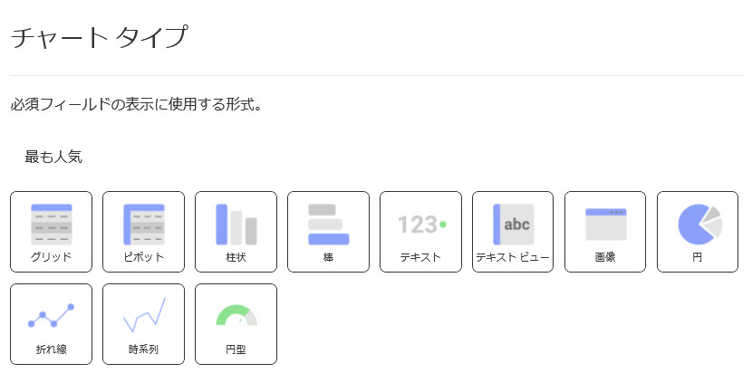

`RevealView.availableChartTypes` コレクションのチャート タイプのみがエンドユーザーに表示されます。

デフォルトでは、サポートされているすべてのチャート タイプを使用できます。

少数のチャート タイプを使用する場合は、すべてのチャート タイプを削除して、使用可能にしたいチャートのみを追加する方が簡単な場合があります。これを行うには、RevealView.AvailableChartTypes プロパティを、ユーザーが利用できるようにするチャートの種類のみを含む配列に設定します。

```javascript
revealView.availableChartTypes = [$.ig.RVChartType.BarChart, $.ig.RVChartType.ColumnChart];
```

`RevealView.availableChartTypes` から特定のチャート タイプを削除するには、この例のようなコードを使用して、`RevealView.AvailableChartTypes` から `RVChartType.AreaChart`、`RVChartType.Indicator`、および `RVChartType.IndicatorTarget` (KPI とも呼ばれます) を削除します。

```javascript
var chartTypesToRemove = [$.ig.RVChartType.AreaChart, $.ig.RVChartType.Indicator, $.ig.RVChartType.IndicatorTarget];
revealView.availableChartTypes = revealView.availableChartTypes.filter(t => !chartTypesToRemove.includes(t));
```

`RVChartType` 列挙体の値は次のとおりです:
- AreaChart
- BarChart
- BubbleChart
- BulletGraph
- CandlestickChart
- Choropleth
- ColumnChart
- ComboChart
- DIY
- DoughnutChart
- FunnelChart
- Grid
- Image
- Indicator
- IndicatorTarget
- LabelGauge
- LineChart
- LinearGauge
- OHLC_Chart
- PieChart
- Pivot
- RadialGauge
- RadialLineChart
- ScatterChart
- ScatterMap
- ScriptPython
- ScriptR
- Sparkline
- SplineChart
- SplineAreaChart
- StackedAreaChart
- StackedBarChart
- StackedColumnChart
- StepAreaChart
- StepLineChart
- TextBox
- TextView  
- TimeSeriesChart
- TreeMap

> [!NOTE]
> `AvailableChartTypes.Clear` メソッドを呼び出したが、コレクションにチャート タイプを追加しなかった場合、サポートされているすべてのチャート タイプが引き続き使用可能です。

### canAddCalculatedFields

このプロパティは、表示形式エディターの **[計算フィールド]** メニュー項目を表示/非表示にします。


```javascript
revealView.canAddCalculatedFields = false;
```

### canAddDashboardFilter

このプロパティは、ダッシュボードの **[ダッシュボード フィルターの追加]** メニュー項目を表示/非表示にします。

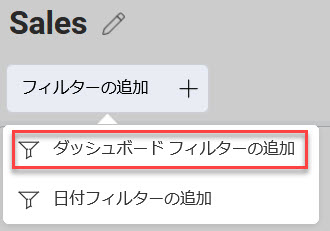

```javascript
revealView.canAddDashboardFilter = false;
```

### canAddDateFilter

このプロパティは、ダッシュボードの **[日付フィルターの追加]** メニュー項目を表示/非表示にします。

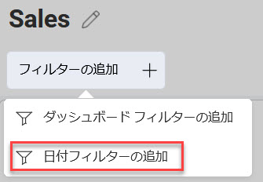

```javascript
revealView.canAddDateFilter = false;
```

### canAddPostCalculatedFields

このプロパティは、表示形式視覚化エディターのフィールド セクションの **F(x)** メニュー項目を表示/非表示にします。


```javascript
revealView.canAddPostCalculatedFields = false;
```

### canAddVisualization

このプロパティは、編集モードのときにダッシュボードの **[+ 追加]** ボタンを表示/非表示にします。

```javascript
revealView.canAddVisualization = false;
```

### canChangeVisualizationBackgroundColor

このプロパティを使用すると、可視化エディターの **[設定]** タブで可視化の背景色を指定できます。


```javascript
revealView.canChangeVisualizationBackgroundColor = true;
```

このプロパティを使用する場合は、次の依存関係をクライアント アプリケーションにインストールする必要があります:

- Spectrum v 1.8.0 以降

``` html
<link href="https://cdnjs.cloudflare.com/ajax/libs/spectrum/1.8.0/spectrum.min.css" rel="stylesheet" type="text/css" >
<script src="https://cdnjs.cloudflare.com/ajax/libs/spectrum/1.8.0/spectrum.min.js"></script>
```

### canCopyVisualization

このプロパティは、可視化の **[コピー]** メニュー項目を表示/非表示にします。

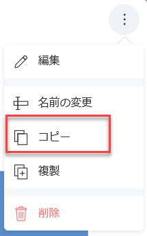

```javascript
revealView.canCopyVisualization = false;
```

### canDuplicateVisualization

このプロパティは、可視化の **[複製]** メニュー項目を表示/非表示にします。

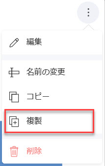

```javascript
revealView.canDuplicateVisualization = false;
```

### canEdit

このプロパティは、ダッシュボードの **[編集]** メニュー項目を表示/非表示にします。

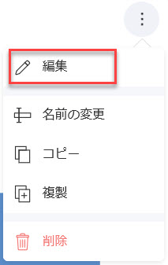

```javascript
revealView.canEdit = false;
```

`RevealView.canEdit` プロパティが `false` に設定されている場合、ダッシュボード編集は完全に無効になります。

### canMaximizeVisualization

このプロパティは、可視化の**最大化**ボタンを表示/非表示にします。


```javascript
revealView.canMaximizeVisualization = false;
```

### canSaveAs

このプロパティは、ダッシュボード メニューの **[名前を付けて保存]** ボタンを表示/非表示にします。

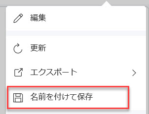

```javascript
revealView.canSaveAs = false;
```

### showChangeDataSource

このプロパティは、可視化エディターの [データ] タブにある **[データ ソースの変更]** ボタンを表示/非表示にします。


```javascript
revealView.showChangeDataSource = false;
```

### showEditDataSource

このプロパティは、可視化エディターでデータ ソースの **[編集]** メニュー項目を表示/非表示にします。

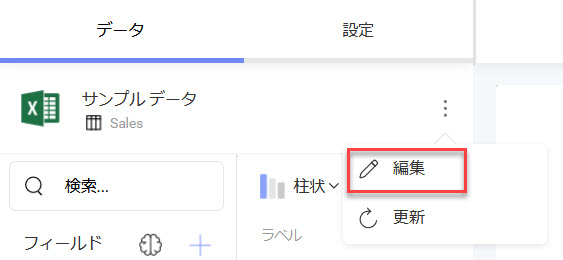

```javascript
revealView.showEditDataSource = false;
```

### showExportImage

このプロパティは、エクスポート メニューから **[画像]** 項目を表示/非表示にします。


```javascript
revealView.showExportImage = false;
```

### showExportToExcel

このプロパティは、エクスポート メニューから **[Excel]** 項目を表示/非表示にします。

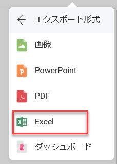

```javascript
revealView.showExportToExcel = false;
```

### showExportToPDF

このプロパティは、エクスポート メニューから **[PDF]** 項目を表示/非表示にします。


```javascript
revealView.showExportToPDF = false;
```

### showExportToPowerPoint

このプロパティは、エクスポート メニューから **[PowerPoint]** 項目を表示/非表示にします。


```javascript
revealView.showExportToPowerPoint = false;
```

### showFilters

このプロパティは、ダッシュボード フィルターを表示/非表示にします。


```javascript
revealView.showFilters = false;
```

### showHeader

このプロパティは、ダッシュボードのタイトルとダッシュボード メニューを含むダッシュボード ヘッダー全体を表示/非表示にします。

```javascript
revealView.showHeader = false;
```

### showMenu

このプロパティは、`RevealView` の右上隅に配置されているダッシュボード メニューを表示/非表示にします。

```javascript
revealView.showMenu = false;
```

### showRefresh

このプロパティは、ダッシュボード メニューの **[更新]** ボタンを表示/非表示にします。

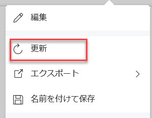

```javascript
revealView.showRefresh = false;
```

### startInEditMode

`true` に設定すると、このプロパティは、ダッシュボードが最初に読み込まれたときに `RevealView` を「編集モード」にします。


```javascript
revealView.startInEditMode = false;
```

### startWithNewVisualization

`true` に設定すると、このプロパティはすぐに [新しい表示形式] ダイアログを起動し、データ ソースを選択するように求めます。

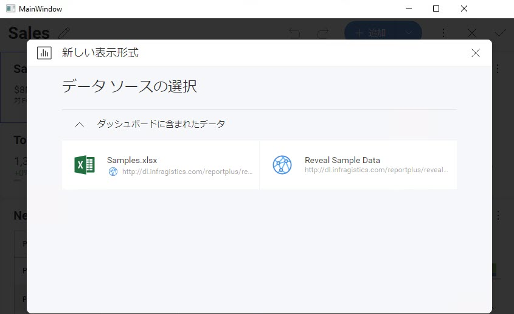

```javascript
revealView.startWithNewVisualization = false;
```

> [!NOTE]
> 既存のダッシュボードを読み込んでいて、`RevealView.startInEditMode` プロパティを `true` に設定していない場合、このプロパティは機能しません。

## Events

### onVisualizationEditorOpening

表示形式エディターが開く**前**にアプリケーション ロジックを実行したい場合や、条件が満たされるまでエディターが開かないようにしたい場合もあります。これを行うには、イベント ハンドラーを `RevealView.onVisualizationEditorOpening` イベントに追加します。

```javascript
revealView.onVisualizationEditorOpening = function (args) {
    if(args.isNewVisualization == false){ //the user is trying to edit an existing visualization
        args.cancel = true; //prevent it
    }
};
```

`VisualizationEditorOpeningArgs` には、次のプロパティが含まれています:
- **cancel** - イベントをキャンセルするかどうかを示す値を取得または設定します。イベントをキャンセルする必要がある場合は `true`。それ以外の場合は `false`。
- **isNewVisualization** - `true` の場合、可視化は新しく追加された可視化です。`false` の場合、それは既存の可視化です。
- **visualization** - 編集および/または追加された可視化

> [!NOTE]
> `VisualizationEditorOpeningArgs.cancel` を `true` に設定すると、表示形式視覚化エディターは開きません。

### onVisualizationEditorOpened

可視化エディターを開いた**後**、既存の可視化を編集するとき、または新しい可視化を作成するときに通知を受け取りたい場合は、`RevealView.onVisualizationEditorOpened` イベントにイベント ハンドラーを追加できます。

```javascript
revealView.onVisualizationEditorOpened = function (args) {
    if(args.isNewVisualization == false) { 
        //the user is editing an existing visualization
    }
};
```

`VisualizationEditorOpenedEventArgs` には、次のプロパティが含まれています:
- **isNewVisualization** - `true` の場合、可視化は新しく追加された可視化です。`false` の場合、それは既存の可視化です。
- **visualization** - 編集および/または追加された可視化

### onVisualizationEditorClosing

表示形式エディターが閉じる**前**にアプリケーション ロジックを実行したい場合や、条件が満たされるまでエディターが閉じないようにしたい場合もあります。これを行うには、`RevealView.onVisualizationEditorClosing` イベントにイベント ハンドラーを追加します。

```javascript
revealView.onVisualizationEditorClosing = function (args) {
    if(args.isNewVisualization == false) {  //the user is editing
         args.resetVisualization = true; //puts the widget to the state when it was when the user started editing it
    }
};
```

`VisualizationEditorClosingArgs` には、次のプロパティが含まれています:
- **cancel** - イベントをキャンセルするかどうかを示す値を取得または設定します。イベントをキャンセルする必要がある場合は `true`。それ以外の場合は `false`。
- **isNewVisualization** - `true` の場合、可視化は新しく追加された可視化です。`false` の場合、それは既存の可視化です。
- **resetVisualization** - `true` の場合、可視化を編集前の状態にリセットします。
- **visualization** - 編集および/または追加された可視化

> [!NOTE]
> `VisualizationEditorClosingArgs.cancel` を `true` に設定すると、表示形式視覚化エディターは閉じません。

### onVisualizationEditorClosed
エンドユーザーが `RevealView` で単一の可視化を編集するときはいつでも、エディターが閉じられた**後**に `RevealView.onVisualizationEditorClosed` イベントが発生します。これは、既存の可視化の編集、または新しい可視化の追加に対応する場合があります。`RevealView.onVisualizationEditorClosed` イベントにイベント ハンドラーを追加することで、このイベントに応答できます。

```javascript
revealView.onVisualizationEditorClosed = function (args) {
    if(args.isNewVisualization == false) { 
    }
};
```

`VisualizationEditorClosedEventArgs` には、次のプロパティが含まれています:
- **isCancelled** - 表示形式エディターが **X ボタン** (`false`) または **Check ボタン** (`true`) のどちらで閉じられたかを決定します。
- **isNewVisualization** - `true` の場合、可視化は新しく追加された可視化です。`false` の場合、それは既存の可視化視覚化です。
- **visualization** - 編集および/または追加された可視化
