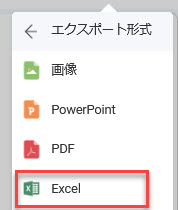
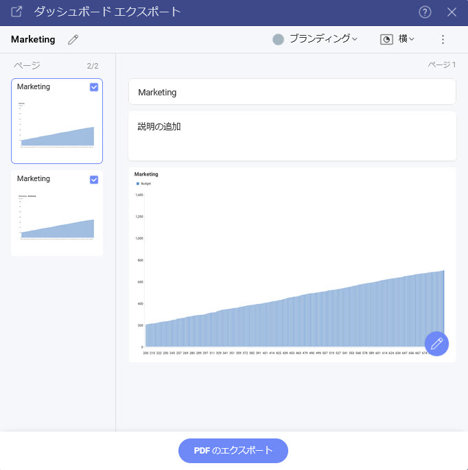
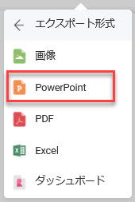

# エクスポート

Reveal SDK を使用すると、ダッシュボードと表示形式の両方をエクスポートして、新しいドキュメント タイプまたは画像を生成できます。

サポートされているダッシュボードのエクスポート形式:
- Excel
- 画像
- JSON
- PDF
- PowerPoint

サポートされている視覚化エクスポート形式:
- Excel
- 画像

すべてのエクスポート オプションは、ダッシュボードを開いたとき、または視覚化を最大化したときに、`RevealView` オーバー フロー メニューの **[エクスポート]** メニュー項目にあります。


ユーザーが **[エクスポート]** ボタンをクリックすると、有効なエクスポート オプションの 1 つを選択できます。

## Excel へエクスポート
エンドユーザーが **[エクスポート]** オーバーフロー メニューから **[Excel]** メニュー項目をクリックすると、Excel のエクスポートが実行されます。



**[Excel]** メニュー項目は、`RevealView.showExportToExcel` プロパティを設定することで表示/非表示にできます。

```javascript
revealView.showExportToExcel = false;
```

**[Excel]** メニュー項目をクリックすると、エンドユーザーは、ワークブックのタイトル、ワークシートのタイトル、作成するワークシート、および表示形式を含めるかどうかを変更できるさまざまなオプションを求められます。


## 画像へのエクスポート
Reveal SDK では、ダッシュボードまたは表示形式を画像にエクスポートする方法が 2 つあります:
- エンドユーザーによるエクスポート
- プログラムでエクスポート

### エンドユーザーによる画像エクスポート
エンドユーザーの画像のエクスポートは、エンドユーザーが **[エクスポート]** オーバーフロー メニューから **[画像]** メニュー項目をクリックすると実行されます。


**[画像]** メニュー項目は、`RevealView.showExportImage` プロパティを設定することで表示/非表示にできます。

```javascript
revealView.showExportImage = false;
```

**[画像]** メニュー項目をクリックすると、エンドユーザーにダイアログが表示され、画像をクリップボードにコピーするか、組み込みの画像エディターを使用して画像を編集するか、画像を PNG としてディスクに保存するかを選択できます。


#### カスタム画像のエクスポート
デフォルトでは、エンドユーザーが **[画像をエクスポート] ダイアログ**の **[画像をエクスポート]** ボタンをクリックすると、画像がエクスポートされ、エンドユーザーが画像ファイルを保存する場所を選択できるようにブラウザーのダウンロードに追加されます。ただし、この動作は傍受される可能性があり、代わりにカスタム画像エクスポート ロジックを使用できます。

カスタム画像エクスポートを使用するには、`RevealView.onImageExported` イベントにイベント ハンドラーを追加する必要があります。

```javascript
revealView.onImageExported = (image) => {

};
```

`RevealView.onImageExported` イベントは、画像のエクスポートを保存するのに役立つ次のパラメーターを提供します:
- **image** - 撮影されたダッシュボードのスクリーンショット

#### 例: カスタム画像のエクスポート

```javascript
revealView.onImageExported = (image) => {
    var body = window.open("about:blank").document.body;
    body.appendChild(image);
};
```

### プログラムで画像のエクスポート
エンドユーザーの操作なしでダッシュボードの画像をプログラムでエクスポートするには、`RevealView.toImage` メソッドを呼び出す必要があります。`RevealView.toImage` メソッドを呼び出すと、画面に表示されている RevealView コンポーネントのスクリーンショットが作成されます。``RevealView.toImage`` メソッドは、[画像をエクスポート] ダイアログでユーザーにプロンプトを**表示しません**。

```cs
revealView.toImage( image => {
    //handle image
});
```

#### 例: プログラムで画像のエクスポート

```html
<button onclick="exportToImage()">Export to Image</button>
```

```javascript
function exportToImage() {
    revealView.toImage(image => {
        console.log(image);
        var body = window.open("about:blank").document.body;
        body.appendChild(image);
    });
}
```

> [!NOTE]
> このサンプルのソース コードは [GitHub](https://github.com/RevealBi/sdk-samples-javascript/tree/master/Exporting-Image) にあります。

## PDF へのエクスポート
PDF エクスポートは、エンドユーザーが **[エクスポート]** オーバーフロー メニューから **[PDF]** メニュー項目をクリックすると実行されます。


**[PDF]** メニュー項目は、`RevealView.ShowExportToPDF` プロパティを設定することで表示/非表示にできます。

```javascript
revealView.showExportToPDF = false;
```

**[PDF]** メニュー項目をクリックすると、エンドユーザーにさまざまなオプションの入力を求められます。これにより、ユーザーは PDF ドキュメントのタイトルを変更したり、ドキュメントに含める表示形式、各表示形式のタイトルと説明、ブランド、ページの向き、言語を選択ができます。



## PowerPoint へエクスポート
エンドユーザーが **[エクスポート]** オーバーフロー メニューから **[PowerPoint]** メニュー項目をクリックすると、PowerPoint のエクスポートが実行されます。



**PowerPoint** メニュー項目は、`RevealView.ShowExportToPowerpoint` プロパティを設定することで表示/非表示にできます。

```javascript
revealView.showExportToPowerPoint = false;
```

**PowerPoint** メニュー項目をクリックすると、エンドユーザーは、PowerPoint ドキュメントのタイトルを変更したり、ドキュメントに含める表示形式、各表示形式のタイトルと説明、およびブランディングを選択したりできるさまざまなオプションが表示されます。


## Server Export

Dashboards can be exported to Excel, PDF, or PowerPoint on the server without the need of a UI. Also known as a "headless export". Exporting dashboards on the server is accomplished by using the `IDashboardExporter`.

The `IDashboardExporter` can be obtained by injecting it into your ASP.NET controller or minimal API function as follows:

```csharp
app.MapGet("/dashboards/export/{name}", async (string name, IDashboardExporter dashboardExporter) =>
{

}
```

### How to Export Dashboards
The `IDashboardExporter` provides APIs to export a dashboard as a file stream, or to a file path on disk. Each supported export format has an API to help simplify the export process.

**Excel**
```csharp 
//export to stream
var stream = await dashboardExporter.ExportToExcel(dashboardName);

//export to file
await dashboardExporter.ExportToExcel(dashboardName, filePath);
```

**PDF**
```csharp 
//export to stream
var stream = await dashboardExporter.ExportToPdf(dashboardName);

//export to file
await dashboardExporter.ExportToPdf(dashboardName, filePath);
```

**PowerPoint**
```csharp 
//export to stream
var stream = await dashboardExporter.ExportToPowerPoint(dashboardName);

//export to file
await dashboardExporter.ExportToPowerPoint(dashboardName, filePath);
```

> [!NOTE]
> Exporting to the PDF or PowerPoint formats can be time consuming. If invoking a server side export from the UI, be sure to provide a visual indicator to your user that the export is processing.

### Provide User Context
Sometimes dashboards have data sources that require the Reveal SDK [User Context](user-context.md). In this case, you must provide the Reveal SDK `IRVUserContext` as an argument to the export method to ensure a successful dashboard export.

The first step to obtain the `IRVUserContext` is to inject the `IRVUserContextProvider` and `IHttpContextAccessor` into the ASP.NET controller or minimal API function. Next, make a call to the `IRVUserContextProvider.GetUserContext` passing the `IHttpContextAccessor.HttpContext` as an argument.

```csharp
app.MapGet("/dashboards/export/{name}", async (string name, IDashboardExporter dashboardExporter, 
    IRVUserContextProvider userContextProvider, IHttpContextAccessor httpContextAccessor) =>
{
    var userContext = userContextProvider.GetUserContext(httpContextAccessor.HttpContext);
}
```

Once you have the `IRVUserContext` instance you can pass it as an argument to the export method.

```csharp
//export to stream
var stream = await dashboardExporter.ExportToExcel(dashboardName, userContext);

//export to file
await dashboardExporter.ExportToExcel(dashboardName, filePath, userContext);
```

### Export Options
Each export format supports various options when exporting a dashboard. For example, you can add the author's name to the header of each page, or add the comapny's name to each page footer.

Each export format has a specific options object:
- Excel: use the `ExcelExportOptions` object
- PDF: use the `PdfExportOptions` object
- PowerPoint: use the `PowerPointExportOptions` object

To set options for a dashboard export, create an instance of the export format options class and provide it as an argument to the export method.

```csharp
//create Pdf options
var pdfOptions = new PdfExportOptions()
{
    Landscape = true
};

//export Pdf to stream
var stream = await dashboardExporter.ExportToPdf(dashboardName, options: pdfOptions);
```

### Example: Exporting on the Server
In this example, we will create a service endpoint that will export a dashboard based on the format.

In an ASP.NET minimal API project, create a new route for the dashboard export. Define the dashboard name and the export format as the route parameters. You'll also need to inject the `IDashboardExporter` to perform the export. Next, create the logic to perform the correct export based on the export format route parameter. Be sure to provide the correct content type when returning the results of the export.

```csharp
app.MapGet("/dashboards/export/{name}", async (string name, string format, IDashboardExporter dashboardExporter) =>
{
    Stream stream;
    string contentType = "application/pdf";
    if (format=="xlsx")
    {
        stream = await dashboardExporter.ExportToExcel(name);
        contentType = "application/vnd.openxmlformats-officedocument.spreadsheetml.sheet";
    }
    else if (format == "pptx")
    {
        stream = await dashboardExporter.ExportToPowerPoint(name);
        contentType = "application/vnd.openxmlformats-officedocument.presentationml.presentation";
    }
    else
    {
        stream = await dashboardExporter.ExportToPdf(name);
    }
    
    return Results.File(stream, contentType);
});
```

In the client application. Create a set of buttons that will invoke a function that will make a call to our service endpoint. 
```html
<button onclick="onExportButtonClicked('pdf')">Export as PDF</button>
<button onclick="onExportButtonClicked('xlsx')">Export as Excel</button>
<button onclick="onExportButtonClicked('pptx')">Export as Power Point</button>
```

In this example we are exporting a dashboard named **Sales**, and it will use the export format that was provided by the button being clicked.
```javascript
function onExportButtonClicked(format) {
    fetch(`http://localhost:5111/dashboards/export/Sales?format=${format}`)
    .then(resp => resp.blob())
    .then(blob => 
    {
        downloadFile(blob, format);
    });
}

function downloadFile(blob, format) {
    var a = document.createElement("a");
    a.download = `Sales.${format}`;
    a.href = window.URL.createObjectURL(blob);
    a.click();
}
```

> [!NOTE]
> The source code to this sample can be found on [GitHub](https://github.com/RevealBi/sdk-samples-javascript/tree/main/Exporting-Server).