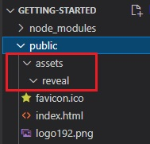
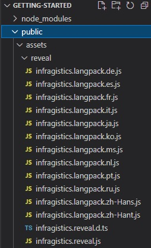

# Getting Started with Reveal SDK for React

## 手順 1 - React アプリの作成

1 - お気に入りのターミナルを開きます。


2 - 「create-react-app」コマンドを使用して新しい React アプリケーションを作成します。

<pre style="background:#141414;color:white;display:inline-block;padding:16x;margin-top:10px;font-family:'Consolas';border-radius:5px;width:100%">
> npx create-react-app getting-started --template typescript
</pre>

3 - ディレクトリを新しく作成した app ディレクトリに移動し、お気に入りのエディターでプロジェクトを開きます。この例では、Visual Studio Code を使用しています。

<pre style="background:#141414;color:white;display:inline-block;padding:16x;margin-top:10px;font-family:'Consolas';border-radius:5px;width:100%">
> cd getting-started
> code .
</pre>

## 手順 2 - Reveal JavaScript API の追加

1 - `public` フォルダーを展開し、`assets` と呼ばれる新しいフォルダーを作成します。`assets` フォルダー内に `reveal` と呼ばれる別のフォルダーを作成します。



2 - `%public%/Documents/Infragistics/Reveal/SDK/Web/JS/Client` にあるすべての JavaScript ファイルを以前作成した `assets/reveal` フォルダーにコピーします。



3 - `index.html` ファイルを開いて変更し、ページの下部に (`</body>` 終了タグの直前) `infragistics.reveal.js` スクリプトを含めます。

```html
<script src="assets/reveal/infragistics.reveal.js"></script>
```

4 - 残りの Reveal JavaScript API 依存関係をインストールします。

- jQuery 2.2 またはそれ以降

```html
<script src="https://cdn.jsdelivr.net/npm/jquery@3.6.0/dist/jquery.min.js"></script>
```
- Day.js 1.8.15 またはそれ以降

```html
<script src="https://unpkg.com/dayjs@1.8.21/dayjs.min.js"></script>
```

- Quill RTE 1.3.6 またはそれ以降

```html
<link href="https://cdn.quilljs.com/1.3.6/quill.snow.css" rel="stylesheet" type="text/css">    
<script src="https://cdn.quilljs.com/1.3.6/quill.min.js"></script>
```

- Spectrum v1.8.0 またはそれ以降 (オプション) - これは、エンドユーザーが特定の可視化の背景色を設定できるように UI を有効にする場合にのみ必要です。

``` html
<link href="https://cdnjs.cloudflare.com/ajax/libs/spectrum/1.8.0/spectrum.min.css" rel="stylesheet" type="text/css" >
<script src="https://cdnjs.cloudflare.com/ajax/libs/spectrum/1.8.0/spectrum.min.js"></script>
```

最終の `index.html` ファイルは以下のようになります。

```html
<!DOCTYPE html>
<html lang="en">
  <head>
    <meta charset="utf-8" />
    <link rel="icon" href="%PUBLIC_URL%/favicon.ico" />
    <meta name="viewport" content="width=device-width, initial-scale=1" />
    <meta name="theme-color" content="#000000" />
    <meta
      name="description"
      content="Web site created using create-react-app"
    />
    <link rel="apple-touch-icon" href="%PUBLIC_URL%/logo192.png" />
    <!--
      manifest.json provides metadata used when your web app is installed on a
      user's mobile device or desktop. See https://developers.google.com/web/fundamentals/web-app-manifest/
    -->
    <link rel="manifest" href="%PUBLIC_URL%/manifest.json" />
    <!--
      Notice the use of %PUBLIC_URL% in the tags above.
      It will be replaced with the URL of the `public` folder during the build.
      Only files inside the `public` folder can be referenced from the HTML.

      Unlike "/favicon.ico" or "favicon.ico", "%PUBLIC_URL%/favicon.ico" will
      work correctly both with client-side routing and a non-root public URL.
      Learn how to configure a non-root public URL by running `npm run build`.
    -->
    <link href="https://cdn.quilljs.com/1.3.6/quill.snow.css" rel="stylesheet" type="text/css">  
    <title>React App</title>
  </head>
  <body>
    <noscript>You need to enable JavaScript to run this app.</noscript>
    <div id="root"></div>
    <!--
      This HTML file is a template.
      If you open it directly in the browser, you will see an empty page.

      You can add webfonts, meta tags, or analytics to this file.
      The build step will place the bundled scripts into the <body> tag.

      To begin the development, run `npm start` or `yarn start`.
      To create a production bundle, use `npm run build` or `yarn build`.
    -->
    <script src="https://cdn.jsdelivr.net/npm/jquery@3.6.0/dist/jquery.min.js"></script>
    <script src="https://unpkg.com/dayjs@1.8.21/dayjs.min.js"></script>
    <script src="https://cdn.quilljs.com/1.3.6/quill.min.js"></script>
    <script src="assets/reveal/infragistics.reveal.js"></script>
  </body>
</html>
```

## 手順 3 - Reveal ビューの初期化

1 - `src/app.tsx` ファイルを開いて変更します。`return` ステートメント内のすべてのコンテンツを削除し、新しい `<div>` タグを追加し、`id` を `revealView` に設定します。

```ts
function App() {
  return (
    <div id="revealView" style={{height: "100vh", width: "100%"}}></div>
  );
}
```

2 - 最初に、import ステートメントの下のファイルの先頭で、タイプ `any` の `$` という名前の新しい変数を宣言することによって、jQuery を使用できることを確認する必要があります。これにより、TypeScript が JavaScript をコンパイルします。

```ts
declare let $: any;
```

3 - `App()` 関数コンポーネント内で、`revealView` を初期化します。

```ts
  $.ig.RevealSdkSettings.ensureFontsLoadedAsync().then(() => {
    var revealView = new $.ig.RevealView("#revealView");
  }); 
```

この JavaScript コードは最初に `$.ig.RevealSdkSettings.ensureFontsLoadedAsync` を呼び出してすべてのフォントが正しく読み込まれたことを確認します。次に、新しい `$.ig.RevealView` を作成し、`#revealView` セレクターを渡すことで、`RevealView` の新しいインスタンスを作成します。

最終の `index.html` ファイルは以下のようになります。

```ts
import React from 'react';
import logo from './logo.svg';
import './App.css';

declare let $: any;

function App() {

  $.ig.RevealSdkSettings.ensureFontsLoadedAsync().then(() => {
    var revealView = new $.ig.RevealView("#revealView");
  }); 

  return (
    <div id="revealView" style={{height: "100vh", width: "100%"}}></div>
  );
}

export default App;
```

> [!IMPORTANT]
> クライアント アプリは、クライアントが別の URL でホストしている場合、`$.ig.RevealSdkSettings.setBaseUrl("url-to-server");` をダッシュボードをホストしているサーバー アドレスに設定する必要があります。

## 手順 4 - アプリケーションの実行

Visual Studio Code ターミナルで、`npm start` コマンドを入力します。

<pre style="background:#141414;color:white;display:inline-block;padding:16x;margin-top:10px;font-family:'Consolas';border-radius:5px;width:100%">
> npm start
</pre>


完了しました! 最初の Reveal SDK React アプリケーションを作成しました。

次の手順:
- [新しいダッシュボードの作成](creating-dashboards.md)
- [既存のダッシュボードの読み込み](loading-dashboards.md)

> [!NOTE]
> このサンプルのソース コードは [GitHub](https://github.com/RevealBi/sdk-samples-react/tree/main/01-GettingStarted) にあります。
