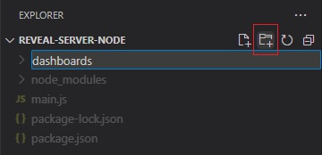

# Node.js を使用した Reveal SDK サーバーの設定

> [!WARNING]
> Node server support is currently available as a **Beta** versioned product. Some features may not work, or be missing completely. The API will experience breaking changes before the RTM release.

## 手順 1 - Node.js プロジェクトの作成

1 - コマンドラインを開き、**reveal-server-node** という名前のディレクトリを作成します。
<pre style="background:#141414;color:white;display:inline-block;padding:16x;margin-top:10px;font-family:'Consolas';border-radius:5px;width:100%">
> mkdir reveal-server-node
</pre>

2 - コマンドライン パスを新しく作成したディレクトリに変更します。
<pre style="background:#141414;color:white;display:inline-block;padding:16x;margin-top:10px;font-family:'Consolas';border-radius:5px;width:100%">
> cd reveal-server-node
</pre>

3 - ディレクトリで **npm** を初期化します。
<pre style="background:#141414;color:white;display:inline-block;padding:16x;margin-top:10px;font-family:'Consolas';border-radius:5px;width:100%">
> npm init -y
</pre>

4 - **express** フレームワークをインストールします。
<pre style="background:#141414;color:white;display:inline-block;padding:16x;margin-top:10px;font-family:'Consolas';border-radius:5px;width:100%">
> npm install express
</pre>

5 - **VS Code** でプロジェクトを開きます。
<pre style="background:#141414;color:white;display:inline-block;padding:16x;margin-top:10px;font-family:'Consolas';border-radius:5px;width:100%">
> code .
</pre>

6 - **main.js** という名前の新しいファイルを作成し、次のコードを追加します:

```javascript
var express = require('express');

const app = express();

app.listen(8080, () => {
	console.log(`Reveal server accepting http requests`);
});
```

## 手順 2 - Reveal SDK の追加

1 - Node.js 用の **Reveal SDK** をインストールします。
<pre style="background:#141414;color:white;display:inline-block;padding:16x;margin-top:10px;font-family:'Consolas';border-radius:5px;width:100%">
> npm install reveal-sdk-node
</pre>

2 - `main.js` ファイルを変更して Reveal を追加します。

```javascript
var express = require('express');
var reveal = require('reveal-sdk-node');

const app = express();

//add reveal sdk
app.use('/', reveal());

app.listen(8080, () => {
	console.log(`Reveal server accepting http requests`);
});
```

## 手順 3 - ダッシュボード フォルダーの作成

1 - Visual Studio Code で、エクスプローラーの [**新しいフォルダー**] ボタンをクリックし、**dashboards** という名前を付けます。フォルダーの名前は **dashboards** にしてください。



デフォルトで、Reveal SDK は **dashboards** フォルダーからすべてのダッシュボードを読み込む規則を使用します。この規則を変更でするにはカスタムの `IRVDashboardProvider` を作成します。

## 手順 4 - CORS ポリシー (デバッグ) の設定

アプリケーションの開発とデバッグでは、サーバーとクライアント アプリを異なる URL でホストするのが一般的です。たとえば、サーバーは `https://localhost:24519` で実行されますが、Angular アプリは `https://localhost:4200` で実行されます。クライアント アプリケーションからダッシュボードを読み込もうとすると、Cross-Origin Resource Sharing (CORS) ポリシーが原因で失敗します。このシナリオを有効にするには、CORS ポリシーを作成し、サーバー プロジェクトで有効にする必要があります。

1 - **cors** パッケージをインストールします。
<pre style="background:#141414;color:white;display:inline-block;padding:16x;margin-top:10px;font-family:'Consolas';border-radius:5px;width:100%">
> npm install cors
</pre>

2 - `main.js` ファイルを変更して **cors** を有効にします。

```javascript
var express = require('express');
var cors = require('cors');
var reveal = require('reveal-sdk-node');

const app = express();

app.use(cors()); // DEVELOPMENT only! In production, configure appropriately.

app.use('/', reveal());

app.listen(8080, () => {
	console.log(`Reveal server accepting http requests`);
});
```

## 手順 5 - Node.js サーバーの起動

最後の手順は、次のコマンドを実行して Node.js サーバーを起動することです。

<pre style="background:#141414;color:white;display:inline-block;padding:16x;margin-top:10px;font-family:'Consolas';border-radius:5px;width:100%">
> node main.js
</pre>

次の手順:
- [Angular クライアント アプリの作成](getting-started-angular.md)
- [Html/JS クライアント アプリの作成](getting-started-javascript.md)
- [React クライアント アプリの作成](getting-started-react.md)

> [!NOTE]
> このサンプルのソース コードは [GitHub](https://github.com/RevealBi/sdk-samples-javascript/tree/main/01-GettingStarted/server/nodejs) にあります。