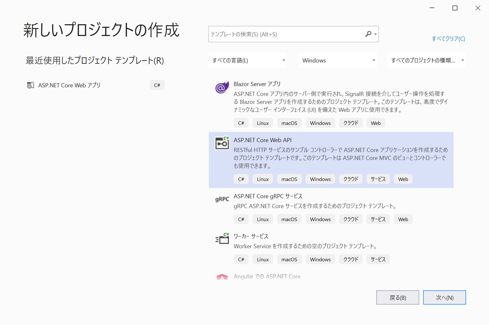
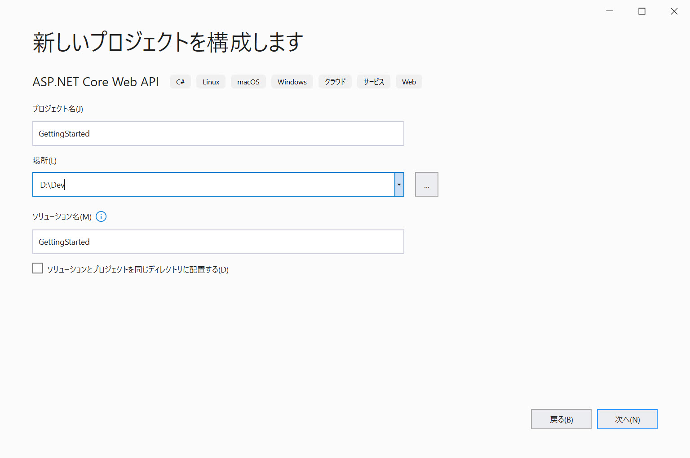
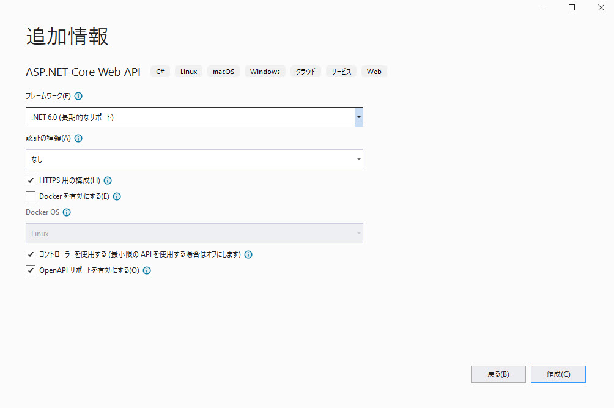

# Reveal SDK Server の設定

## 手順 1 - 手順新しい ASP.NET Core Web API の作成

以下の手順では、新しい ASP.NET Core Web API プロジェクトを作成する方法を説明します。既存のアプリケーションに Reveal SDK を追加する場合は、手順 2 へ移動します。

1 - Visual Studio 2019 を起動し、スタート ページで **[新しいプロジェクトの作成]** をクリックします。**[ASP.NET Core Web API]** テンプレートを選択し、**[次へ]** をクリックします。



2 - プロジェクト名を入力し、場所を先ほど作成した **server** ディレクトリに設定して、**[次へ]** をクリックします。



3 - フレームワーク、認証タイプ、Docker オプションを選択し、**[作成]** をクリックします。



## 手順 2 - Reveal SDK の追加

1 - ソリューションまたはプロジェクトを右クリックし、**[ソリューションの NuGet パッケージの管理]** を選択します。


2 - パッケージ マネージャー ダイアログで **[参照]** タブを開き、**Infragistics (Local)** パッケージ ソースを選択して **Reveal.Sdk.Web.AspNetCore** NuGet パッケージをプロジェクトにインストールします。


> [!NOTE]
> トライアル版をお使いの場合、[NuGet.org](https://www.nuget.org/packages/Reveal.Sdk.Web.AspNetCore.Trial/) にある **Reveal.Sdk.Web.AspNetCore.Trial** NuGet パッケージをインストールできます。

3 - `Program.cs` ファイルを開き、`using Reveal.Sdk` 名前空間を追加します。次に、既存の `builder.Services.AddControllers()` メソッドに `IMcvBuilder.AddReveal()` の呼び出しを追加します。

```
using Reveal.Sdk;

builder.Services.AddControllers().AddReveal();
```

## 手順 3 - ダッシュボード フォルダーの作成

1 - プロジェクトを右クリックし、**[追加] -> [新しいフォルダー]** を選択します。フォルダーの名前は **「Dashboards」** にしてください。


デフォルトで、Reveal SDK は **Dashboards** フォルダーからすべてのダッシュボードを読み込む規則を使用します。この規則を変更でするにはカスタムの `IRVDashboardProvider` を作成します。詳細については、[ダッシュボードの読み込み](loading-dashboards.md)トピックを参照してください。


## 手順 4 - CORs ポリシー (デバッグ) の設定

アプリケーションの開発とデバッグでは、サーバーとクライアント アプリを異なる URL でホストするのが一般的です。たとえば、サーバーは `https://localhost:24519` で実行されますが、Angular アプリは `https://localhost:4200` で実行されます。クライアント アプリケーションからダッシュボードを読み込もうとすると、ASP.NET Core の Cross-Origin Requests (CORs) セキュリティ ポリシーが原因で失敗します。このシナリオを有効にするには、CORs ポリシーを作成し、サーバー プロジェクトで有効にする必要があります。

1 - `Program.cs` ファイルを開いて変更し、任意のヘッダーとメソッドへの任意のオリジン (URL) アクセスを許可する CORs ポリシーを作成します。

```cs
builder.Services.AddCors(options =>
{
  options.AddPolicy("AllowAll",
    builder => builder.AllowAnyOrigin().AllowAnyHeader().AllowAnyMethod()
  );
});
```

2 - ポリシーはデバッグ モードでのみ適用します。プロダクション アプリケーションがある場合、プロダクション ビルドに適切なポリシーを適用します。

```cs
if (app.Environment.IsDevelopment())
{
    app.UseCors("AllowAll");
}
```

ミドルウェアが実行される順序を理解することが重要です。`UseCors` は特定の順序で呼び出す必要があります。この例では、`UseHttpsRedirection()` の後と `UseAuthorization()` の前にあります。詳細については、[この Microsoft ヘルプ トピック](https://docs.microsoft.com/ja-jp/aspnet/core/security/cors?view=aspnetcore-6.0)を参照してください。

次の手順:
- [Angular クライアント アプリの作成](getting-started-angular.md)
- [Html/JS クライアント アプリの作成](getting-started-javascript.md)
- [React クライアント アプリの作成](getting-started-react.md)

> [!NOTE]
> このサンプルのソース コードは [GitHub](https://github.com/RevealBi/sdk-samples-aspnetcore/tree/main/01-GettingStarted-Server-WebApi) にあります。