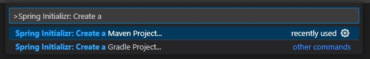
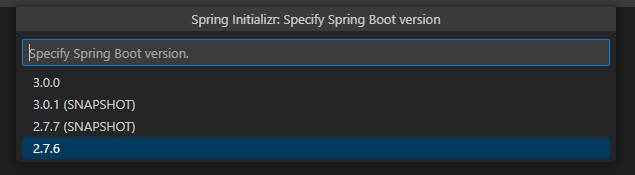
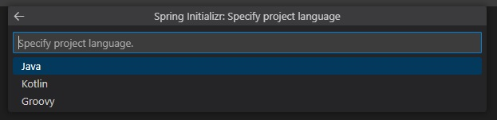
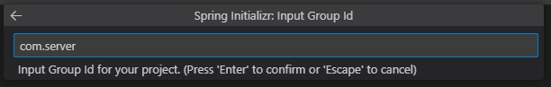
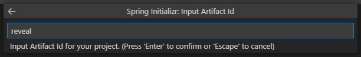
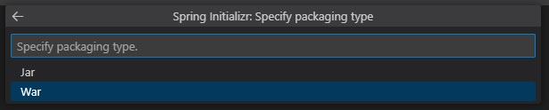
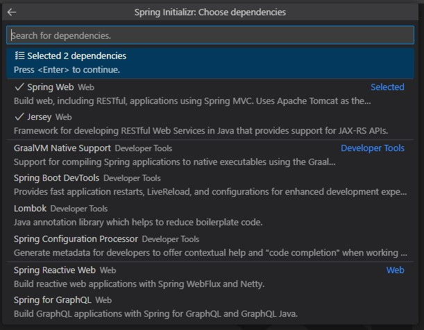
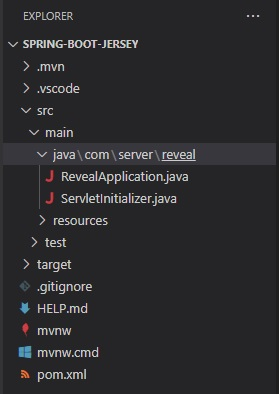
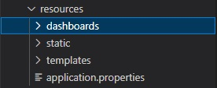

# Spring Boot と Jersey を使用した Reveal SDK サーバーのセットアップ

## 手順 1 - Jersey プロジェクトで Spring Boot を作成する

以下の手順では、Jersey プロジェクトを使用して新しい Java Spring Boot を作成する方法について説明します。既存のアプリケーションに Reveal SDK を追加する場合は、手順 2 へ移動します。

To develop a Spring Boot application in Visual Studio Code, you need to install the following:
- [Development Kit (JDK)](https://www.microsoft.com/openjdk)
- [Extension Pack for Java](https://marketplace.visualstudio.com/items?itemName=vscjava.vscode-java-pack)
- [Spring Boot Extension Pack](https://marketplace.visualstudio.com/items?itemName=pivotal.vscode-boot-dev-pack)

More information about how to get started with Visual Studio Code and Java can be found at [Getting Started with Java](https://code.visualstudio.com/docs/java/java-tutorial) tutorial.

1 - Start Visual Studio Code, open the Command Palette and type **>Spring Initializr: Create a Maven Project** and press **Enter**.



2 - Select the Spring Boot version **2.7.6**.



> [!WARNING]
> バージョン 3.0.0 は現在サポートされていません。

3 - Select **Java**  as the language.



4 - Provide the Group Id. In this example, we are using **com.server**.



5 - Provide the Artifact Id. In this example we are using **reveal**.



6 - Select the **War** package type.



7 - Select the Java version. In this example we are using version **17**.


8 - Choose the **Spring Web** and **Jersey** dependencies.



9 - Save and open the newly created project.



## 手順 2 - Reveal SDK の追加

1 - Update the **pom.xml** file.

まず、Reveal Maven リポジトリを追加します。

```xml
<repositories>
    <repository>
        <id>reveal.public</id>
        <url>https://maven.revealbi.io/repository/public</url>
    </repository>	
</repositories>
```

次に、Reveal SDK を依存関係として追加します。

```xml
<dependency>
    <groupId>com.infragistics.reveal.sdk</groupId>
    <artifactId>reveal-sdk</artifactId>
    <version>1.3.0</version>
</dependency>
```

2 - Create a Jersey Config class and initialize the Reveal SDK by calling the `RevealEngineInitializer.initialize` method. In order for the Reveal SDK to function properly with Jersey, we need to register all of the Reveal SDK classes with Jersey. To register the Reveal SDK classes, loop through the classes returned by the `RevealEngineInitializer.getClassesToRegister` method, and register them with the Jersey Config.

```java
import org.glassfish.jersey.server.ResourceConfig;
import org.springframework.stereotype.Component;

import com.infragistics.reveal.engine.init.InitializeParameterBuilder;
import com.infragistics.reveal.engine.init.RevealEngineInitializer;

import javax.ws.rs.ApplicationPath;

@Component
@ApplicationPath("/")
public class RevealJerseyConfig extends ResourceConfig 
{
    public RevealJerseyConfig()
    {
        RevealEngineInitializer.initialize();
        
        //register all Reveal classes in JAX-RS context
        for (Class<?> clazz : RevealEngineInitializer.getClassesToRegister()) {
        	register(clazz);
        }
    }
}
```

## 手順 3 - ダッシュボード プロバイダーの作成

1 - In Visual Studio Code, select the **resources** folder and then click the New Folder button in the Explorer. Name the new folder **dashboards**.



2 - Next, create a dashboard provider that will load the Reveal dashboards from the newly created **dashboards** folder.

```java
import com.infragistics.reveal.sdk.api.IRVUserContext;

import java.io.IOException;
import java.io.InputStream;

import com.infragistics.reveal.sdk.api.IRVDashboardProvider;

public class RevealDashboardProvider implements IRVDashboardProvider {

    @Override
    public InputStream getDashboard(IRVUserContext userContext, String dashboardId) throws IOException {
        InputStream dashboardStream = getClass().getResourceAsStream("/dashboards/" + dashboardId + ".rdash");
		return dashboardStream;
    }

    @Override
    public void saveDashboard(IRVUserContext arg0, String arg1, InputStream arg2) throws IOException {
        
    }	
}
```

3 - Finally, register the Dashboard Provider with the `RevealEngineInitializer` in the `RevealJerseyConfig` class.

```java
@Component
@ApplicationPath("/")
public class RevealJerseyConfig extends ResourceConfig 
{
    public RevealJerseyConfig()
    {
        RevealEngineInitializer.initialize(new InitializeParameterBuilder()
        .setDashboardProvider(new RevealDashboardProvider())
        .build());
        
        //register all Reveal classes in JAX-RS context
        for (Class<?> clazz : RevealEngineInitializer.getClassesToRegister()) {
        	register(clazz);
        }
    }
}
```

## 手順 4 - CORs ポリシー (デバッグ) の設定

アプリケーションの開発とデバッグでは、サーバーとクライアント アプリを異なる URL でホストするのが一般的です。例えば、サーバーは `https://localhost:24519` で実行されている可能性がありますが、Angular アプリは `https://localhost:4200` で実行されている可能性があります。クライアント アプリケーションからダッシュボードを読み込もうとすると、Cross-Origin Resource Sharing (CORS) ポリシーが原因で失敗します。このシナリオを有効にするには、CORS ポリシーを作成し、サーバー プロジェクトで有効にする必要があります。

1 - Create a CorsFilter

```java
import java.io.IOException;

import javax.ws.rs.container.ContainerRequestContext;
import javax.ws.rs.container.ContainerRequestFilter;
import javax.ws.rs.container.ContainerResponseContext;
import javax.ws.rs.container.ContainerResponseFilter;
import javax.ws.rs.container.PreMatching;
import javax.ws.rs.core.Response;

@PreMatching
public class CorsFilter implements ContainerRequestFilter, ContainerResponseFilter {

    /**
     * Method for ContainerRequestFilter.
     */
    @Override
    public void filter(ContainerRequestContext request) throws IOException {

        // If it's a preflight request, we abort the request with
        // a 200 status, and the CORS headers are added in the
        // response filter method below.
        if (isPreflightRequest(request)) {
            request.abortWith(Response.ok().build());
            return;
        }
    }

    /**
     * A preflight request is an OPTIONS request
     * with an Origin header.
     */
    private static boolean isPreflightRequest(ContainerRequestContext request) {
        return request.getHeaderString("Origin") != null
                && request.getMethod().equalsIgnoreCase("OPTIONS");
    }

    /**
     * Method for ContainerResponseFilter.
     */
    @Override
    public void filter(ContainerRequestContext request, ContainerResponseContext response)
            throws IOException {

        // if there is no Origin header, then it is not a
        // cross origin request. We don't do anything.
        if (request.getHeaderString("Origin") == null) {
            return;
        }


        // If it is a preflight request, then we add all
        // the CORS headers here.
        if (isPreflightRequest(request)) {
            response.getHeaders().add("Access-Control-Allow-Credentials", "true");
            response.getHeaders().add("Access-Control-Allow-Methods",
                "GET, POST, PUT, DELETE, OPTIONS, HEAD");
            response.getHeaders().add("Access-Control-Allow-Headers",
                // Whatever other non-standard/safe headers (see list above) 
                // you want the client to be able to send to the server,
                // put it in this list. And remove the ones you don't want.
                "X-Requested-With, Authorization, " +
                "Accept-Version, Content-MD5, CSRF-Token, Content-Type");
        }

        // Cross origin requests can be either simple requests
        // or preflight request. We need to add this header
        // to both type of requests. Only preflight requests
        // need the previously added headers.
        response.getHeaders().add("Access-Control-Allow-Origin", "*");
    }
}
```

2 - Register the `CorsFilter` in the `RevealJerseyConfig` class.

```java
@Component
@ApplicationPath("/")
public class RevealJerseyConfig extends ResourceConfig 
{
    public RevealJerseyConfig()
    {
        RevealEngineInitializer.initialize(new InitializeParameterBuilder()
        .setDashboardProvider(new RevealDashboardProvider())
        .build());
        
        //register all Reveal classes in JAX-RS context
        for (Class<?> clazz : RevealEngineInitializer.getClassesToRegister()) {
        	register(clazz);
        }

        //register the cors filter for debugging
        register(CorsFilter.class);  
    }
}
```

次の手順:
- [Angular クライアント アプリを作成する](getting-started-angular.md)
- [Html/JS クライアント アプリを作成する](getting-started-javascript.md)
- [React クライアント アプリを作成する](getting-started-react.md)

> [!NOTE]
> このサンプルのソース コードは [GitHub](https://github.com/RevealBi/sdk-samples-javascript/tree/main/01-GettingStarted/server/spring-boot-jersey) にあります。