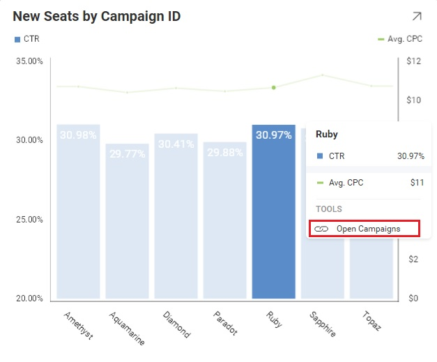

# ダッシュボード リンク

Reveal SDK はダッシュボードのリンクをサポートしているため、ユーザーはダッシュボードをナビゲートできます。ダッシュボードからダッシュボードに移動することで、業務上のハイレベルな概要からより詳細なビューに進むことができます。

Reveal SDK の観点からは、ダッシュボードのリンクは、エンドユーザーがビジュアル化されたリンクをクリックして別のダッシュボードをロードするときに呼び出されます。



ダッシュボードリンク機能の詳細については、Reveal のユーザーガイドの [ダッシュボードのリンク](../dashboards/dashboard-linking.md) を参照してください。

> [!NOTE]
> 現在、ダッシュボードのリンクは Reveal SDK で作成できません。[https://app.revealbi.io/](https://app.revealbi.io/) などのネイティブ Reveal アプリケーションを使用する必要があります。

## ダッシュボード リンクへの応答

ダッシュボード内で**ダッシュボード リンク**がクリックされたときに応答するには、ダッシュボードを読み込む `RVDashboard.loadDashboardAsync Promise` を返すメソッドに `RevealView.onLinkedDashboardProvider` プロパティを設定する必要があります。

ダッシュボード ID を使用する方法:
```javascript
revealView.onLinkedDashboardProviderAsync = (dashboardId, title) => {
    return $.ig.RVDashboard.loadDashboardAsync(dashboardId);
};
```

ダッシュボードが [Reveal アプリ](https://app.revealbi.io/)で作成された場合、ダッシュボードの ID は自動生成されます。ダッシュボードの ID はシナリオに応じて使用しない場合があります。このため、代わりにダッシュボードのタイトルを使用できます。

ダッシュボード タイトルを使用する方法:
```javascript
revealView.onLinkedDashboardProviderAsync = (dashboardId, title) => {
    return $.ig.RVDashboard.loadDashboardAsync(title);
};
```

ダッシュボードのタイトルは、サーバーでホストされているダッシュボードの .rdash ファイルのファイル名です。

> [!NOTE]
> このサンプルのソース コードは [GitHub](https://github.com/RevealBi/sdk-samples-javascript/tree/master/LinkingDashboards) にあります。