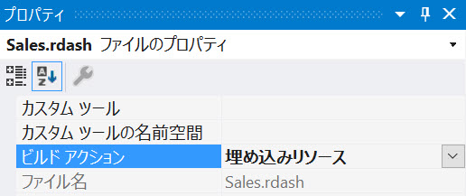

# ダッシュボードの読み込み

アプリケーションに埋め込まれた `RevealView` コントロールに既存の Reveal ダッシュボードを表示する場合は、4 つのオプションから選択できます。
- ファイル パスからダッシュボードを読み込み
- ファイル ストリームからダッシュボードを読み込み
- 埋め込まれたリソースからダッシュボードを読み込み
- json からダッシュボードを読み込み

ダッシュボードはサーバー上にあります。クライアント アプリケーションは `$.ig.RVDashboard.loadDashboard` メソッドを呼び出し、読み込むダッシュボードの名前を渡します。ダッシュボードのリクエストがサーバーに送信され、サーバーはリクエストされたダッシュボードでクライアントに応答します。クライアントは、サーバーの応答で提供されたダッシュボードを取得し、`RevealView.dashboard` プロパティを設定します。

**.rdash** ダッシュボード ファイルは次の方法で作成できます:
- ダッシュボードを [Reveal BI Web サイト](https://app.revealbi.io/)から .rdash ファイルとしてエクスポートします。
- ダッシュボードをネイティブの Reveal アプリケーションの 1 つから .rdash ファイルとしてエクスポートします。
- Reveal SDK を使用してアプリケーションで作成されたダッシュボードを保存またはエクスポートします。
- [サンプル ダッシュボード](https://github.com/RevealBi/sdk-samples-wpf/raw/master/SampleDashboards.zip)のダウンロード

## ファイル パスから読み込み

デフォルトでは、Reveal SDK は規則を使用して、ファイル パスからダッシュボードを読み込みます。具体的には、Reveal SDK は、サーバーの **Dashboards** フォルダーでダッシュボードを検索します。このフォルダーの作成方法については、[サーバーの設定](getting-started-server.md#step-3---create-the-dashboards-folder)トピックを参照してください。

1 - ASP.NET Core Web Api サーバー アプリケーションで、**Dashboards** という名前のフォルダーを作成し、そのフォルダー内にダッシュボード ファイルを配置します。


2 - クライアント アプリケーションで、`$.ig.RevealSdkSettings.setBaseUrl` メソッドを呼び出し、サーバーの URL を渡します。デバッグ時には、サーバーの URL は `https://localhost` の後にポート番号が続きます。例:

```javascript
$.ig.RevealSdkSettings.setBaseUrl("https://localhost:/7111");   
```

> [!IMPORTANT]
> サーバーがクライアント アプリケーションとは異なる URL で実行されている場合は、`$.ig.RevealSdkSettings.setBaseUrl` を呼び出す必要があります。サーバー アプリケーションとクライアント アプリケーションの両方が同じ URL で実行されている場合、このメソッドは必要ありません。このメソッドを呼び出す必要があるのは 1 回だけです。

3 - `$.ig.RVDashboard.loadDashboard` メソッドを呼び出し、ダッシュボード ファイルの名前を .rdash 拡張子なしで渡します。このメソッドには、サーバーから要求されているダッシュボードを提供するコールバックがあります。コールバックからダッシュボードを受け取ったら、`$.ig.RevealView` のインスタンスを取得し、応答のダッシュボードに `RevealView.dashboard` プロパティを設定します。

```javascript
$.ig.RVDashboard.loadDashboard("Sales", (dashboard) => {
    var revealView = new $.ig.RevealView("#revealView");
    revealView.dashboard = dashboard;
});
```

> [!NOTE]
> このサンプルのソース コードは [GitHub](https://github.com/RevealBi/sdk-samples-javascript/tree/main/LoadingDashboards) にあります。

## カスタム ファイル パスから読み込み

デフォルトの **Dashboards** ファイル ディレクトリがアプリケーションのオプションではない場合は、代わりにダッシュボードを読み込むためのカスタム ファイル パスを指定できます。

1 - ASP.NET Core Web API サーバー アプリケーションで、`IRVDashboardProvider`インターフェイスを実装する新しいクラスを作成します。`GetDashboardAsync` メソッドでカスタム ファイル ディレクトリからダッシュボードを読み込むロジックを追加します。この例では、ASP.NET Core Web API サーバー アプリケーションは **MyDashboardsFolder** という名前のフォルダーを使用してすべてのダッシュボードを格納します。

```cs
public class DashboardProvider : IRVDashboardProvider
{
    public Task<Dashboard> GetDashboardAsync(IRVUserContext userContext, string dashboardId)
    {
        var filePath = Path.Combine(Environment.CurrentDirectory, $"MyDashboardsFolder/{dashboardId}.rdash");
        var dashboard = new Dashboard(filePath);
        return Task.FromResult(dashboard);
    }

    public Task SaveDashboardAsync(IRVUserContext userContext, string dashboardId, Dashboard dashboard)
    {
        throw new NotImplementedException();
    }
}
```

2 - `Program.cs` ファイルの `AddReveal` メソッドを更新し、`RevealSetupBuilder.AddDashboardProvider` メソッドを使用して、作成したばかりの `IRVDashboardProvider` を  `RevealSetupBuilder` に追加します。

```cs
builder.Services.AddControllers().AddReveal( builder =>
{
    builder.AddDashboardProvider<DashboardProvider>();
});
```

3 - クライアント アプリケーションで、`$.ig.RevealSdkSettings.setBaseUrl` メソッドを呼び出し、サーバーの URL を渡します。デバッグ時には、サーバーの URL は `https://localhost` の後にポート番号が続きます。例:

```javascript
$.ig.RevealSdkSettings.setBaseUrl("https://localhost:/7111");   
```

> [!IMPORTANT]
> サーバーがクライアント アプリケーションとは異なる URL で実行されている場合は、`$.ig.RevealSdkSettings.setBaseUrl` を呼び出す必要があります。サーバー アプリケーションとクライアント アプリケーションの両方が同じ URL で実行されている場合、このメソッドは必要ありません。このメソッドを呼び出す必要があるのは 1 回だけです。

4 - `$.ig.RVDashboard.loadDashboard` メソッドを呼び出し、ダッシュボード ファイルの名前を .rdash 拡張子なしで渡します。このメソッドには、サーバーから要求されているダッシュボードを提供するコールバックがあります。コールバックからダッシュボードを受け取ったら、`$.ig.RevealView` のインスタンスを取得し、応答のダッシュボードに `RevealView.dashboard` プロパティを設定します。

```javascript
$.ig.RVDashboard.loadDashboard("Sales", (dashboard) => {
    var revealView = new $.ig.RevealView("#revealView");
    revealView.dashboard = dashboard;
});
```

> [!NOTE]
> このサンプルのソース コードは [GitHub](https://github.com/RevealBi/sdk-samples-javascript/tree/main/LoadingDashboards-File).

## ファイル ストリームから読み込み

ファイル ストリームからの Reveal ダッシュボードの読み込みは、ファイル パスからのダッシュボードの読み込みと非常によく似ています。この場合、ダッシュボード ファイルのファイル パスを取得したら `Dashboard` オブジェクト インスタンスを作成する前に、それを `FileStream` に読み込みます。

1 - ASP.NET Core Web API サーバー アプリケーションで、`IRVDashboardProvider`インターフェイスを実装する新しいクラスを作成します。`GetDashboardAsync` メソッドでカスタム ファイル ディレクトリからダッシュボードを読み込むロジックを追加します。この例では、`File.OpenRead` メソッドを使用して、ダッシュボード ファイルをファイル ストリームに読み込んでいます。次に、コンストラクター引数としてファイル ストリームを渡すことにより、新しい `Dashboard` オブジェクトを作成し、新しく作成された `Dashboard` インスタンスを返します。

```cs
public class DashboardProvider : IRVDashboardProvider
{
    public Task<Dashboard> GetDashboardAsync(IRVUserContext userContext, string dashboardId)
    {
        var filePath = Path.Combine(Environment.CurrentDirectory, $"Dashboards/{dashboardId}.rdash");
        using (var stream = File.OpenRead(filePath))
        {
            var dashboard = new Dashboard(stream);
            return Task.FromResult(dashboard);
        }
    }

    public Task SaveDashboardAsync(IRVUserContext userContext, string dashboardId, Dashboard dashboard)
    {
        throw new NotImplementedException();
    }
}
```

2 - `Program.cs` ファイルの `AddReveal` メソッドを更新して、`RevealSetupBuilder.AddDashboardProvider` メソッドを使用して、作成したばかりの `IRVDashboardProvider` を  `RevealSetupBuilder` に追加します。

```cs
builder.Services.AddControllers().AddReveal( builder =>
{
    builder.AddDashboardProvider<DashboardProvider>();
});
```

3 - クライアント アプリケーションで、`$.ig.RevealSdkSettings.setBaseUrl` メソッドを呼び出し、サーバーの URL を渡します。デバッグ時には、サーバーの URL は `https://localhost` の後にポート番号が続きます。例:

```javascript
$.ig.RevealSdkSettings.setBaseUrl("https://localhost:/7111");   
```

> [!IMPORTANT]
> サーバーがクライアント アプリケーションとは異なる URL で実行されている場合は、`$.ig.RevealSdkSettings.setBaseUrl` を呼び出す必要があります。サーバー アプリケーションとクライアント アプリケーションの両方が同じ URL で実行されている場合、このメソッドは必要ありません。このメソッドを呼び出す必要があるのは 1 回だけです。

4 - `$.ig.RVDashboard.loadDashboard` メソッドを呼び出し、ダッシュボード ファイルの名前を .rdash 拡張子なしで渡します。このメソッドには、サーバーから要求されているダッシュボードを提供するコールバックがあります。コールバックからダッシュボードを受け取ったら、`$.ig.RevealView` のインスタンスを取得し、応答のダッシュボードに `RevealView.dashboard` プロパティを設定します。

```javascript
$.ig.RVDashboard.loadDashboard("Sales", (dashboard) => {
    var revealView = new $.ig.RevealView("#revealView");
    revealView.dashboard = dashboard;
});
```

> [!NOTE]
> このサンプルのソース コードは [GitHub](https://github.com/RevealBi/sdk-samples-javascript/tree/main/LoadingDashboards-FileStream).

## リソースから読み込み

アプリケーションでファイルを配布するためのもう 1 つのオプションは、ファイルをリソースとしてサーバー アプリケーションに埋め込むことです。

1 - サーバー アプリケーションにリソースとして Reveal ダッシュボード **.rdash** ファイルを埋め込むには、Visual Studio でダッシュボードファイルのプロパティを開き、.rdash ファイルの **[ビルド アクション]** を **[理め込みリソース]** に設定します。



ダッシュボードが**理め込みリソース**として定義されたら、`Assembly.GetManifestResourceStream` メソッドを使用してダッシュボードを読み込むことができます。このメソッドは、`Dashboard` オブジェクトの作成に使用できる `Stream` オブジェクトを返します。`Assembly.GetManifestResourceStream` メソッドで指定するリソースの`名前`には、.rdash ファイルの`名前空間`とファイル名が含まれている必要があることに注意してください。

2 - ASP.NET Core Web API サーバー アプリケーションで、`IRVDashboardProvider`インターフェイスを実装する新しいクラスを作成します。`GetDashboardAsync` メソッドの埋め込みリソースからダッシュボードを読み込むロジックを追加します。この例では、リソースの名前は、アプリケーションのルート名前空間 **RevealSdk.Server** に加えて、ダッシュボード ファイルを含むディレクトリである **Dashboards** で始まり、その後に `dashboardId` パラメーターを使用して構築された .rdash ファイルの名前が続きます。

```cs
public class DashboardProvider : IRVDashboardProvider
{
    public Task<Dashboard> GetDashboardAsync(IRVUserContext userContext, string dashboardId)
    {
        var resource = Assembly.GetExecutingAssembly().GetManifestResourceStream($"RevealSdk.Server.Dashboards.{dashboardId}.rdash");
        using (resource)
        {
            var dashboard = new Dashboard(resource);
            return Task.FromResult(dashboard);
        }
    }

    public Task SaveDashboardAsync(IRVUserContext userContext, string dashboardId, Dashboard dashboard)
    {
        throw new NotImplementedException();
    }
}
```

3 - `Program.cs` ファイルの `AddReveal` メソッドを更新して、`RevealSetupBuilder.AddDashboardProvider` メソッドを使用して、作成したばかりの `IRVDashboardProvider` を  `RevealSetupBuilder` に追加します。

```cs
builder.Services.AddControllers().AddReveal( builder =>
{
    builder.AddDashboardProvider<DashboardProvider>();
});
```

4 - クライアント アプリケーションで、`$.ig.RevealSdkSettings.setBaseUrl` メソッドを呼び出し、サーバーの URL を渡します。デバッグ時には、サーバーの URL は `https://localhost` の後にポート番号が続きます。例:

```javascript
$.ig.RevealSdkSettings.setBaseUrl("https://localhost:/7111");   
```

> [!IMPORTANT]
> サーバーがクライアント アプリケーションとは異なる URL で実行されている場合は、`$.ig.RevealSdkSettings.setBaseUrl` を呼び出す必要があります。サーバー アプリケーションとクライアント アプリケーションの両方が同じ URL で実行されている場合、このメソッドは必要ありません。このメソッドを呼び出す必要があるのは 1 回だけです。

5 - `$.ig.RVDashboard.loadDashboard` メソッドを呼び出し、ダッシュボード ファイルの名前を .rdash 拡張子なしで渡します。このメソッドには、サーバーから要求されているダッシュボードを提供するコールバックがあります。コールバックからダッシュボードを受け取ったら、`$.ig.RevealView` のインスタンスを取得し、応答のダッシュボードに `RevealView.dashboard` プロパティを設定します。

```javascript
$.ig.RVDashboard.loadDashboard("Sales", (dashboard) => {
    var revealView = new $.ig.RevealView("#revealView");
    revealView.dashboard = dashboard;
});
```

> [!NOTE]
> このサンプルのソース コードは [GitHub](https://github.com/RevealBi/sdk-samples-javascript/tree/main/LoadingDashboards-Resource).

## JSON から読み込み

上級ユーザー、または Reveal ダッシュボードを .rdash ファイルではなく .json ファイルにシリアル化するユーザーの場合、サーバー アプリケーションで `Dashboard.LoadFromJsonAsync` メソッドを使用してこれらの JSON ベースのファイルを読み込むことができます。

1 - ASP.NET Core Web API サーバー アプリケーションで、`IRVDashboardProvider`インターフェイスを実装する新しいクラスを作成します。`GetDashboardAsync` メソッドで json ダッシュボード ファイルからダッシュボードを読み込むロジックを追加します。この例では、`File.ReadAllText` メソッドを使用して、ダッシュボード ファイルを JSON 文字列に読み込んでいます。次に、JSON 文字列を引数として `Dashboard.FromJsonString` メソッドに渡すことにより、新しい `Dashboard` オブジェクトを作成し、新しく作成された `Dashboard`インスタンスを返します。

```cs
public class DashboardProvider : IRVDashboardProvider
{
    public Task<Dashboard> GetDashboardAsync(IRVUserContext userContext, string dashboardId)
    {
        var filePath = Path.Combine(Environment.CurrentDirectory, $"Dashboards/{dashboardId}.json");
        var json = File.ReadAllText(filePath);
        var dashboard = Dashboard.FromJsonString(json);
        return Task.FromResult(dashboard);
    }

    public Task SaveDashboardAsync(IRVUserContext userContext, string dashboardId, Dashboard dashboard)
    {
        throw new NotImplementedException();
    }
}
```

> [!WARNING]
> JSON にシリアル化された後に Reveal ダッシュボードのコンテンツを操作または変更すると、ダッシュボードの完全性が損なわれ、ダッシュボードのコンテンツに取り返しのつかない損傷が生じる可能性があります。これにより、エラーやダッシュボードの読み込みの失敗により、アプリケーションで実行時に例外がスローされる可能性があります。

2 - `Program.cs` ファイルの `AddReveal` メソッドを更新して、`RevealSetupBuilder.AddDashboardProvider` メソッドを使用して、作成したばかりの `IRVDashboardProvider` を  `RevealSetupBuilder` に追加します。

```cs
builder.Services.AddControllers().AddReveal( builder =>
{
    builder.AddDashboardProvider<DashboardProvider>();
});
```

3 - クライアント アプリケーションで、`$.ig.RevealSdkSettings.setBaseUrl` メソッドを呼び出し、サーバーの URL を渡します。デバッグ時には、サーバーの URL は `https://localhost` の後にポート番号が続きます。例:

```javascript
$.ig.RevealSdkSettings.setBaseUrl("https://localhost:/7111");   
```

> [!IMPORTANT]
> サーバーがクライアント アプリケーションとは異なる URL で実行されている場合は、`$.ig.RevealSdkSettings.setBaseUrl` を呼び出す必要があります。サーバー アプリケーションとクライアント アプリケーションの両方が同じ URL で実行されている場合、このメソッドは必要ありません。このメソッドを呼び出す必要があるのは 1 回だけです。

4 - `$.ig.RVDashboard.loadDashboard` メソッドを呼び出し、ダッシュボード ファイルの名前を .rdash 拡張子なしで渡します。このメソッドには、サーバーから要求されているダッシュボードを提供するコールバックがあります。コールバックからダッシュボードを受け取ったら、`$.ig.RevealView` のインスタンスを取得し、応答のダッシュボードに `RevealView.dashboard` プロパティを設定します。

```javascript
$.ig.RVDashboard.loadDashboard("Sales", (dashboard) => {
    var revealView = new $.ig.RevealView("#revealView");
    revealView.dashboard = dashboard;
});
```

> [!NOTE]
> このサンプルのソース コードは [GitHub](https://github.com/RevealBi/sdk-samples-javascript/tree/main/LoadingDashboards-Json).
