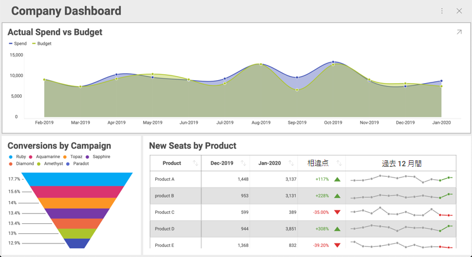

# 可視化の最大化と単一視覚化モード

## 概要

ダッシュボードをユーザーに表示するときに、最大化された可視化を 1 つだけ表示したい場合があります。さらに、最初の可視化をロックして、ユーザーがダッシュボード全体にアクセスできないようにすることもできます。Web Client SDK を使用して両方のシナリオを実現できます。


### サンプル詳細

可視化した 3 つのダッシュボードがあり、それぞれの可視化に会社の異なる部門のデータが表示されているとします。




この例では、業務アプリケーションでこれらの可視化を使用します。各部署のホーム ページに表示される情報の一部として含めます。

## 可視化の最大化

視覚化を最大化してダッシュボードを開くには、ダッシュボードのプロパティを __revealView__ に設定する必要があります。次に、最大化する可視化を __$.ig.RevealView__ インスタンスに渡し、__maximizedVisualization__ プロパティを設定します。この属性に可視化を設定しないと、ダッシュボード全体が表示されます。

``` javascript
$.ig.RVDashboard.loadDashboard("AllDivisions", function (dashboard) {
    var revealView = new $.ig.RevealView("#revealView");
    revealView.dashboard = dashboard;
    revealView.maximizedVisualization = dashboard.visualizations.getByTitle('Sales');
});
```

最初に最大化された可視化は Sales というタイトルの可視化になりますが、それでもエンドユーザーはダッシュボードに戻って残りの可視化を表示できます。

## 単一可視化モード

また、最初の可視化をロックして、常に可視化を 1 つのみ表示するようにすることもできます。これにより、ダッシュボードは単一の視覚化ダッシュボードのように機能します。これが [シングル可視化モード] の概念です。

[単一可視化モード] をオンにするには、次のように __singleVisualizationMode__ を true に設定します。

``` js
revealView.singleVisualizationMode = true;
```

この 1 行を追加すると、ダッシュボードは単一の視覚化ダッシュボードとして機能します。各部門のホーム ページでも同じことができます。`dashboard.visualizations.getByTitle()` の可視化タイトルを正しいタイトルに置き換えるだけです。

### ロックされた可視化を動的に変更

ページを再読み込みせずに、表示されている単一の可視化を動的に変更することもできます。ユーザーの観点から見ると、アプリは部門のセレクターと最大化された視覚化を備えた単一ページのアプリケーションになります。ユーザーがリストから 1 つの部門を選択すると、最大化された視覚化が更新されます。

このシナリオは、以下に示すように、__$.ig.RevealView__ の **maximizeVisualization** メソッドを使用して実現できます。

```html
<section style="display:grid;grid-template-rows:30px auto;">
    <section style="display:grid;grid-template-columns:auto auto auto;">
        <button onclick="maximizeVisualization('Sales')">Sales</button>
        <button onclick="maximizeVisualization('HR')">HR</button>
        <button onclick="maximizeVisualization('Marketing')">Marketing</button>
    </section>
    <div id="revealView" style="height:500px;" />
</section>
```

```javascript
var dashboardId = 'AllDivisions';

$.ig.RVDashboard.loadDashboard(dashboardId, function (dashboard) {
    var revealView = window.revealView = new $.ig.RevealView("#revealView");
    revealView.singleVisualizationMode = true;
    revealView.dashboard = dashboard;
    revealView.maximizedVisualization = dashboard.visualizations.getByTitle('Sales');

});

function maximizeVisualization(title) {
    var dashboard = window.revealView.dashboard;
    window.revealView.maximizedVisualization = dashboard.visualizations.getByTitle(title);
}
```

注意事項:
  - __$.ig.RevealView__ オブジェクトは \_window.revealView\</emphasis\> に設定され、後で **maximizeVisualization** プロパティが設定されたときに使用できるようになっています。
  - Div の前のセクションに追加されたボタンは、単なる例として使用されています。最大化された可視化を切り替える手段として追加されました。ここでは、アプリケーションで同様のコードを使用する必要があります。
  - この例では、サンプル ダッシュボードのビジュアライゼーションと一致するようにボタンがハードコードされていますが、ダッシュボードのビジュアライゼーションのリストを繰り返すことでボタンのリストを動的に生成することもできます。
    詳細については __$.ig.RVDashboard.visualizations__ を参照してください。
