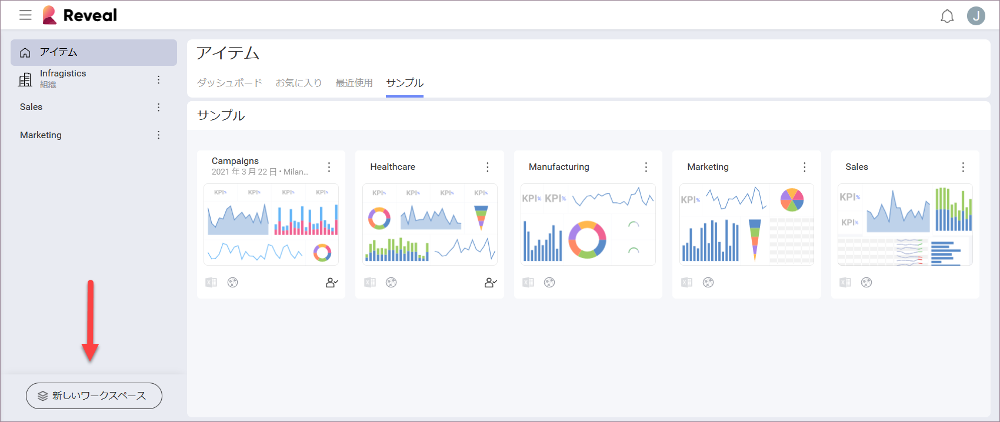
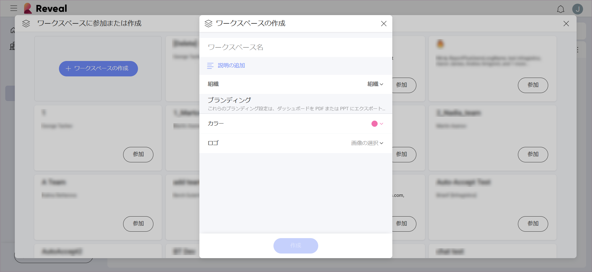
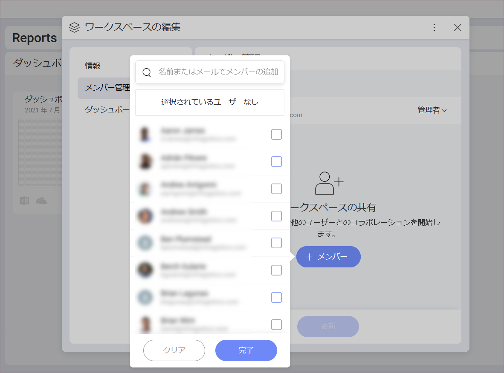
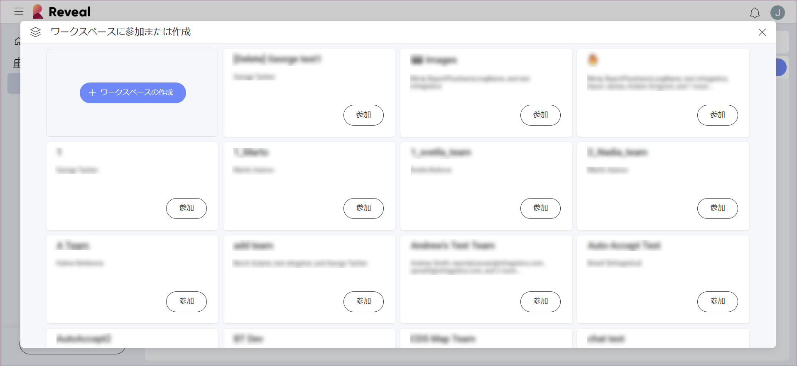

## ワークスペースの作成と参加

Reveal の**ワークスペース**は、組織内外とのコラボレーションを容易にします。組織内すべてのワークスペースへのアクセスや参加が可能で、あなたのワークスペースを作成して、組織内のユーザーが他のワークスペースと共同作業を行うことができます。

[ワークスペースを新規に作成](#create-workspace-scratch)または[既存のワークスペースに参加し](#join-workspace)、ワークスペースの使用を開始します。

### ワークスペースを新規に作成

1.  画面の左下角にある [新しいワークスペース] をクリック/タップします。

    

    >[!NOTE]
    > 初めてサインインする際に、すでにワークスペースに参加されている場合があります。つまり、Office365 アカウントで Reveal にログインしたことのある、組織の他のメンバーを含む[組織ワークスペース](overview.html#organization-workspace)です。

2.  青い **[+ ワークスペースの作成]** ボタンをクリック/タップします。以下の画面が表示されます。

    

    以下の手順を実行します。

      - ワークスペースに**名前**を割り当てます。

      - ワークスペースがメイン**組織**に属するかどうかを選択します。

          - [組織ワークスペース](overview.html#organization-workspace) (このオプションは、*Infragistics、Inc* などの組織名で表示されます)。ワークスペースをメイン組織ワークスペースに関連付けると、ワークスペースがメイン組織のすべてのメンバーが[参加できる](#join-workspace)ワークスペースのリストに表示されます (非公開にしない場合)。

          - **個人組織** - 新しいワークスペースはメイン組織に属しておらず、招待なしに他のユーザーが参加できません。

            >[!NOTE]
            >後で変更することはできないため、慎重にワークスペースの*組織*プロパティを選択してください。
      
      - ワークスペースの[*プライバシー*](overview.html#workspace-privacy-levels)を決定する - このオプションは、ワークスペースに組織を選択した場合は使用できません。ワークスペースを招待なしで検出して参加させる場合は、**[公開]** を選択します。

      - ブランディング設定 - ワークスペースのダッシュボードを [PDF 文書](~/jp/dashboards/exporting-dashboards/export-as-pdf-document.md)および [PPT プレゼンテーション](~/jp/dashboards/exporting-dashboards/export-as-powerpoint-presentation.md)としてエクスポートするときに使用するメイン色とロゴを選択します。
      
        >[!NOTE] 
        >**ロゴ画像の要件**。ロゴとしてアップロードする画像は、**5 MB** 以下で、jpg、jpeg、png、gif のいずれかの形式である必要があります。

      - **状態**、**開始日**、**終了日**を選択します - これらの設定は**オプション**ですが、プロジェクトで作業しているときに非常に便利です。  
  

3.  **[作成]** をクリック/タップします。これでワークスペースが作成され、画面の左側にあるワークスペースのリストに表示されます。

### ワークスペースへのユーザーの招待

ワークスペースを作成すると、他のユーザーを招待するように求められます。 

1. **[+ メンバー]** の青いボタンをクリック/タップします。ドロップダウン リストからユーザーを選択できます (以下を参照)。検索を使用して、組織外のユーザーの電子メールを追加することもできます。準備ができたら、[完了] を選択します。

    

2. 別のロールを割り当てない場合、招待するユーザーのデフォルトのロールは*メンバー*です。各ユーザー名の横にあるドロップダウンで、[管理者]、[メンバー]、[閲覧者] から選択できます。ワークスペース ロールの詳細については[「ワークスペースのコラボレーションとプライバシー」](overview.html#members-roles-permissions)トピックを参照してください。

5. 役割を決定すると、[更新] をクリックして招待を送信します。ユーザーはそれらを電子メールで受け取り、Reveal 内でも通知されます。

### 既存のワークスペースに参加

アカウントが[組織ワークスペース](overview.html#organization-workspace)に自動的に追加された場合、**組織に属する他のワークスペースを検出して参加できます**。

以下の手順で既存のワークスペースに参加できます。

1.  画面の左下にある **[新しいワークスペース]** の青いボタンをクリック/タップします。

2.  **[ワークスペースの参加または作成]** ダイアログが表示されます。

    

    ここには、組織に属するすべての[公開](overview.html#workspace-privacy-levels)ワークスペースがあります。

4.  **[参加]** ボタンをクリック/タップすると、メンバーの[権限](overview.html#members-roles-permissions)を持つ新しいメンバーとして選択したワークスペースに自動的に追加されます。ワークスペースがワークスペース リストに表示されます。
