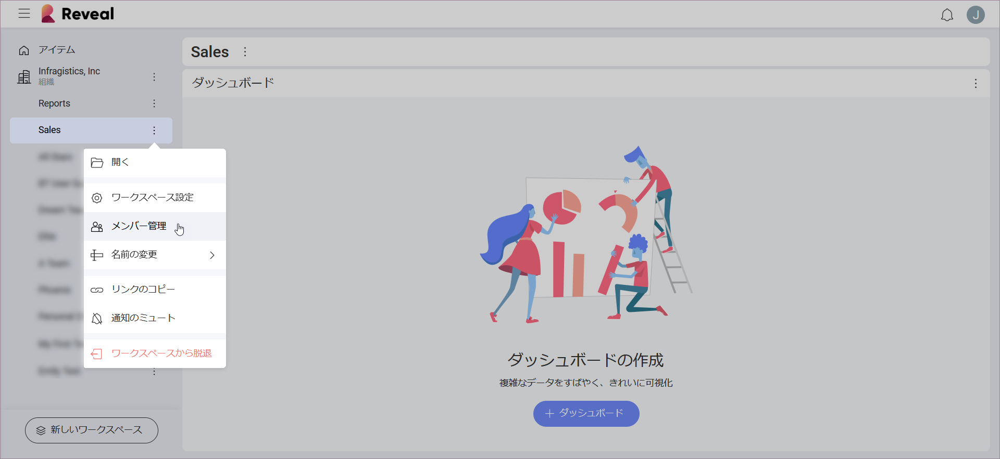

## ワークスペースの管理

ワークスペースの[管理者](overview.html#members-roles-permissions)として、次のことができます:

  - ワークスペース メンバーを管理する;

  - ワークスペース プロパティを管理する;

  - ワークスペースを[削除する](#delete-workspace);

特殊なタイプのワークスペースとして、[組織](overview.html#organization-workspace)管理は、Reveal のワークスペース管理の一般的なルールに対応しています。組織のワークスペース管理に違いがある場合、それらはこのトピックで明示的に言及されます。

### ワークスペース メンバーの管理

ワークスペースの管理者のみが他のユーザーを招待できます。

ワークスペースの完全なメンバーのリストを表示するには:

ワークスペースを選択 > オーバーフロー メニューをクリック/タップ > **[メンバーの管理]** を選択します (以下を参照)。

このメニューでは、ユーザーのロールを変更し、メンバーを削除または追加できます。

#### 役割の変更または複数のメンバーの同時削除

1. **[+ メンバー]** の青いボタンの右側にあるチェックボックスをオンにします。
2. ユーザーのロールの右側にチェックボックスが表示されます。
3.  画面下部中央のメニューからゴミ箱アイコンまたは役割を選択します。

### ワークスペース設定の管理

管理者のみがワークスペースの設定を変更できます。そのためには次の手順を実行します。

ワークスペースを選択 > その横にあるオーバーフロー メニューをクリック/タップ >* [ワークスペース設定]* を選択します。

ここで、ワークスペースの**プライバシー**設定、**名前**、または**説明**を変更できます。

**ロゴ**をアップロードして**色**を設定することで、ワークスペースの**ブランディング**を設定することもできます。ロゴとしてアップロードする画像に使用できる形式は以下のとおりです:

  - jpg、jpeg、png、gif

  - 最大 5 MB

ブランド情報は、ダッシュボードを PDF 文書および PowerPoint プレゼンテーションにエクスポートするときに使用されます。

**組織のワークスペース**: 組織ワークスペースの名前は変更できません。

### ワークスペースの削除

管理者のみがワークスペースを削除できます。そのためには次の手順を実行します。

ワークスペースの[設定](#manage-workspace-properties)に移動 > [閉じる] ボタンの横にあるオーバーフロー ボタンをクリック/タップ > **[ワークスペースの削除]** を選択します。

ワークスペースを削除すると、ワークスペースのすべてのコンテンツが消えます。

最後のメンバーがワークスペースを脱退した場合、ワークスペースも削除されます。

**組織ワークスペース**: は削除できません。

### ワークスペースから脱退

ワークスペースを脱退するには、ワークスペースの[メンバー リスト](#manage-workspace-members)に移動し、名前の右側にあるドロップダウン メニューをクリック/タップして、**[脱退]** を選択します。

ワークスペースの唯一の管理者である場合、別のメンバーを管理者として割り当てずにワークスペースを脱退することはできません。これを行うには、ユーザーのロールをメンバー/閲覧者から管理者に変更し、**[更新]** を選択します。これで、ワークスペースを脱退することができます。

**組織のワークスペース**: 組織のワークスペースの唯一または最後の管理者であり、脱退する場合は、Reveal [サポート](https://jp.infragistics.com/my-account/submit-support-request/reveal)に連絡して、新しい管理者を割り当てるプロセスを開始してください。
