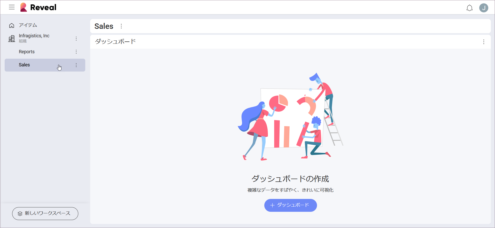

## ワークスペースのコラボレーションとプライバシー

ワークスペースは、Reveal ユーザーの任意のグループ間のダッシュボードでの効果的なコラボレーションを促進します。また、機密情報を含むダッシュボードの高レベルのセキュリティを保証します。

Reveal ワークスペースの機能:

  - ワークスペース セクションでグループの作業を整理 - ダッシュボードを作成して他のメンバーと直接共有し、ダッシュボードを表示および編集します。

  - ワークスペースのダッシュボードを他のワークスペースや Reveal の個々のユーザーと[**共有します**](~/jp/dashboards/sharing-dashboards/share-a-dashboard.md)。

  - すべてのワークスペース メンバーを、機密情報でダッシュボードを保護するために、異なるアクセス レベルを持つ [**3 つのメンバーのロール**](#members-roles-permissions)の 1 つに割り当てます。

  - 組織全体のさまざまな部署や従業員が自動的に作成された[**組織ワークスペース**](#organization-workspace)で共同で作業できます。

  - 組織ワークスペースに所属するメンバーを含む**他のワークスペースを検索します**。

### ワークスペースへのアクセス

画面の左側、*Reveal* アイコンの下にあるワークスペースにアクセスできます。

ワークスペースのリストは、**アイテム**および**組織**パネルにあります。そこでは、新しいワークスペースを作成したり、既存のワークスペースに参加したりすることもできます。

### 組織ワークスペース

組織のメンバーが Office365 で最初にログインすると、Reveal は組織ワークスペースを自動的に作成します。メンバーは、組織のメール アドレスでログインして組織に関連付け、組織ワークスペースに追加する必要があります。

組織ワークスペースは [アイテム] のすぐ下にあります。このワークスペースは、組織と同じ名前になります。

他のワークスペースとは異なり、組織ワークスペースでダッシュボードを作成およびアップロードできるのは[管理者](#members-roles-permissions)のみです。組織のキー メンバーのみに管理者のロールが付与されます。この制限により、組織ワークスペースのダッシュボードに正確で信頼できるデータが含まれるようになります。

### ワークスペースのプライバシー レベル

ワークスペースを作成するときに、プライバシー レベルを選択できます。

  - **公開**:  メインの組織ワークスペースのメンバーは誰でも、ワークスペースを検索して参加できます。
    
  - **プライベート**:  ワークスペースは検索結果に表示されません。ユーザーは招待を受け取った場合のみ参加できます。

### メンバーのロールとアクセス許可

Reveal には 3 種類のワークスペース メンバーがあります:

  - **管理者**

  - **メンバー**

  - **閲覧者**

組織ワークスペースでこれらのロールを割り当てるプロセスは、他のワークスペースとは異なります。以下に、このプロセスの説明と、組織および他のワークスペースのメンバーのアクセス許可を示す 2 つの参照表を示します。

#### 組織ワークスペース - メンバーのロールおよびアクセス許可の割り当て

Reveal にサインインする組織の最初のユーザーには、組織ワークスペースの**管理者**のロールが与えられます。初めてサインインする同じ組織の他のユーザーも管理者として追加されます。管理者の 1 人が初めて他のユーザーを**閲覧者**または**メンバー**として割り当てた後、将来の新しいユーザーは管理者ではなくメンバーとして追加されます。

次の表は、組織ワークスペースのメンバーのさまざまなアクセス許可を示しています。

| アクセス許可                                                      | 管理者                                   | メンバー                                  | 閲覧者                                  |
| --------------------------------------------------------------- | --------------------------------------- | --------------------------------------- | --------------------------------------- |
| **ダッシュボード**を表示できます。                                         | O | O | O |
| 組織ワークスペースで**ダッシュボード**を作成、編集、削除できます。                 | O | X  | X  |
| 編集のアクセス許可を持って組織外の**ダッシュボード**を共有できます。  | O | X  | X  |
| 表示のアクセス許可を持って組織外の**ダッシュボード**を共有できます。  | O | O | O |
| 組織ワークスペースで**メンバー**を管理できます。           | O | X  | X  |
| ユーザーを組織に**招待**できます。                               | O | X  | X  |
| **公開ワークスペース**を検出して参加できます。                           | O | O | O |
| **プライベート ワークスペース**を検出できます。                                      | X  | X  | X  |
| 組織内に独自のワークスペースを作成できます。 | O | O | X  |

#### ワークスペース - メンバーのロールおよびアクセス許可の割り当て

ユーザーがワークスペースを作成すると、ユーザーはそのワークスペースの管理者であり、そこにアクセス許可のレベルを分散できます。管理者は新しいメンバーを招待し、そのロールを割り当てます。

次の表は、組織ワークスペースとは異なるワークスペース内のユーザーのアクセス許可を示しています。

| アクセス許可                                                      | 管理者                                   | メンバー                                  | 閲覧者                                  |
| --------------------------------------------------------------- | --------------------------------------- | --------------------------------------- | --------------------------------------- |
| **ダッシュボード**を表示できます。                                         | O | O | O |
| ワークスペースで**ダッシュボード**を作成、編集、削除できます。                           | O | O | X  |
| 編集のアクセス許可を持ってワークスペース外の**ダッシュボード**を共有できます。 | O | O | X  |
| 表示のアクセス許可を持ってワークスペース外の**ダッシュボード**を共有できます。 | O | O | O |
| ワークスペースの**メンバー**を管理できます。                                     | O | X  | X  |
| ユーザーを**招待**できます。                             | O | X  | X  |
| **公開ワークスペース**にメンバーとして参加できます。                           | O | O | O |
| **プライベート ワークスペース**を検出できます。                                      | X  | X  | X  |

ワークスペースと組織のプロパティとメンバーの管理について詳しく知りたい場合は、[ワークスペースの管理](managing-your-workspace.md)のトピックをお読みください。
