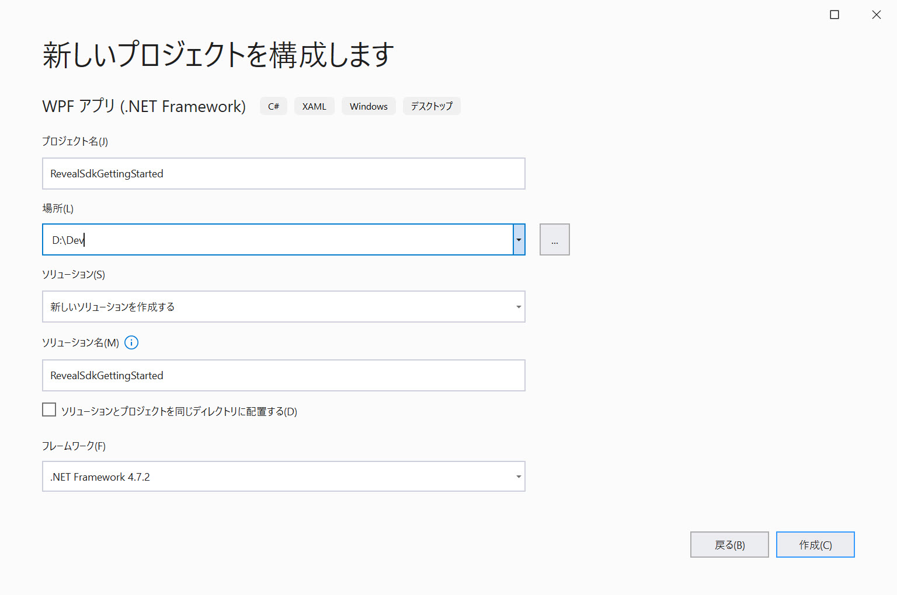
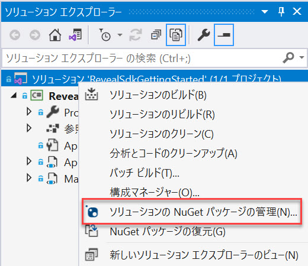
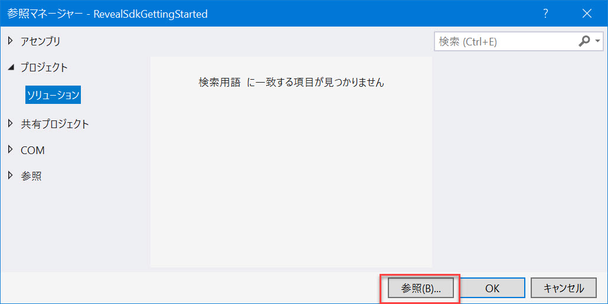
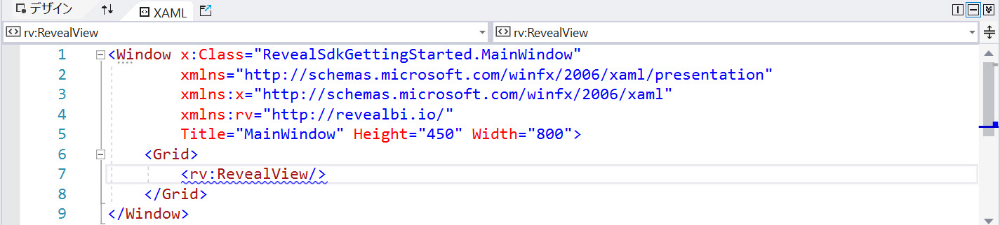

# Reveal SDK を使用した作業の開始

## 手順 1 - 新しい WPF プロジェクトの作成
以下の手順では、新しい WPF プロジェクトを作成する方法を説明します。既存のアプリケーションに Reveal SDK を追加する場合は、[手順 2](#step-2---add-reveal-sdk) へ移動します。

1 - Start Visual Studio 2019 and click **Create a new project** on the start page, select the **WPF App (.NET Framework)** template, and click **Next**.


2 - Provide a project name, select **.NET Framework 4.6.2** or higher, and click **Create**.



## 手順 2 - Reveal SDK の追加

### NuGet

1 - Right click the Solution, or Project, and select **Manage NuGet Packages** for Solution.



2 - In the package manager dialog, open the **Browse** tab, select the **Infragistics (Local)** package source, and install the **Reveal.Sdk.Wpf** NuGet package into the project.


> [!NOTE]
> トライアル版をお使いの場合、[NuGet.org](https://www.nuget.org/packages/Reveal.Sdk.Wpf.Trial/) にある **Reveal.Sdk.Wpf.Trial** NuGet パッケージをインストールできます。

### 手動

1 - Right click the References node in the Solution Explorer, and select **Add Reference**.


2 - Click the **Browse** button and select all the assemblies dropped by the installer at **%public%\Documents\Infragistics\Reveal\SDK\WPF\Binaries**.



3 - Install the following NuGet packages, which the Reveal SDK depends on:
   1. CefSharp.Wpf (87.1.132 またはそれ以降) 
   2. SkiaSharp (1.68.0 またはそれ以降)
   3. System.Data.SQLite.Core (1.0.108 またはそれ以降)
   4. Microsoft.Data.SqlClient (1.1.3 またはそれ以降)

## 手順 3 - RevealView コントロールの追加

### XAML の使用

1 - Open the **MainWindow.xaml** file and add the `xmlns:rv="http://revealbi.io/"` namespace

```xml
xmlns:rv="http://revealbi.io/"
```

2 - Add the RevealView to the content of the MainWindow

```xml
<rv:RevealView />
```

### ツールボックスの使用

1 - Open the **MainWindow.xaml** file

2 - Open the Visual Studio Toolbox and find the **RevealView** control under the **Reveal SDK** toolbox tab


3 - Click and drag the **RevealView** control onto the design surface of the **MainWindow.xaml** file. The Reveal SDK namespace and the RevealView control will both be added to the MainWindow.xaml file.



## 手順 4 - アプリケーションの実行

[F5] を押してアプリケーションを実行します。


完了しました! 最初の Reveal SDK アプリケーションを作成しました。

次の手順:
- [新しいダッシュボードの作成](creating-dashboards.md)
- [既存のダッシュボードの読み込み](loading-dashboards.md)

> [!NOTE]
> このサンプルのソース コードは [GitHub](https://github.com/RevealBi/sdk-samples-wpf/tree/master/01-GettingStarted) にあります。