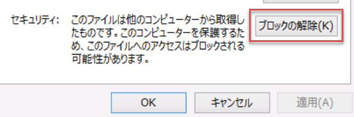
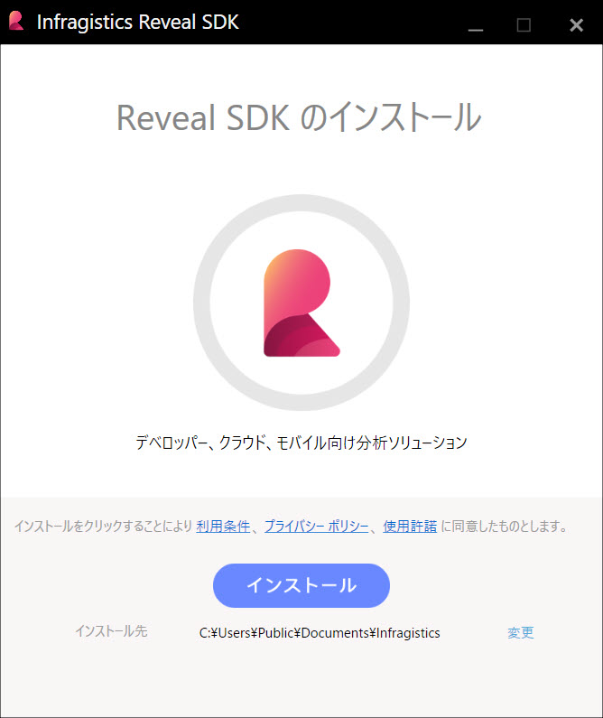
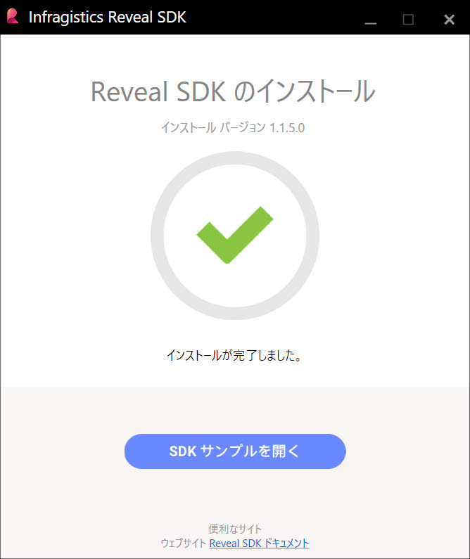
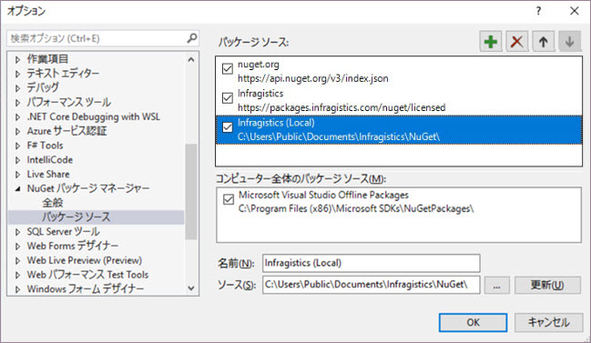
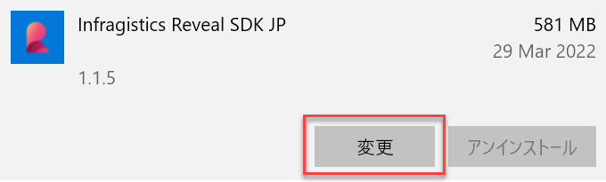
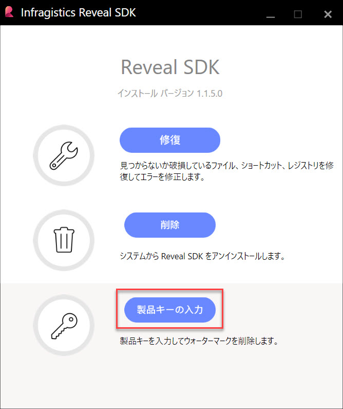
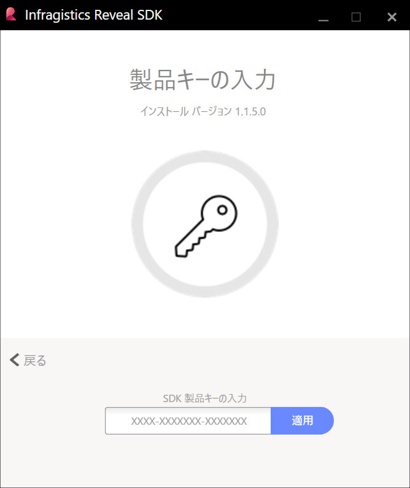

# インストール

## システム要件

- Windows 10 またはそれ以降
- Visual Studio 2019 またはそれ以降
- .NET Framework 4.6.2 またはそれ以降 

## Reveal SDK のインストール

Reveal SDK をインストールするには、Reveal SDK インストーラーをダウンロードして実行する必要があります。以下はインストール方法です。
1. [Reveal Web サイト](https://www.revealbi.io/download-sdk)から Reveal SDK インストーラーをダウンロードします。
2. Web ページの「Reveal SDK を試す」フォームに記入します。
3. Reveal SDK インストーラーをディスクの既知の場所に保存します。

保存したReveal SDK インストーラー zip ファイルを抽出する前にブロックを解除する必要があります。zip ファイルを右クリックして **[プロパティ]** を選択します。ファイルのブロックを解除するチェック ボックスがあるプロパティ ダイアログが表示されます。[**ブロックの解除**] オプションをチェックして [**適用**] をクリックします。

プラットフォーム インストーラー zip ファイルのブロックを解除した後、以下の手順に従ってください。
1. ZIP を現在の場所に解凍します。
2. 解凍した Reveal SDK インストーラー EXE ファイルをダブルクリックして起動します。
3. インストール場所を選択します。
4. インストールを続行するために使用許諾に同意する必要があります。(インストールをクリックすると同意します)

インストールが完了すると、Reveal SDK インストーラーの完了画面が表示されます。この時点で、[SDK サンプルを開く] ボタンをクリックして Reveal SDK サンプルを参照するか、[ヘルプ ドキュメント](https://help.revealbi.io/)、コミュニティ [ブログ (英語)](https://www.revealbi.io/blog) や[ビデオ](https://www.youtube.com/revealbi)などを活用できます。

## インストールされる項目

インストールが完了すると、**"%public%\Documents\Infragistics\Reveal\SDK\"** ローカル フォルダーに以下の項目がインストールされます。

- Reveal SDK バイナリ (手動で使用)
- Reveal SDK NuGet パッケージ
- Reveal SDK サンプル

Reveal SDK NuGet パッケージをポイントする Visual Studio に自動的に追加されるローカル NuGet パッケージ ソースもあります。

> [!NOTE]
> Infragistics NuGet フィード トピックの NuGet フィードを使用することもできます。

## ライセンス キーの追加

デフォルトでは、Reveal SDK インストーラーを使用して Reveal SDK を初めてインストールする場合、**トライアル版**の製品のみがインストールされます。**ライセンス版**の製品のロックを解除するには、インストーラーでライセンス キーを提供する必要があります。

インストーラーにライセンス キーを提供する方法は 2 つあります。
1. 解凍した Reveal SDK インストーラー EXE ファイルをダブルクリックして起動します。
2. Windows では、**[設定] -> [アプリ]** に移動し、Reveal SDK インストールを変更します。

既存のインストールを変更するか、Reveal SDK インストーラーを再実行すると、[修復]、[削除]、または [製品キーの入力] のいずれかの画面が表示されます。  [**製品キーの入力**] を選択します。

[**製品キーの入力**] を選択すると、ライセンス キーを入力する画面が表示されます。

> [!NOTE]
> ライセンスを追加したら、**Reveal.Sdk.Wpf.Trial** をアンインストールし、**Reveal.Sdk.Wpf** nuget パッケージをインストールします。