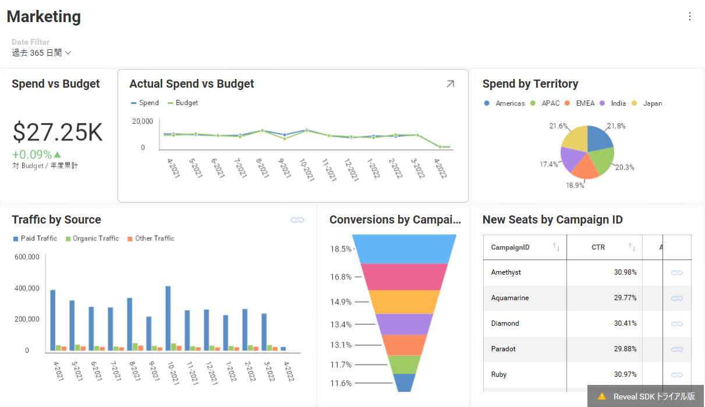
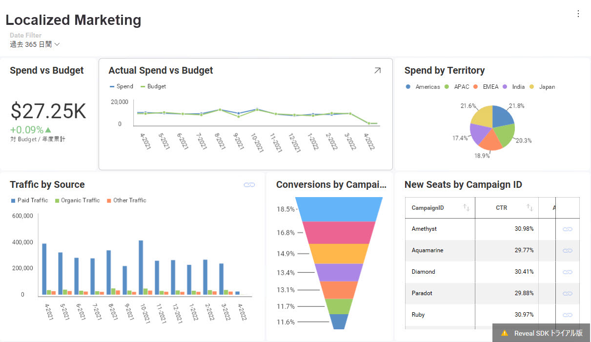
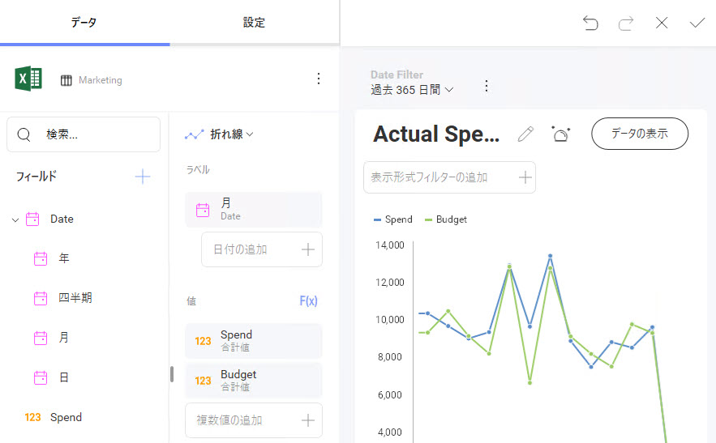
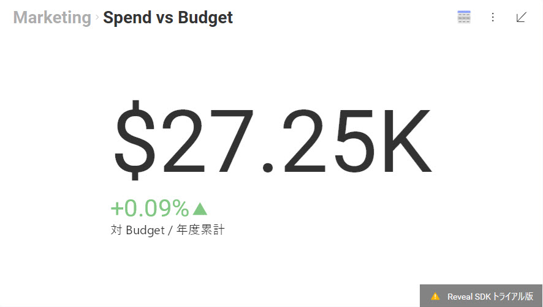
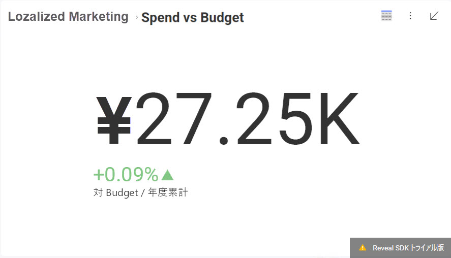
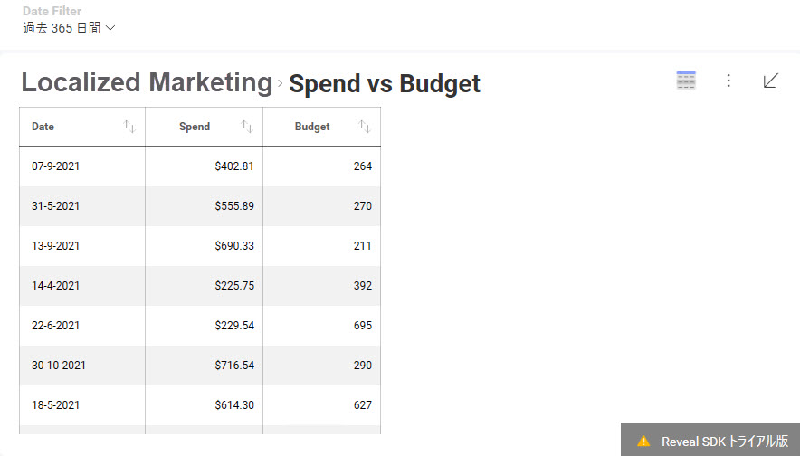
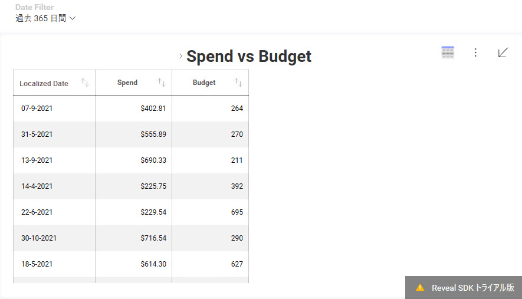

# ダッシュボードのローカライズ

ローカリゼーション サービスを使用すると、カスタムロジックに基づいてさまざまなダッシュボード要素をローカライズできます。また、フィールドのカスタム書式設定を設定する機能も提供します。

### ローカライズがサポートされる要素

ローカライズできるダッシュボード要素:

  - ダッシュボードのタイトル
  - フィルター タイトル
  - 表示形式フィルター
  - フィールド ラベル
  - 集計フィールド ラベル

### ローカリゼーション サービスの使用

以下に、[**ダッシュボードのタイトルをローカライズする**](#localize-dashboard-title)方法と、カスタム ロジックを追加して同じダッシュボードの[**フィールド ラベルをローカライズする**](#localize-field-label)方法の 2 つの例を示します。また、**[数値フィールド](#format-numeric-field)と[非集計日付フィールド](#format-date-field)の書式設定を変更する**方法の例もあります。この例で使用されているダッシュボードは、*Marketing* サンプル ダッシュボードです。

<a name='localize-dashboard-title'></a>
#### ダッシュボードのタイトルのローカライズの例

*Marketing* サンプルの初期状態:



以下の手順に従って、*Marketing* ダッシュボードのタイトルを *Localized Marketing* にローカライズします。

1.  ダッシュボードのローカライズを許可するには、カスタム実装に **LocalizationProvider** プロパティを設定する必要があります。

    ``` csharp
    RevealSdkSettings.LocalizationProvider = new UpMediaLocalizationProvider()
    ```

2.  **IRVLocalizationProvider** を実装します:

    ``` csharp
    public class UpMediaLocalizationProvider : IRVLocalizationProvider
    {
        public IRVLocalizationService GetLocalizationService()
        {
          return new UpMediaLocalizationService();
        }
    }
    ```

3.  以下に示すように、**IRVLocalizationService** に **GetLocalizedString** メソッドを実装して、ダッシュボードのタイトルをローカライズします。

    ``` csharp
    public class UpMediaLocalizationService : IRVLocalizationService
    {
        public RVFormattingSpec GetFormattingSettingsForField(string fieldName, RVDashboardDataType dataType, RVFormattingSpec currentSettings, bool isAggregated)
        {
            return null;
        }

        public string GetLocalizedString(string originalValue, RVLocalizationElementType type)
        {
            if (type == RVLocalizationElementType.DashboardTitle && originalValue == "Marketing")
            {
                return "Localized Marketing";
            }

            return originalValue;
        }
    }
    ```

アプリを再度実行すると、ローカライズされたダッシュボードのタイトル (*Localized Marketing*) が表示されます。



<a name='localize-field-label'></a>
#### フィールド ラベルのローカライズの例

以下に、同じダッシュボードの複数の要素をローカライズする方法の例を示します。

以下は、*Marketing* サンプルの表示形式 (*Actual Spend vs Budget*) で初期状態の 1 つの例です:



*Date* フィールド ラベルをローカライズするには、*Date* フィールドのローカリゼーションを処理するロジックを **UpMediaLocalizationService** に追加する必要があります。

``` csharp
public class UpMediaLocalizationService : IRVLocalizationService
{
    public RVFormattingSpec GetFormattingSettingsForField(string fieldName, RVDashboardDataType dataType, RVFormattingSpec currentSettings, bool isAggregated)
    {
        return null;
    }

    public string GetLocalizedString(string originalValue, RVLocalizationElementType type)
    {
        if (type == RVLocalizationElementType.DashboardTitle && originalValue == "Marketing")
        {
            return "Localized Marketing";
        }
        else if (type == RVLocalizationElementType.FieldLabel && originalValue == "Date")
        {
            return "Localized Date";
        }

        return originalValue;
    }
}
```

*Actual Spend vs Budget* の *Date* フィールド ラベルが *Localized Date* に変更されました。


手順の例に従って、その他のダッシュボード要素をローカライズできます。

### ローカリゼーション サービスを使用して書式設定を変更する

現在、ローカリゼーション サービスを使用して、数値フィールドと非集計日付フィールドの書式設定を変更できます。

<a name='format-numeric-field'></a>
#### 数値フィールドの書式設定の変更の例

以下の *Spend vs Budget* 表示形式の初期状態では、米ドル ($) 通貨で書式設定された数値フィールドを示します。



通貨書式を変更するには、新しい書式設定を作成し、**IRVLocalizationService** の実装の ***GetFormattingSettingsForField** メソッドでそれらを返す必要があります。

コード スニペットは、数値の書式設定を日本円(¥) に変更し、小数桁なしで表示する方法を示します。

``` csharp
public class UpMediaLocalizationService : IRVLocalizationService
{
    public RVFormattingSpec GetFormattingSettingsForField(string fieldName, RVDashboardDataType dataType, RVFormattingSpec currentSettings, bool isAggregated)
    {
        if (fieldName == "Spend" && dataType == RVDashboardDataType.Number && isAggregated == true)
        {
            var newSettings = new RVNumberFormattingSpec()
            {
                ApplyMkFormat = false,
                CurrencySymbol = "¥",
                DecimalDigits = 0,
                FormatType = RVDashboardNumberFormattingType.Currency,
                NegativeFormat = RVDashboardNegativeFormatType.MinusSign,
                ShowGroupingSeparator = true
            };

            return newSettings;
        }

        return null;
    }

    public string GetLocalizedString(string originalValue, RVLocalizationElementType type)
    {
       ...
    }
}
```

現在、金額は別の通貨で表示されます。



<a name='format-date-field'></a>
#### 日付フィールドの書式設定の変更の例

現在、集計された日付フィールドの書式設定の変更は、ローカリゼーション サービスでは設定できず、ピボットの値には影響しません。これを実現するには、[書式設定サービス](formatting-service.md)を使用する必要があります。

ローカリゼーション サービスでは、**非集計日付フィールド**の書式設定を変更できます。

まず、集計データを除外するために、*Actual Spend vs Budget* 表示形式を**グリッド**に変更します。



*Date* フィールドの書式設定を変更するには、**GetFormattingSettingsForField** メソッドのロジックに設定を追加する必要があります。以下のコード スニペットは、January 01、2001 のように、日付形式を変更して月のフルネームを表示する方法を示しています。

``` csharp
public RVFormattingSpec GetFormattingSettingsForField(string fieldName, RVDashboardDataType dataType, RVFormattingSpec currentSettings, bool isAggregated)
{
    if (fieldName == "Spend" && dataType == RVDashboardDataType.Number && isAggregated == true)
    {
        var newSettings = new RVNumberFormattingSpec()
        {
            ApplyMkFormat = false,
            CurrencySymbol = "¥",
            DecimalDigits = 0,
            FormatType = RVDashboardNumberFormattingType.Currency,
            NegativeFormat = RVDashboardNegativeFormatType.MinusSign,
            ShowGroupingSeparator = true
        };

        return newSettings;
    }
    else if (fieldName == "Date" && dataType == RVDashboardDataType.Date && isAggregated == false)
    {
        var newSettings = new RVDateFormattingSpec()
        {
            DateFormat = "MMMM dd,yyyy"
        };

        return newSettings;
    }

    return null;
}
```

> [!NOTE]
> フィールド名が *Localized Date* ではなく *Date* であるかどうかを確認する必要があることに注意してください。これは、フィールドの名前に基づいて書式設定が適用されるためです。この場合、*Date* はフィールドの名前で、*Localized Date* は表示されるラベルです。ダッシュボードを編集する場合、フィールド ラベルは変更できますが、フィールド名は元の名前のままです。

アプリを再度実行し、表示形式をグリッドに変更すると、更新された日付形式が表示されます。


